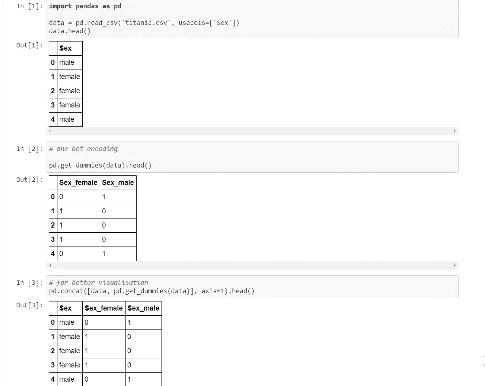
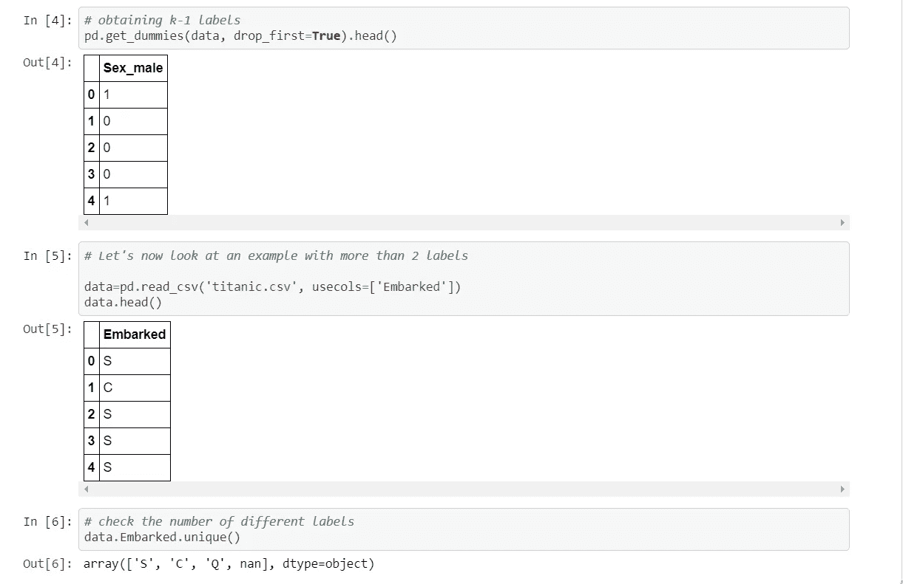
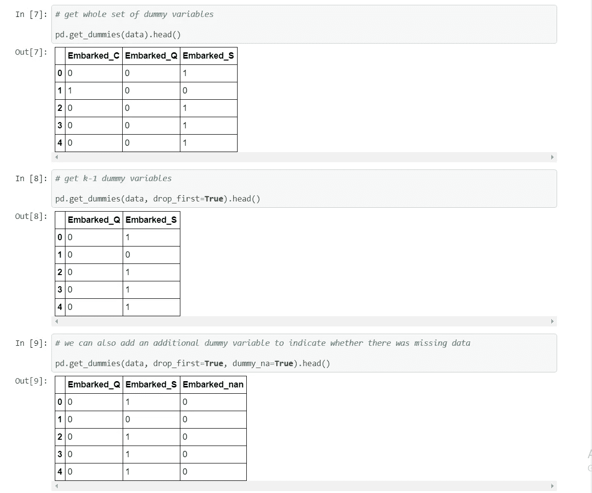
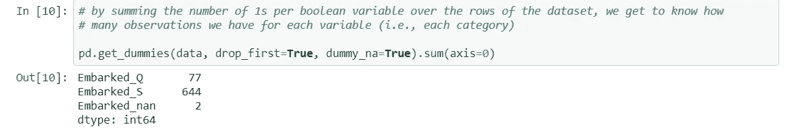
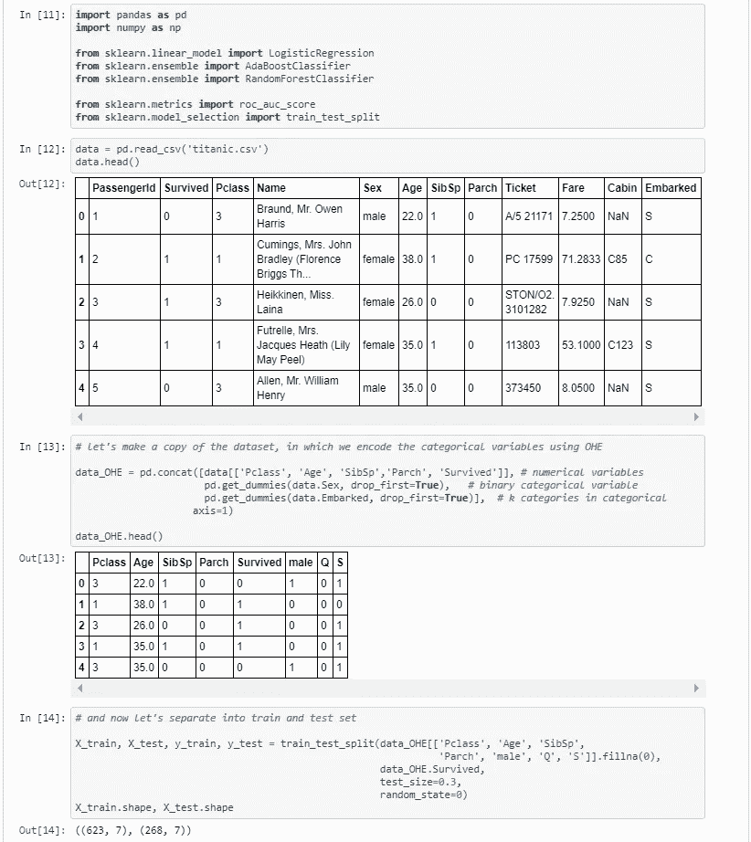
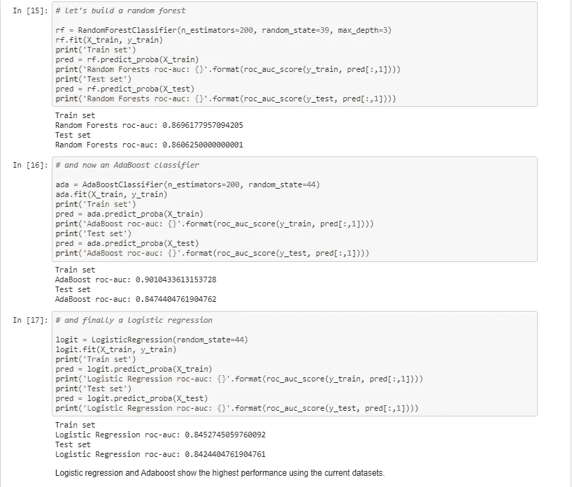
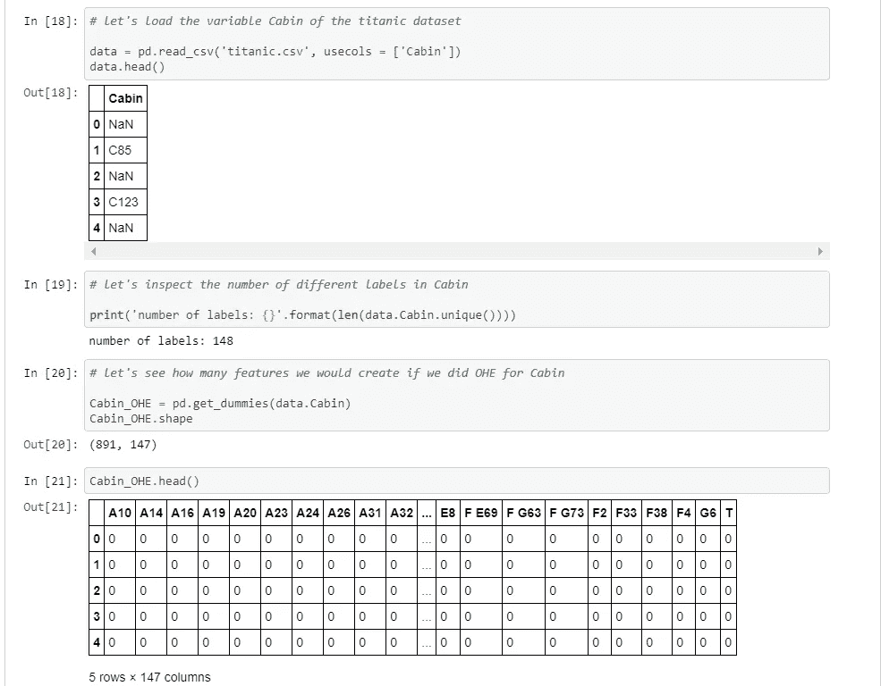

# 特征工程的一种热编码方法

> 原文：<https://medium.com/analytics-vidhya/one-hot-encoding-method-of-feature-engineering-11cc76c4b627?source=collection_archive---------5----------------------->

在这一节中，我将描述一种将分类变量的字符串转换为数字的方法，以便我们可以使用 sklearn 在机器学习算法中输入这些变量。

一种热编码包括用不同的布尔变量替换分类变量，布尔变量取值为 0 或 1，以指示该变量的某个类别/标签是否存在于该观察中。

每一个布尔变量也被称为**虚拟变量**或二进制变量。

例如，从带有标签“女性”和“男性”的分类变量“性别”中，我们可以生成布尔变量“女性”，如果人是女性，则取 1，否则取 0。我们还可以生成变量 male，如果这个人是“男性”，则取 1，否则取 0。

见下文:

您可能已经注意到，我们只需要两个虚拟变量中的一个来表示原始分类变量性别。这两个中的任何一个都可以，我们选择哪一个都没关系，因为它们是等价的。

因此，要用 2 个标签对分类变量进行编码，我们需要 1 个哑变量。

为了扩展这个概念，用 k 个标签编码分类变量，我们需要 k-1 个虚拟变量。

我们如何用熊猫来得到这个？

# 笔记

熊猫和 sklearn 都将从一个分类变量中提供一整套虚拟变量。也就是说，它们将返回 k，而不是返回 k-1 个二进制变量，在 pandas 中可以选择删除第一个二进制变量并获得 k-1。

# 什么时候应该用 k，什么时候用 k-1？

当原始变量是二进制时，也就是说，当原始变量只有 2 个标签时，那么你应该创建**一个且只有一个**二进制变量。

当原始变量有 2 个以上的标签时，以下几点很重要:

## 一个热编码到 k-1:

一种热编码成 k-1 个二进制变量的方法考虑到我们可以少用 1 个维度，仍然表示全部信息:如果在所有的二进制变量中观察值都是 0，那么在最终的(去掉的)二进制变量中它一定是 1。例如，对于编码为男性的变量性别，如果观察值为 0，那么它必须为女性。我们不需要额外的女性变量来解释。

线性回归中应使用 k-1 个二进制变量的热编码，以保持正确的自由度数量(k-1)。线性回归在训练时可以访问所有的特征，因此可以检查整个虚拟变量集。这意味着 k-1 个二元变量为线性回归提供了关于(完全代表)原始分类变量的全部信息。

并且对于所有在训练过程中同时查看所有特征的机器学习算法来说也是如此。例如，支持向量机和神经网络。和聚类算法。

## 一次热编码成 k 个虚拟变量

然而，基于树的模型在每次迭代中仅选择一组特征来做出决定。这是为了在每个节点分离数据。因此，最后一个类别，即在 k-1 个变量的一次性编码中被删除的类别，将只被那些一次使用整个二进制变量集的分割或甚至树考虑。这种情况很少发生，因为每次拆分通常使用 1-3 个特征来做出决定。因此，基于树的方法永远不会考虑那个被丢弃的附加标签。因此，如果分类变量将在基于树的学习算法中使用，将它编码成 k 个二进制变量而不是 k-1 个是好的实践。

最后，如果您计划进行特征选择，您还需要整个二元变量集(k ),以便让机器学习模型选择最具预测能力的变量。

让我们用一个热编码对分类变量重新编码的数据训练一个模型。

# 一个热门编码:最终笔记

# 优势

*   易于实施
*   不做假设
*   保留分类变量的所有信息

# 不足之处

*   不添加任何可能使变量更具预测性的信息
*   如果变量有很多类别，那么 OHE 会显著增加特征空间。

见下文:

如果我们在包含 148 个不同标签的变量舱中执行 OHE，我们将得到 147 个变量，而原来只有一个。如果我们有一些像这样的分类变量，我们最终会得到巨大的数据集。因此，OHE 并不总是编码分类变量的最佳选择。

# 笔记

如果我们的数据集有一些多标签变量，我们很快就会得到有数千列或更多列的数据集。这可能会使我们的算法训练速度变慢。

此外，这些虚拟变量中的许多可能彼此相似，因为两个或更多变量共享相同的 1 和 0 的组合并不罕见。

# 页（page 的缩写）如果你喜欢这个博客，请在下面评论:)