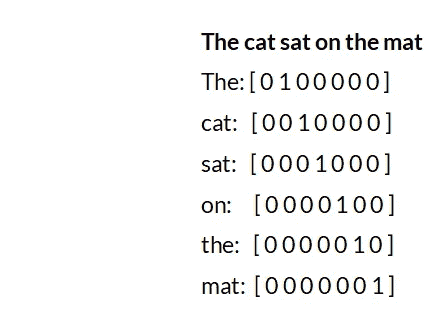

# 自然语言处理中文本数据的一种热编码。

> 原文：<https://medium.com/analytics-vidhya/one-hot-encoding-of-text-data-in-natural-language-processing-2242fefb2148?source=collection_archive---------1----------------------->

机器学习和深度学习最有趣的应用之一可以在**自然语言处理(NLP)** 领域找到。NLP 中的许多任务包括处理被理解为文本序列的文本和句子。但是作为机器学习模型一部分的**神经网络**需要以张量或向量的形式输入，其组成元素是数字形式的。那么，这些数据是如何以文本形式输入到这样一个神经网络模型中的呢？使我们能够做到这一点的方法之一，我们将在下面讨论，被称为**一个热编码**。

在一种热编码中，作为给定文本数据一部分的每个单词(甚至符号)都以向量的形式书写，仅由 1 和 0 组成。所以一个热向量是元素只有 1 和 0 的向量。每个单词被写成或编码成一个热向量，每个热向量都是唯一的。这允许单词由其一个热向量唯一地识别，反之亦然，即没有两个单词将具有相同的一个热向量表示。例如，下图显示了给定句子中单词的一种热编码。

请注意，在左侧图像中，单词“The”**和“The”**具有不同的编码，暗示它们是不同的。因此，我们**将文本数据中的每个单词和符号**表示为唯一的一个热向量，该向量包含数字数据(1 和 0)作为其组成元素。一个单词被表示为一个**向量**，因此句子中的单词列表可以表示为一个**向量数组**或一个**矩阵**，如果我们有一个单词被热编码的句子列表，那么它将产生一个元素是矩阵的数组。所以我们最终得到了一个三维张量，可以输入到神经网络中。****

****现在让我们从头开始使用 **numpy** 库来检查它在 **Python** 中的实现。****

****在第一行，我们有由两个句子组成的样本集。接下来，我们创建一个空的 Python **字典**，用于存储我们的**单词(键)**和它们对应的**索引(值)**，后面是一个设置为 0 的计数器，用于计算字典中键-值对的数量。第一个 for 循环遍历句子，而下一行中的 for 循环遍历所选句子中的每个单词，并拆分每个单词，返回一个**字符串列表。**然后，如果 *current_word* 变量的值不在字典 *token_index* 中，那么我们将它添加到 *token_index* 字典中，并为它分配一个等于 *counter* 变量的值的索引，并将其加 1，以从 1 而不是 0 开始我们的索引，并且还将 *counter* 的值加 1。****

****因此，我们得到了如上图所示的字典。请注意，样本中有 11 个单词，但只有 10 个索引，因为“has”是重复的，甚至符号和数字(表示为字符串)也有分配给它们的索引，因为它们也是由空格分隔的文本字符。因此，字典的最大长度也是 10。****

****接下来，我们创建一个由 0 作为元素的张量。****

*****结果*是一个三维张量，其元素为两个矩阵(样本中元素的数量)。每个矩阵都有 *max_length* 行数(这里是 6)和*max(token _ index . values())+1*列(这里是 10 + 1 = 11)。因此，我们现在有一个**形状张量(2，6，11)。******

****现在我们用零作为元素，从之前的张量创建一个热表示。****

****在第一个 for 循环中，我们考虑每个句子及其在由*枚举返回的**枚举对象**中的索引(示例)。*****

****以上是为“示例”中的一个句子转换为列表的枚举对象。****

****枚举对象被转换成 l **ist** (代码在左边)，for 循环在单词列表元素上迭代。在下一行中，我们得到了 *token_index* 中的 **(keys)** 的**值**。例如在 *token_index* 中‘Neptune’的值是 7。然后将前一个零张量中的位置索引**等于 *(i，j，index)* 的元素设为 1。再次考虑我们之前的“Neptune”示例，这里我们从 0 开始对行和列进行计数，因为它属于第二个句子，所以 i = 1，这意味着它是合成张量中第二个矩阵的一部分，它是句子的第一个单词，所以它在第二个矩阵的第 0 行，并且它在 token_index 的第 7 列中的值将被设置为 1.0。******

****结果是我们的*样本中句子的一个热点表示。*形状的张量(2，6，11)。****

****因此，我们将“样本”中的数据表示为 **One hot。******