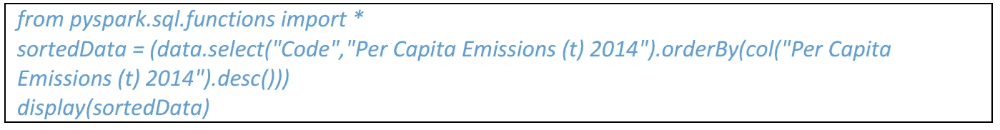

# PySpark 中数据操作的一站式指南

> 原文：<https://medium.com/analytics-vidhya/one-stop-guide-to-data-manipulation-in-pyspark-22b0c4f0d843?source=collection_archive---------2----------------------->

Apache Spark 是用 Scala 编程语言编写的。PySpark 的发布是为了支持 Apache Spark 和 Python 的协作，它实际上是一个用于 Spark 的 Python API。此外，PySpark 可以帮助您与 Apache Spark 和 Python 编程语言中的弹性分布式数据集(rdd)进行交互(来源:Databricks)

在本教程中，您将学习-

# 第一部分

## 1.1 —计数()

返回数据集中的行数

## 1.2 — printSchema()

我们拥有的数据类型

## 1.3 —显示(..)

允许我们将数据打印到控制台。

n:打印到控制台的记录数，默认为 20。

## 1.4 —显示(..)

稍微优雅一点的选择

1.  显示(..)很丑——显示器(..)挺好看的。
2.  显示(..)具有截断列和行的参数—显示(..)没有。
3.  显示(..)是 DataFrame/Dataset 类的函数— display(..)与许多不同的对象一起工作

## 1.5 —极限值(..)

如果您能回忆起，请展示(..)有一个参数来控制打印多少条记录，但是，显示(..)没有。

我们可以用我们第一个变换 limit(..)

## 1.6 —选择(..)

通过计算每个元素的给定列表达式，返回新的数据集

## 1.7 —下降(..)

返回删除了一列的新数据集

## 1.8 —独特()

返回一个新的数据集，该数据集仅包含数据集中的唯一行

# 第二部分

## 2.1 —排序依据(..)

返回按给定表达式排序的新数据集。

## 2.2 — desc()

Column 类是一个对象，它不仅包含列的名称，还包含列级别的转换，比如按降序排序。

返回按降序排序的新数据集

## 2.3 —过滤器(..)

使用给定条件筛选行

## 2.4 —第一个()

返回第一行

# 第三部分

## 3.1 —重命名列:别名()

as()或 alias()方法可以附加到调用链中

## 3.2 —重命名列:withColumnRenamed()

with 列(..)重命名列(第一个参数),并接受我们转换所需的表达式作为第二个参数

## 3.3.重命名列— toDF()

我们可以把这个又大又丑的名字明确地重新命名。

## 3.4.groupBy()

使用指定的列对数据集进行分组，以便我们可以对它们运行聚合

1.  平均(..):计算每个组的每个数字列的平均值。
2.  计数(..):计算每组的行数。
3.  总和(..):计算每个组的每个数字列的总和。
4.  最小(..):计算每个组的每个数值列的最小值。
5.  最大(..):计算每个组的每个数字列的最大值。
6.  平均(..):计算每个组的每个数值列的平均值。
7.  聚集(..):通过指定一系列聚合列来计算聚合。
8.  枢轴(..):透视当前 DataFrame 的一列并执行指定的聚合。

# 第四部分

## 4.1.加入(..)

如果您熟悉 SQL 连接，那么 DataFrame.join(..)应该是相当直截了当的。

## 4.2.how= "左"

例如

