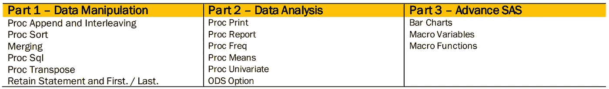
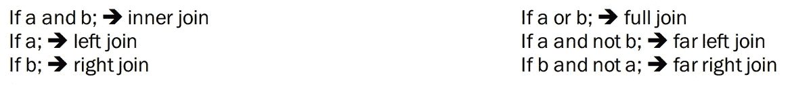
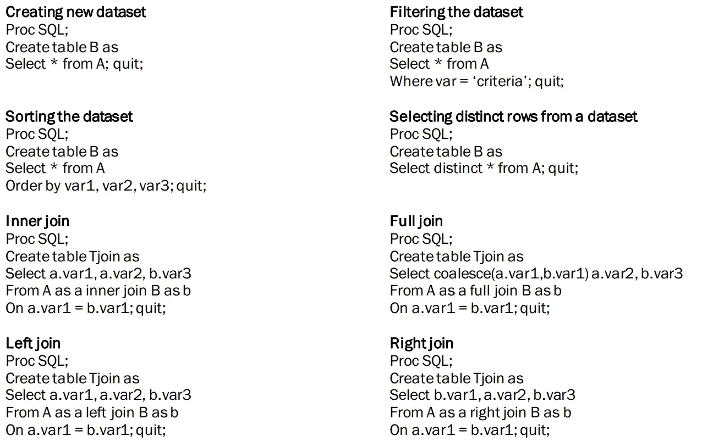
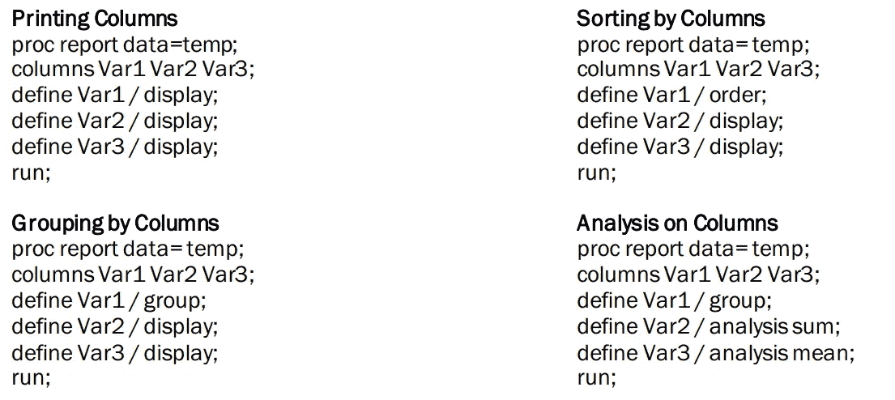
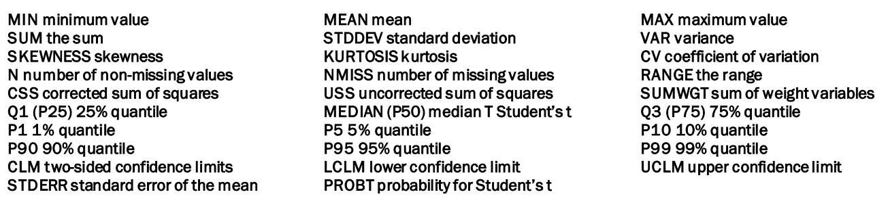
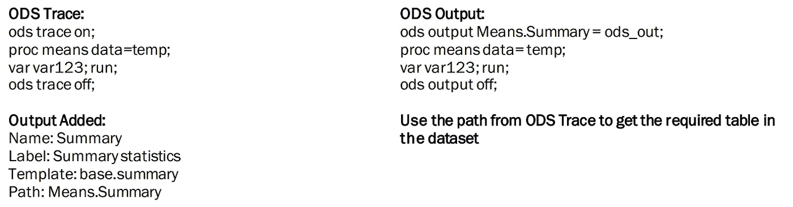
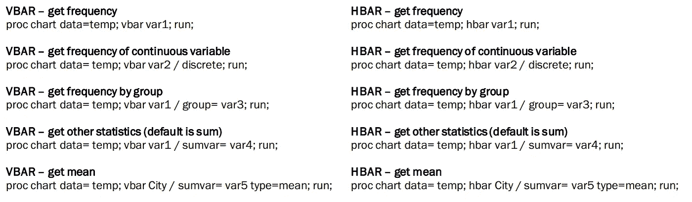
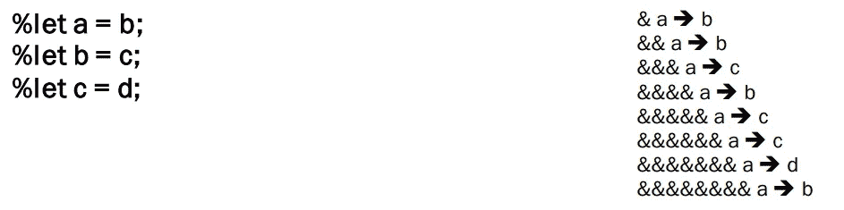
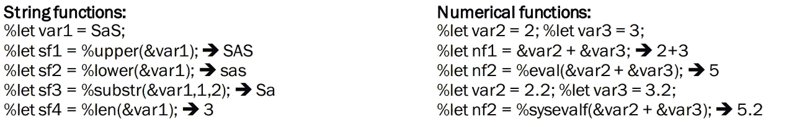

# SAS 中数据操作的一站式指南

> 原文：<https://medium.com/analytics-vidhya/one-stop-guide-to-data-manipulation-in-sas-983708a79fd6?source=collection_archive---------7----------------------->

SAS 是一个软件解决方案的集成系统，使您能够执行以下任务:数据输入、检索和管理；报告写作和图形设计；统计和数学分析；业务预测和决策支持；运筹学和项目管理；应用开发。本文涵盖的主题:

# 1.第 1 部分—数据操作

# 1.1.过程附加和交错

附加过程将来自一个 SAS 数据集的观测值添加到另一个 SAS 数据集的末尾。PROC APPEND 不处理第一个数据集中的观察值。它将第二个数据集中的观察值直接添加到原始数据集的末尾。

> *PROC APPEND BASE = BASE-SAS-data-set*
> 
> *<数据= SAS-数据集-追加> <强制>；*

交错将单独的、排序的 SAS 数据集组合成一个排序的 SAS 数据集。

> *Proc 排序数据= temp1 按键；跑步；*
> 
> *Proc 排序数据= temp2 按键；跑步；*
> 
> *数据 temp3 设置 temp1 temp2 按键；跑步；*

# 1.2.过程排序

对数据进行排序的原因有很多——在合并数据集之前，或者在另一个过程或数据步骤中使用 BY 语句之前，为报表组织数据。幸运的是，PROC 排序非常简单。这个程序的基本形式是

> *PROC 排序；*
> 
> *按变量-1 …变量-n；*

DATA=和 OUT=选项指定输入和输出数据集。如果不指定 DATA=选项，那么 SAS 将使用最近创建的数据集。如果没有指定 OUT=选项，那么 SAS 将用新排序的版本替换原始数据集。NODUPKEY 选项告诉 SAS 消除对 BY 变量具有相同值的任何重复观测值。

默认情况下，SAS 按照从低到高或从 A 到 z 的升序对数据进行排序。要按照从高到低的顺序对数据进行排序，请在 By 语句中每个应该按照从高到低的顺序排序的变量之前添加关键字 DESCENDING。

# 1.3.合并

您可以在数据步骤中使用 merge 语句合并数据集。本节中使用的 MERGE 语句的形式如下:

> *数据 temp3*
> 
> *合并 temp 1(in = a)temp 2(in = b)；*
> 
> *通过变量-列表；*
> 
> *如果<条件>*

# 1.4.过程 Sql

Proc Sql 可以用来做比我们用 Data step 所能做的更多的事情。

# 1.5.过程转置

转置程序转置 SAS 数据集，将观察值变成变量或将变量变成观察值。在大多数情况下，要将观察值转换为变量，可以使用以下语句:

> *PROC 转置数据=旧数据集输出=新数据集；*
> 
> *通过变量-列表；*
> 
> *ID 变量；*
> 
> *VAR 变量-列表；*

**BY 语句:**如果您有任何想要保留为变量的分组变量，您可以使用 BY 语句。这些变量包含在转置的数据集中，但它们本身并没有转置。

**ID 语句:**ID 语句命名其格式化值将成为新变量名的变量。ID 值在数据集中只能出现一次；或者如果存在 BY 语句，那么这些值在 BY 组中必须是唯一的。

**VAR 语句**VAR 语句命名你要转置其值的变量。

# 1.6.首先保留语句和。/最后。

RETAIN 语句使在数据步骤中创建的变量从当前观察到下一次观察都保留其值。在数据步的每次迭代开始时，变量没有设置为 missing。RETAIN 是声明性语句，不是可执行语句。该语句具有以下形式:

> *保留变量-1 <。。。可变-n>；*

当您在数据步骤中使用 BY 语句时，SAS 会为 BY 语句中的每个变量自动创建两个附加变量。一个变量名为 FIRST.variable，其中 variable 是 BY 变量的名称。另一个变量名为 LAST.variable。它们的值要么是 1，要么是 0。

> *数据温度；设置一些数据；*
> 
> *by sorted _ var；*
> 
> *First_var=first。sorted _ var*
> 
> *Last _ var =最后。sorted _ var*
> 
> *运行；*

# 2.第 2 部分—数据分析

# 2.1.过程打印

PRINT 程序可能是应用最广泛的 SAS 程序。PROC PRINT 打印 SAS 数据集中所有观察值的所有变量。SAS 会决定格式化输出的最佳方式，因此您不必担心一页中能容纳多少变量之类的问题。但是 PROC PRINT 还有一些您可能想要使用的特性。打印过程只需要一条语句:

> *PROC 打印数据=数据集；*

DATA=指定数据集的选项。

如果您不想要观察数字，请在 PROC PRINT 语句中使用 NOOBS 选项。

如果您想打印标签而不是变量名，那么也添加标签选项。

# 2.2.进程报告

报告程序与打印、均值、制表和排序程序以及数据步骤具有相同的功能。由于所有这些功能都集中在一个程序中，所以 PROC 报告可能很复杂也就不足为奇了。

# 2.3.过程频率

当你有一个变量的计数，他们被称为单向频率。当您组合两个或更多变量时，计数被称为双向、三向等等，直到 n 向频率/或简单的交叉列表。使用 PROC FREQ 最明显的原因是创建显示分类数据值分布的表格。

要生成单向频率表，只需列出变量名。该语句生成一个频率表，列出变量中每个值的观察次数。

> *PROC FREQ；*
> 
> *表变；*

要制作交叉列表，请列出用星号分隔的变量。该语句生成一个交叉表，显示变量 1 和变量 2 的每个组合的观察值数量。

> *徐健 FREQ；*
> 
> *表格 variable1 * variable2*

# 2.4.过程方法

平均值、标准偏差、最小值和最大值等统计数据可以让您对数据有所了解。MEANS 过程提供数字变量的简单统计。MEANS 过程以关键字 PROC MEANS 开始，后面是列出要打印的统计数据的选项:

> *PROC 表示期权；*
> 
> *VAR 变量-列表；*

如果不包含任何统计关键字，则 MEANS 将生成每个数值变量的平均值、非缺失值的数量、标准差、最小值和最大值。下表显示了您可以请求的统计数据

# 2.5.过程单变量

PROC UNIVARIATE 是 Base SAS 软件的一部分，它生成描述单个变量分布的统计数据。这些统计数据包括平均值、中值、众数、标准差、偏斜度和峰度。如果没有 VAR 语句，SAS 将计算数据集中所有数值变量的统计数据。

> *PROC 单变量；*
> 
> *VAR 变量-列表；*

你用 PROC 单变量产生的大多数描述性统计数据也可以用 PROC 均值产生，但是你必须要求它们。当您知道需要所有的汇总统计数据时，单变量是有用的:均值、方差、偏斜度、分位数、极值、t 检验等。默认情况下，单变量打印出所有这些内容。但是如果你知道你只想要其中的一些数据，那么 MEANS 是一个更好的方法。

# 2.6.ODS 选项

ODS TRACE 语句告诉 SAS 在 SAS 日志中打印关于输出对象的信息。有两个 ODS 跟踪语句:一个打开跟踪，一个关闭跟踪。有时，您可能希望将程序的结果放入 SAS 数据集中。使用 ODS，您可以将程序输出的几乎任何部分保存为 SAS 数据集，方法是将其发送到输出目的地。

# 3.第 3 部分—高级服务协议

# 3.1.条形图

PROC CHART 步骤中的 VBAR 语句生成垂直条形图。PROC CHART 步骤中的 HBAR 语句生成水平条形图

# 3.2.宏变量

宏变量的名称以&号为前缀，而宏的名称以百分号(%)为前缀。宏变量类似于标准数据变量，只是它只有一个值，不属于数据集，并且它的值总是字符。这个值可以是一个变量名，一个数字，或者任何你想代入你的程序的文本。

给宏变量赋值最简单的方法是使用%LET 语句。

> *%LET 宏变量名称=值；*

要使用宏变量，只需添加&前缀，并将宏变量名放在需要替换其值的地方。

> *B = &迭代次数；*

多级和分辨率

使用宏变量

# 3.3.宏功能

如果您反复编写相同或相似的 SAS 语句，您应该考虑使用宏。宏允许您打包一段无错误的代码，并在单个 SAS 程序或多个 SAS 程序中重复使用。你可以把宏想象成一种三明治。%MACRO 和%MEND 语句就像两片面包。在这些切片之间，您可以放置任何您想要的语句。宏的一般形式是

> *%MACRO 宏名；*
> 
> *宏文本*
> 
> *%MEND 宏名；*

参数是宏变量，其值是在调用宏时设置的。最简单的宏没有参数。要给宏添加参数，只需在%MACRO 语句的括号中列出宏变量名。下面是参数列表的一种可能形式。

> *%MACRO 宏名(参数-1，参数-2，.。。参数-n)；*
> 
> *宏文本*
> 
> *%MEND 宏名；*

您可以使用以下语句调用宏:

> *%宏名(var-1，var-2，.。。var-n)；*