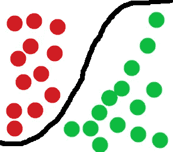
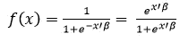
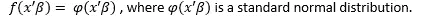
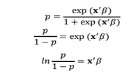
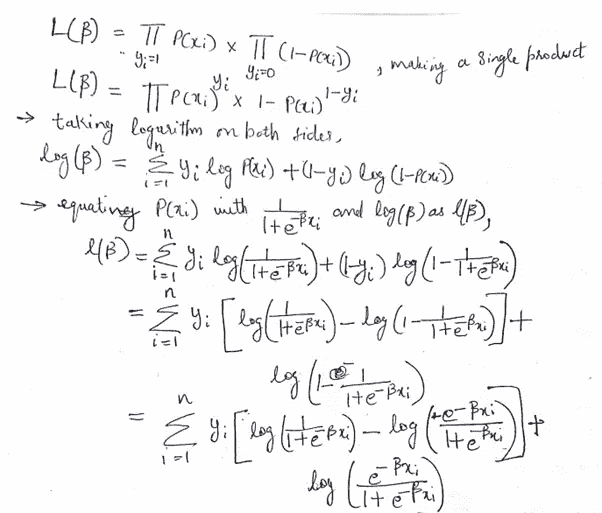
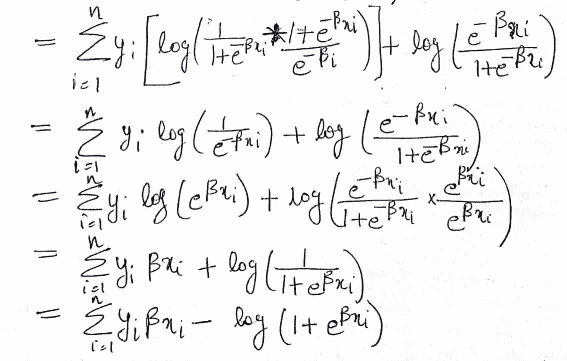
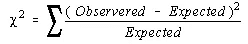
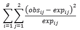
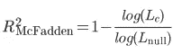
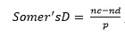

# 逻辑回归的一站式解决方案

> 原文：<https://medium.com/analytics-vidhya/one-stop-solution-for-logistic-regression-c876cf26d37f?source=collection_archive---------12----------------------->

# 介绍

让我首先给出一个逻辑回归在机器学习大图景中的位置。

几个世纪以来，我们一直将分析作为一种强大的工具，用于分析和确定我们感兴趣的特定变量与业务中其他变量之间的强度和关系。在过去的几年里，分析学在识别语音和图像方面也取得了长足的发展。强大的软件和高等数学为这一发展铺平了道路。

强大的分析框架包括三个不同的步骤:

I. **描述性分析** -聚集和总结数据以获得有意义的见解。

二。**预测分析** —使用统计模型和预测技术来预测未来。**机器学习**是一种预测分析方法，它使用各种算法来训练计算机预测未来。

三。**说明性分析** -使用描述性和预测性方法强调可操作的结果或来自数据的洞察力。

机器学习问题分为以下 4 类:

1.**监督学习** —在这种情况下，要预测的变量是已知的或在数据中被标注。诸如线性回归和逻辑回归传统方法是监督学习算法。

2.**无监督学习**——这里，要预测的变量是未知的，或者我们手边没有带标签的数据。这些大多是聚类或降维的情况，其中数据根据数据中的变量或特征被分组到有意义的聚类中。像 K-means、层次聚类、奇异值分解(SVD)等方法。

3.**半监督学习** —在这种情况下，我们同时拥有标记数据和未标记数据，用于预测算法的算法利用了标记数据和未标记数据中包含的信息。图协议方法是一种流行的半监督算法。

**4。** **强化学习—** 反复强调从环境中学习的理念，将情境映射到行动中，以实现回报最大化。这些都是在博弈论，控制理论等研究，并使用马尔可夫决策过程建模。

# 什么是逻辑回归？

监督机器学习问题分为回归和分类两类。

**回归**:用于模拟连续结果，如股票价格

**分类**:用于对分类结果建模，如贷款违约预测

逻辑回归是一种监督机器学习算法，用于二元分类问题(仅 2 类)。典型的分类问题是我们希望将数据分类到所需类别的场景。这种传统的算法以其解释能力而闻名，并在银行中广泛用于贷款违约或非违约的分类。

# 如何解决 logistic 回归问题？

让我们考虑一个包含 x1，x2，x3…的数据集。xn，y 特征或变量，其中 y 是需要建模的带标签的二进制变量 0 或 1。这是可能的，通过找出一个简单的连续函数，其余域是(0，1)。如果模型为输入 xi 返回的值更接近于 0，那么我们给 xi 分配一个负标签；否则，该示例被标记为阳性。两个这样的连续函数是 Logit 和 Probit 函数。

在 Logit 模型中，累积分布函数是由 f(x'β)给出的逻辑分布，如下所示，预测概率限制在 0 和 1 之间。

其中 x’β=β1x1+β2 x2+…+βnXn

在概率单位模型中，累积分布函数是由 f(x'β)给出的标准正态分布，预测概率被限制在 0 和 1 之间。

其中 x’β=β1x1+β2 x2+…+βnXn

经验结果表明，这两个模型产生相同的结果，尽管不同的系数和因此模型的选择取决于用户。Logit 模型是应用最广泛的模型。

**logit 模型的优势比/相对风险**

使用 logit 模型的一个有趣的事实是，使用奇数比率可以很容易地解释结果。优势比或相对风险定义为 p/(1-p)，其中 p 是结果的概率。它是 y=1 的概率相对于 y=0 的概率的比值。

其中 x'β = β1x1+β2x2+…+βnXn。

现在，如果我们分析上述等式的 RHS，就比值比而言的 logit 模型可以被视为线性回归模型。因此命名为逻辑回归而不是逻辑分类。

优势比为 2 意味着结果 y=1 的可能性是结果 y=0 的两倍。

现在为了求解 logit 模型，我们需要估计β。

# 参数估计

参数估计是来自估计理论的一种方法，估计理论是统计学的一个分支，它利用潜在的概率分布来估计经验数据的参数。常用的估算方法有

最大似然估计量

贝叶斯估计量

矩估计方法

最小平方

最小均方误差(MMSE)，也称为贝叶斯最小平方误差(BLSE)

当存在潜在的参数分布时，最大似然估计(MLE)是最优选的估计量，因此 MLE 用于逻辑回归。

**离散分布的似然函数定义为**

设 X 为离散随机变量，概率质量函数 P 取决于参数θ，似然函数 L(θ|x)定义为

L(θ|x) = P(x|θ)

**连续分布的似然函数定义为**

设 X 是一个随机变量，其概率密度函数 f 取决于参数θ，似然函数 L(θ|x)定义为

L(θ|x) = f(x|θ)

参数空间中使似然函数最大的点称为最大似然估计。

概率给出观察结果的机会，而可能性确定对概率结果的信任。因此，似然性度量模型的拟合优度。

因为观察 N 个样本的 N 个标签的可能性是每个观察的可能性的乘积，所以最大可能性函数可以表示为:

我们要求解的最终方程是一个非线性方程，因此只能用数值方法求解。

牛顿-拉夫逊、拟牛顿等基于梯度下降的方法被认为是数值方法。逻辑回归使用牛顿-拉夫森方法。(点击了解更多关于优化[的信息)](/analytics-vidhya/optimizations-an-essential-mathematical-toolkit-b36e77b0e03a)

在这里应用了牛顿-拉夫森方法之后，我们得到了β的估计。

如何解释β，也称为系数？

系数解释为

根据系数的符号，x 的增加会增加或减少 y=1 的可能性。

我们解释系数的符号，但不解释大小。不能使用系数来解释大小，因为不同的模型具有不同的系数标度。

# 逻辑回归模型的拟合优度

以下是适用于逻辑回归模型的拟合优度测试:

卡方拟合优度和偏差

霍斯默-莱梅休试验

伪 R 广场或麦克法登的 R 广场

准确度分数。

***卡方拟合优度与偏差***

在卡方拟合优度中，我们检验样本是否来自所声明分布的总体。测试统计由下式给出

如果这些加权平方偏差的总和很小，则观察到的频率接近预期的频率，因此没有理由拒绝它来自该分布的说法。只有当总和很大时，才是质疑分配的理由。所以卡方拟合优度检验永远是右尾检验。

当满足以下假设时，检验统计量具有卡方分布:

数据是从随机样本中获得的，并且数据是正态分布的。

每个类别的预期频率必须至少为 5。

以下是拟合优度测试的属性:

数据是观察到的频率。这意味着每个类别只有一个数据值。

自由度比类别数少一个，而不是比样本量少一个。

自由度= n-1

这总是一个右尾测试。

它具有卡方分布。

如果类别的顺序被改变，测试统计的值不会改变。

如果获得的 p 值大于显著性水平α，那么我们不能拒绝零假设

H0:样本来自同一人群。

***霍斯默-勒梅肖试验***

该测试仅用于二进制响应变量。数据首先通过对预测概率进行排序并形成 g 个相等的子组来重新分组。

Hosmer-Lemeshow 检验统计量通过以下公式计算:

其中 g =组的数量。使用的检验是具有 g-2 自由度的卡方检验。输出返回一个卡方值(Hosmer-Lemeshow 卡方)和一个 p 值(例如 Pr > ChiSq)。较小的 p 值意味着模型不适合。

像大多数拟合优度测试一样，这些小的 p 值(通常低于 5%)意味着你的模型不是一个很好的拟合。但是大的 p 值并不一定意味着你的模型不适合，只是没有足够的证据表明它适合。许多情况会导致较大的 p 值，包括较差的测试能力。注意:低功耗只是这项测试备受批评的原因之一。

***麦克法登的伪 R 平方***

麦克法登的 R 平方测度定义为

其中，Lc 表示当前拟合模型的(最大化)似然值，Lnull 表示对应的值，但用于零模型，即只有截距且没有协变量的模型。

如果模型没有预测能力，尽管当前模型的似然值将(总是)大于零模型的似然值，但也不会大很多。因此，两个对数似然的比率将接近于 1，并且 R 平方麦克法登将接近于零。

逻辑回归模型的目的是预测每个受试者的 P(Y=1)，对于 Y=1 的受试者，我们需要 P(Y=1) ~ 1，对于 Y=0 的受试者，我们需要 P(Y=1) ~ 0。如果是这样的话，P(Y=1) ~ 1 时看到 Y=1 的概率几乎是 1，同理 P(Y=1) ~ 0 时看到 Y=0 的概率也几乎是 1。这意味着每次观察的似然值接近 1。1 的对数是 0，因此对数似然值 log (Lc)将接近 0。那么麦克法登的平方将接近于 1。

***Somer 的 D 或准确度分数***

Somer's D 或 Somer's Delta 定义如下:

在哪里，

nc =一致对的数量

nd =不一致对的数量

p=n(n-1)/2

如果预测得分的等级顺序与观察得分的等级顺序匹配，则一对预测得分是一致的，否则是不一致的。

Somer 的 D 值范围从 1 到-1，接近 1 的值描述了最理想的模型。

***感谢维基百科和加州大学洛杉矶分校统计***