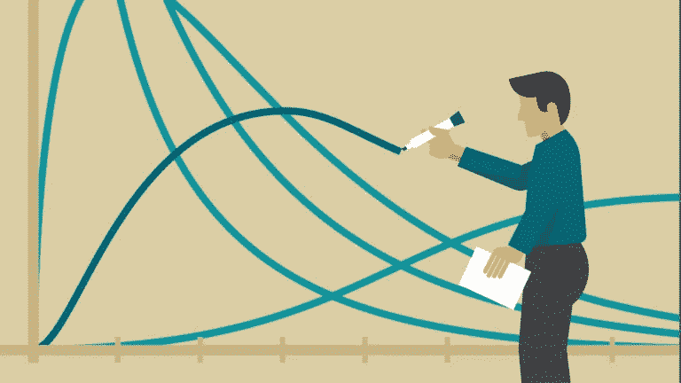

# 使用 Python 进行单向方差分析(ANOVA)

> 原文：<https://medium.com/analytics-vidhya/one-way-analysis-of-variance-anova-with-python-514417babcb4?source=collection_archive---------2----------------------->

## 循序渐进的介绍

当您处理在不同群体或亚群体中呈现给您的数据时，您可能有兴趣知道它们是来自同一个群体，还是代表不同的群体(具有不同的参数)。