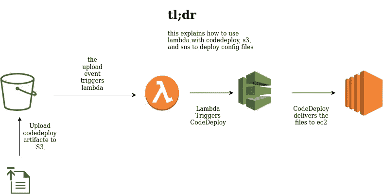
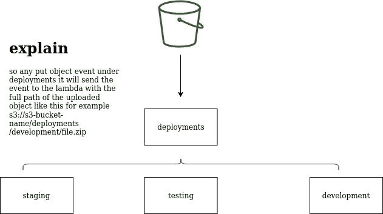

# 利用 Lambda、CodeDeploy、S3 进行持续部署的一种方式

> 原文：<https://medium.com/analytics-vidhya/one-way-to-utilize-lambda-codedeploy-s3-for-your-continuous-development-eac845b0b5bb?source=collection_archive---------20----------------------->



这是一个简单的持续部署过程，根据您使用以下 AWS 工具上传到 S3 bucket 的目录，在所需的环境中触发部署

*   云的形成
*   代码部署
*   萨姆·拉姆达
*   S3

我也不会把 Slack (SNS，Lambda，Slack 配置)因为会有另一个职位

还要注意，这是利用代码部署，所以你必须按照官方[文档](https://docs.aws.amazon.com/codedeploy/latest/userguide/application-revisions.html)上传修订版

## 创建 AWS 代码部署堆栈:

*   AWS CodeDeploy 第一块是应用程序，每个应用程序都包含 DeploymentGroup(一种模式是让每个组部署在特定的环境中，比如一个用于开发，一个用于试运行…。等等)
*   首先，创建[应用程序](https://docs.aws.amazon.com/AWSCloudFormation/latest/UserGuide/aws-resource-codedeploy-application.html)
*   然后创建[部署组](https://docs.aws.amazon.com/AWSCloudFormation/latest/UserGuide/aws-resource-codedeploy-deploymentgroup.html)

## 创建部署 Lambda:

*   你可以选择你喜欢的方式来创建 lambda，但是在下面的例子中，我使用的是 AWS [SAM](https://github.com/awslabs/aws-sam-cli)
*   如果您使用 SAM，您将有一个空项目，因此这里是将创建 Lambda、S3 存储桶和 Lambda 将使用的 IAM 角色的模板
*   我指的是模板中的 slack SNS，我用它来调用另一个 lambda 向它发送通知，然后发送给 slack

```
AWSTemplateFormatVersion: '2010-09-09'
Transform: AWS::Serverless-2016-10-31
Description: >
  deployment_lambdaSam template for lambda invoked by uploading inc to s3 bucketParameters:
  BucketNameParam:
    Description: deployment bucket name paramter
    Type: String
    Default: <NAME OF THE BUCKET>
Globals:
  Function:
    Timeout: 15
    MemorySize: 128
    Runtime: python3.7Resources:
  DeploymentIamRole:
    Type: AWS::IAM::Role
    Properties:
      RoleName: File_Basic_Role
      AssumeRolePolicyDocument:
        Version: '2012-10-17'
        Statement:
        - Effect: Allow
          Principal:
            Service:
            - lambda.amazonaws.com
          Action:
          - sts:AssumeRole
      Path: "/"
      ManagedPolicyArns:
      - arn:aws:iam::aws:policy/AWSCodeDeployDeployerAccess
      - <SNS PUBLISH ROLE ARN>
      - arn:aws:iam::aws:policy/service-role/AWSLambdaBasicExecutionRole
      - arn:aws:iam::aws:policy/service-role/AWSLambdaVPCAccessExecutionRole
  S3DeploymentsBucket:
    Type: AWS::S3::Bucket
    DeletionPolicy: Delete
    Properties:
      BucketName: !Ref BucketNameParam
  DevelopmentDeployer:
    Type: AWS::Serverless::Function 
    Properties:
      FunctionName: deployment_Lambda
      CodeUri: lambda/
      Handler: deployment.lambda_handler
      Role:
        Fn::GetAtt:
        - DeploymentIamRole
        - Arn
      Environment: 
        Variables:
          TOPIC: !ImportValue <SNS TO SLACK TOPIC>
          BUCKET: !Ref BucketNameParam
      Events:
        EventDeployer:
          Type: S3
          Properties:
            Bucket: !Ref S3DeploymentsBucket
            Events: s3:ObjectCreated:*
            Filter:
              S3Key:
                Rules:
                  - Name: prefix
                    Value: deployments
```

*   您必须在 SAM 和 LAMBDA 指南中提到的相同模板中创建 s3 存储桶
*   正如你在 lambda 函数的 events 部分看到的，我使用了在 path 上创建的 S3:object
*   此外，路径是在上传 bucket 中的第一个文件时创建的。本[指南](https://docs.aws.amazon.com/AmazonS3/latest/user-guide/using-folders.html)可以解释 s3 bucket 中的路径是如何工作的
*   我对 s3 铲斗解剖的想法是这样的



S3 桶解剖

*   所以我使用子目录来决定我应该部署到哪个 env 换句话说，当我上传到部署/测试时，测试代码部署部署组将被触发
*   发送给 lambda 的事件对象如下所示

```
{
   "Records": [
      {
         "eventVersion": "2.1",
         "eventSource": "aws:s3",
         "awsRegion": "",
         "eventTime": "",
         "eventName": "ObjectCreated:Put",
         "userIdentity": {
            "principalId": ""
         },
         "requestParameters": {
            "sourceIPAddress": ""
         },
         "responseElements": {
            "x-amz-request-id": "",
            "x-amz-id-2": ""
         },
         "s3": {
            "s3SchemaVersion": "1.0",
            "configurationId": "",
            "bucket": {
               "name": "some-bucket",
               "ownerIdentity": {
                  "principalId": ""
               },
               "arn": "arn:aws:s3:::some-bucket"
            },
            "object": {
               "key": "deployments/development/file.zip",
               "size": 0000,
               "eTag": "",
               "sequencer": ""
            }
         }
      }
   ]
}
```

*   我利用了事件包含一些关于上传对象的信息这一事实来在我的 lambda 中使用它(检查 object 下的键)
*   所以 lambda 代码应该是这样的

```
def lambda_handler(event, context):
    deployment_env = event['Records'][0]['s3']['object']['key'].split('/')[1].strip() 
    response = deployment_creator(deployment_env)
    message = "this is the deployment start response: " + response 
    slacker(message, 'deployments')
```

*   因此，根据上面的事件，deployment_env 值应该是“development ”,这个值将定义它应该运行哪个部署组(感谢 [Sayed](https://www.linkedin.com/in/sayedomar/) 帮助我进行对象导航)
*   deployment_creator 函数如下所示

```
def deployment_creator(deployment_env):
    client = boto3.client('codedeploy')
    response = client.create_deployment(
    applicationName=<YOUR APPLICATION NAME>,
    deploymentGroupName='prefix_' + deployment_env + '_suffix', 
    revision={
        'revisionType': 'S3',
        's3Location': {
            'bucket': os.environ['BUCKET'],
            'key': 'deployments/' + deployment_env + '/<FILE NAME>',
            'bundleType': 'zip'
        }
    },
    description='deployment triggered from s3 upload for file',
    ignoreApplicationStopFailures=True,
    targetInstances={
        'tagFilters': [
            {
                'Key': 'deployment_environment',
                'Value': deployment_env,
                'Type': 'KEY_AND_VALUE'
            },
        ]
    },
    autoRollbackConfiguration={
        'enabled': True,
        'events': [
            'DEPLOYMENT_FAILURE',
        ]
    },
    updateOutdatedInstancesOnly=False,
    fileExistsBehavior='OVERWRITE'
    )
    return response['deploymentId']
```

*   请注意，DeploymentGroupName 被设置为“' ' prefix _ '+deployment _ env+' _ suffix ' '”，因此最终结果将是 prefix _ development _ suffix***，如果在基于我们上传到部署组的文件夹的事件中更改了键，则该键将根据进行更改，并将更改我们部署到*** 的服务器
*   为了简单起见，我在上面的模板中将 bucket 名称定义为 env 变量，所以我只能在模板中的一个地方更改它，它将在任何地方反映出来

希望我已经帮助你解决了你的问题，当然也欢迎所有的建议；)