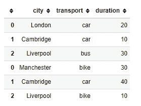
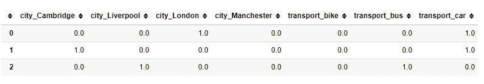
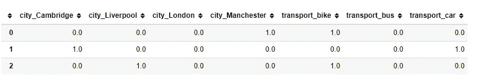
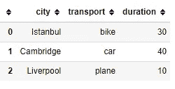
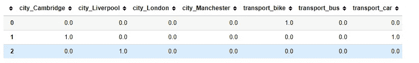

# 对训练集和测试集中的不同项目进行一次性编码

> 原文：<https://medium.com/analytics-vidhya/onehotencoding-with-dissimilar-items-in-train-and-test-set-ffe365f84a4c?source=collection_archive---------10----------------------->


克里斯汀娜·戈塔迪在 [Unsplash](https://unsplash.com?utm_source=medium&utm_medium=referral) 上的照片

假设您在训练集中的某个特征中有 A、B、C 值。令人惊讶的是，你的测试集在那个特性中不包含 A，此外它还有 D。

如果你进入一个包含熊猫的 get_dummies 方法的解决方案，那么，好好享受这个旅程吧。

我更喜欢使用 sklearn 的 OneHotEncoder，借助一些实用函数。这是我的解决方案……(你可以在这里找到笔记本[T5](https://nbviewer.jupyter.org/github/VolkiTheDreamer/PythonRocks/blob/master/OneHotEncoding.ipynb)

## 获取数据

注:我从[这里](https://blog.cambridgespark.com/robust-one-hot-encoding-in-python-3e29bfcec77e)得到的数据模板。

```
import pandas as pd
from sklearn.preprocessing import OneHotEncoder
import mlextension as ml #for the function returning onehot columns#train set
df_train = pd.DataFrame([["London", "car", 20],
                   ["Cambridge", "car", 10], 
                   ["Liverpool", "bus", 30]], 
                  columns=["city", "transport", "duration"])# test set
df_test = pd.DataFrame([["Manchester", "bike", 30], 
                        ["Cambridge", "car", 40], 
                        ["Liverpool", "bike", 10]], 
                       columns=["city", "transport", "duration"])
```

## 一些准备

在我的解决方案中，主要的不同点是**我们得到了整个集合的独特物品**。因为我们可能在训练集和测试集中缺少一个项目，如本例所示。在 train set 中，我们在 city 列中没有曼彻斯特，在 transport 列中没有自行车，而在 test set 中，我们在 city 中没有 London，在 transport 中没有 bus。

```
#which columns to encode
cat_columns = ["city", "transport"]#train+test
whole=pd.concat([df_train,df_test],axis=0)
whole
```



**助手方法**

```
cats=ml.getfullitemsforOHE(whole,cat_columns) #the last parameter is True as defaul, which sorts the items.
#but it doesn't matter whether they are sorted or not,it is just a matter of preference
cats
#[['Cambridge', 'Liverpool', 'London', 'Manchester'], ['bike', 'bus', 'car']]
```

## 编码时间

```
ohe=OneHotEncoder(categories=cats, sparse=False,handle_unknown="ignore")
X_trans=ohe.fit_transform(df_train[cat_columns])#let's presnet them in a dataframe
pd.DataFrame(X_trans,columns=ohe.get_feature_names(cat_columns))
```



```
#let's transform the test set as well, only transform(not fit)
x_test_trans=ohe.transform(df_test[cat_columns])
pd.DataFrame(x_test_trans,columns=ohe.get_feature_names(cat_columns))
```



```
#now, we have a **new dataset** that has values neither train set nor test set has, let's see if any problems crop up
# Istanbul in place of Manchester, plane in place of second bike
df_new = pd.DataFrame([["Istanbul", "bike", 30], 
                        ["Cambridge", "car", 40], 
                        ["Liverpool", "plane", 10]], 
                       columns=["city", "transport", "duration"])
df_new
```



```
#thanks to handle_unknown="ignore" parameter no problems come up. remove that parameter, run again and see the error
x_new_trans=ohe.transform(df_new[cat_columns])
pd.DataFrame(x_new_trans,columns=ohe.get_feature_names(cat_columns))
```



如果你注意到，在第一行，所有的城市都是 0，在最后一行，所有的交通工具都是 0。

仅此而已。感谢阅读。跟我来拿更多的文件。