# 使用 SQL 进行在线业务报告

> 原文：<https://medium.com/analytics-vidhya/online-business-reporting-with-sql-8513514f9a74?source=collection_archive---------10----------------------->

## 从使用 python 创建 CSV 导入管道到使用 PostgreSQL 分析数据。

卢克·切瑟在 [Unsplash](https://unsplash.com?utm_source=medium&utm_medium=referral) 上的照片

作为一名分析师，从大型数据库中提取我们想要的数据是必不可少的，而 SQL 就是实现这一点的工具！

SQL 代表结构化查询语言，它是一种用于创建、删除、更新和从数据库中提取数据的语言。由于大量的数据存储在数据库中，如何从其中提取有用的信息是很重要的。

我想分享如何编写查询来获得电子商务业务的一些重要指标，如 MoM 活跃用户，不同年份的最高销售额。

来自 [Kaggle](https://www.kaggle.com/olistbr/brazilian-ecommerce) 的巴西电子商务数据集拥有巴西多个市场 2016 年至 2018 年的 10 万份订单数据。

但是首先，我需要解决这个问题:将几个 CSV 文件导入到 PostgresSQL。之前我介绍过[一种方式](https://thejasmine.medium.com/how-to-import-csv-file-to-pgadmin-8a662945456e)只使用 PgAdmin 导入 CSV，但是我需要手动创建每个表，这很耗时。

这里是 Python 来玩的！我可以使用“sqlalchemy”工具包，通过运行脚本将 CSV 文件导入我的 PostgreSQL 数据库。这样，它会自动为我创建一个表，并使用 CSV 标题作为列名。你可以在这里学习如何使用[包。](https://www.sqlalchemy.org/)

我用来导入文件的函数。

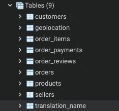

Olist 数据库

现在，我已经创建了一个包含所有数据的数据库。

在开始编写查询之前，理解每个表之间的关系很重要。

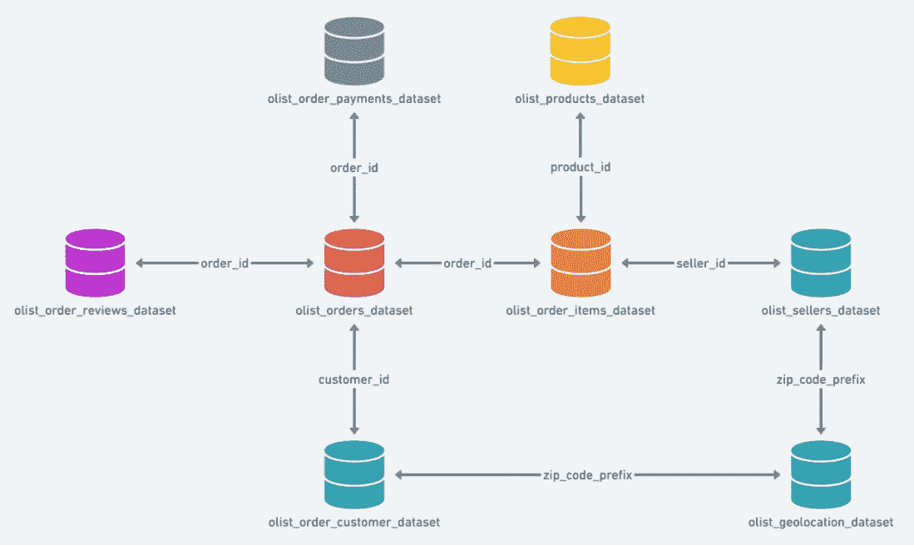

图片来源:Kaggle

在我看来，窗口函数、常用表表达式、提取时间是报表的三个重要技术。窗口函数可以帮助我们执行特定范围的聚合函数，CTE 表可以帮助我们将复杂的查询分解成小块，逐步构建最终结果。

下面的解决方案可能不是最佳的，但是逐步构建一个公共表表达式表是理解逻辑的一种清晰方法。

有 **10 个问题**我有兴趣更多地了解 Olist 的销售业绩及其客户。对于一些问题，我会添加一些注释和一些在编写查询时要记住的要点。

1.  *将产品类别名称更新为英文版本。*
2.  *十大销售产品*
3.  【2016 年、2017 年、2018 年排名前 10 的产品分别是什么？
4.  顾客倾向于在一周的哪一天去购物？
5.  *每个州排名前 3 的产品是什么？*
6.  *2017 年月活跃用户数是多少？MoM 增长率是多少？留存率是多少？*
7.  *最流行的支付方式是什么？*
8.  *不同订单价格范围内有多少订单？*
9.  *评论被回答的平均时间*
10.  *订单金额分布(25%、50%、75%和平均订单金额)*

## 1.将产品类别名称更新为英文版。

有时，您的行可能包含您想要用其他内容替换的值。在这种情况下，我们可以使用' UPDATE '来更新您的表。

*   使用子查询来设置替换英语列的条件。通过使用 where 条件，我可以确保替换相同的产品类别名称。

## 2.十大销售产品

让我们从简单开始！

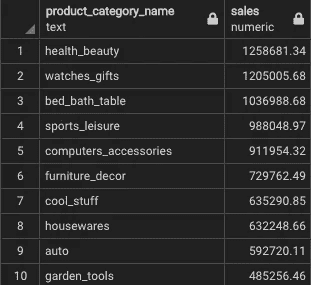

*   执行聚合函数时需要按函数分组！
*   使用`LIMIT`子句选择有限数量的记录。

从结果可以看出，健康 _ 美容类的销量最高！

## 3.2016、2017、2018 年的 10 大产品分别是什么？

显然，仅使用`LIMIT`子句无法获得不同的前 10 名，我只能获得 2016-2018 年的前 10 名。因此，我需要使用一个通用的表表达式来存储临时结果，并使用 window 函数来获得每年的前 10 名！

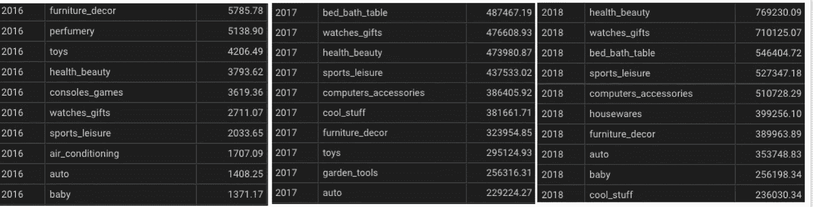

*   首先，按年份获取每个产品的总销售额和分组，并将结果存储在一个临时表中。
*   使用`RANK`子句为每年的销售额创建一个排名列。
*   使用`WHERE`子句将条件设置为排名数字小于等于 10。

2017 健康美妆品类第三，2018 年销量最多。从 2017 年到 2018 年，床和浴室表从排名 1 下降到排名 3。

## 4.顾客倾向于在一周的哪一天去购物？

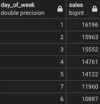

*   使用`EXTRACT`并传递`isodow`参数，该参数将返回星期几。

令人惊讶的是，周一的销售额最多，周六最少。这表明顾客喜欢在工作日购物。

## 5.每个州排名前三的产品是什么？

解决这个问题的方法类似于每年问题的前 10 名产品。这里，为了得到结果，我需要连接 4 个表。回顾连接表的模式总是有用的。

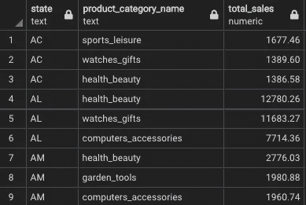

## 6。2017 年的月活跃用户数是多少？MoM 增长率是多少？留存率是多少？

## 每月活跃用户和月环比增长率

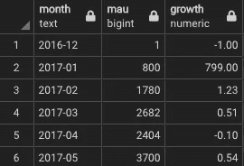

*   `DISTINCT` customer_id 获取每个月的唯一客户计数。
*   `LAG`子句来获取以前的客户计数，以便计算增长率。
*   这里使用最大值是因为我想避免将分母设为 0。由于数据集第一个月的分母为空，这将导致以后计算月环比增长率时出错。

从结果来看，2017 年初活跃用户数增长 800%。

## 客户保持率

留存率是指上个月有多少活跃用户本月还在下单。

*   首先，为每个月获取一个唯一的客户 id。
*   使用 self left join 并使用相同的客户 id 和当月与上月匹配。

## 7.最流行的支付方式是什么？

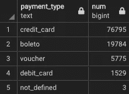

信用卡是这项业务最流行的支付方式。

## 8.不同订单价格范围内有多少订单？

频率表可以将数据放入不同的箱中；它提供了关于频率分布的深刻观点。

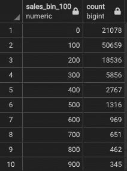

*   使用`ROUND` -2 将销售额舍入到 100，并使用该列对销售箱进行分组。

范围 100–200 的订单数最多。

## 9.回复评论的平均时间

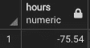

*   `epoch`和`extract`计算回复客户评论的平均时间。

## 10.*订单金额分布(25%、50%、75%和平均订单金额)*

通过了解数据的百分位数，我可以看到数据是正偏还是负偏。

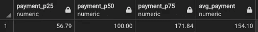

对于订单支付，中位数小于平均值；数据是正偏的，这意味着大多数值都高于平均值。

# 结果

通过问上述问题，我知道:

*   顾客更喜欢用信用卡作为支付方式。
*   顾客倾向于在工作日购物。
*   健康美妆品类是三年内销量第一的产品品类，2018 年第一，2017 年第三。
*   平均一个客户的审核需要两天才能得到答复。
*   更多…

# 外卖食品

使用 SQL 来利用客户数据使我们能够更好地了解业务和客户，从而提高绩效并推动更好的战略。使用 SQL 计算关键指标和获得报告就绪数据，并在 Python 或 Tableau 等商业智能工具中进一步分析数据，使数据分析过程更加高效。

你可以在这里访问完整的项目代码[。](https://github.com/thejasmine/Business_Reporting_SQL)