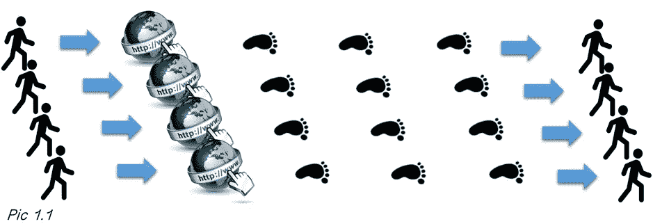
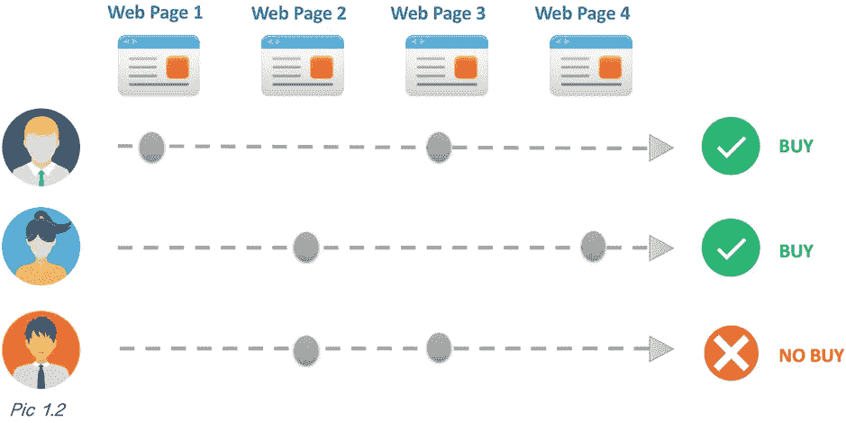
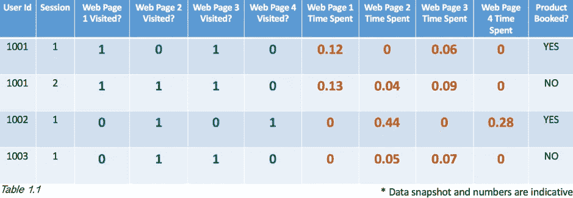
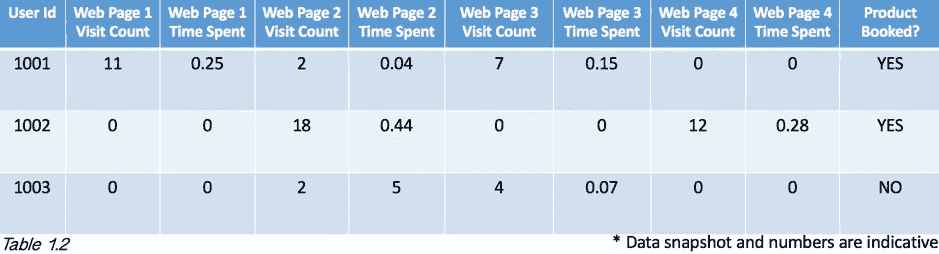
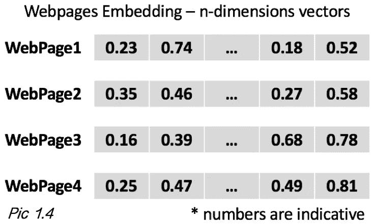
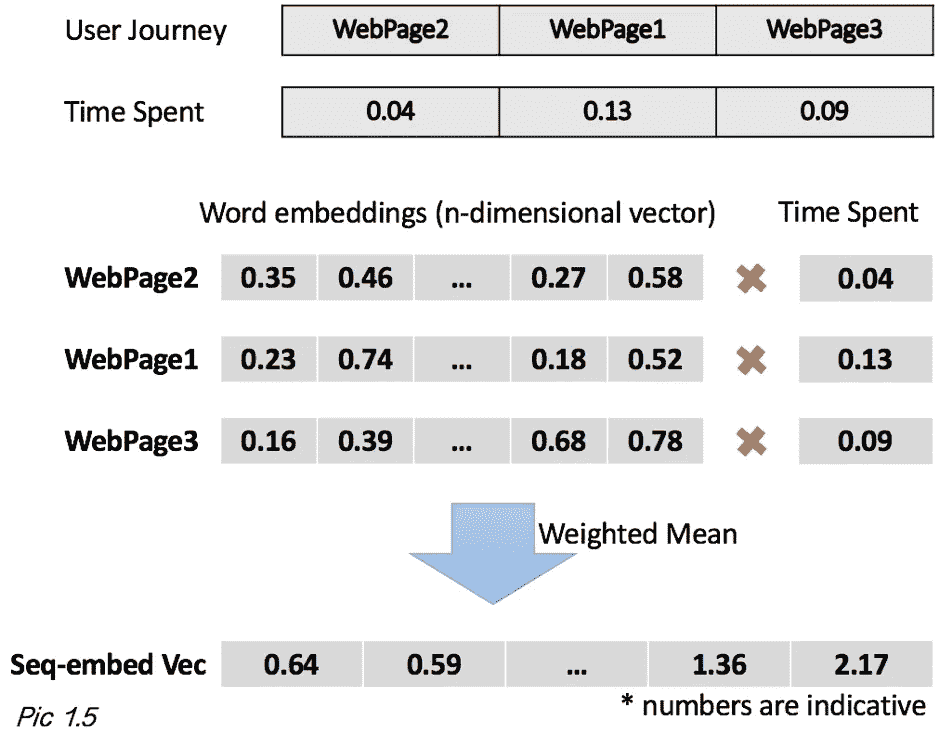
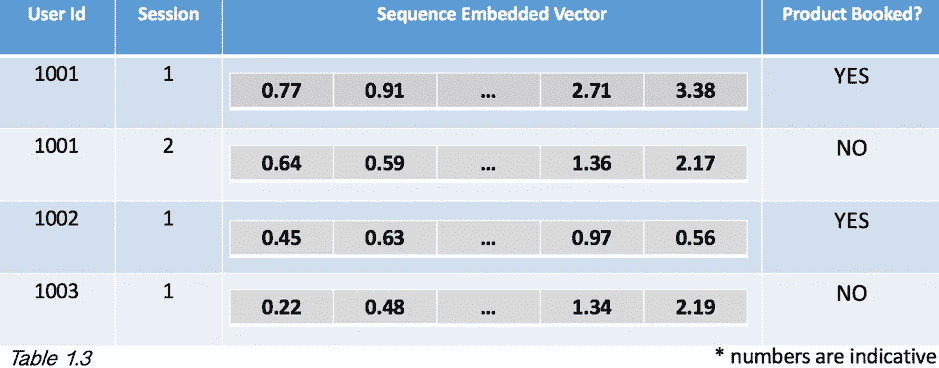

# 基于序列嵌入的在线顾客购买行为分析:案例研究方法

> 原文：<https://medium.com/analytics-vidhya/online-customer-buying-behavior-using-sequence-embedding-a-case-study-approach-f413a9dd348?source=collection_archive---------0----------------------->

## W ***hen 序列嵌入可以产生比常规机器学习算法*** 更好的结果

这篇文章采取了不同于他人的角度；也许只是为了让您更全面地了解这种方法在大多数面向消费者的行业中解决一个非常常见但又非常关键的问题的效用。

## **数字足迹和用户旅程**

根据一份统计报告和预测(参考来自 statista.com)，全球数字买家的数量目前约为 17 亿，到未来三年可能会增加到 21 亿。数百万用户每天都在访问任何一个在线购物网站，同时留下他们的数字足迹。我们如何了解这些消费者的购买行为，或者更具体地说，这些消费者在访问网站时是否会购买任何产品？

用户旅程和转化

## **传统的机器学习方法**

在这个领域已经进行了许多种研究，并且有几十种机器学习算法可用于解决这个典型的分类问题。也许我们可以从定义可以使用已有方法解决的问题开始。从那里，我们可以转移到一个更非正统的方法来解决同样的问题。

在任何购物网站上，每个用户都有着不同于他人的旅程。假设我们有一个消费者数据集，包含数百万条过去的记录，每条记录都显示了个人用户的旅程，如下所示。

消费者数据

在数据示例中，我们可以想象 web 页面(1 到 4 ),如产品规格页面、产品购物车页面、产品交易页面、产品账单页面等。在上表中，我们可以看到第一个用户(id:1001)在会话 1 中只访问了网页 1 和 3 (1:已访问，0:未访问)，而第二个用户(id:1002)访问了网页 2 和 4。此外，我们还有另一种类型的功能，显示在任何网页上花费的总时间。花费的时间单位可以假定为分钟。为了简单起见，这里我们只选取了四个网页和两种类型的特征；在现实世界中，可能有数百个这样的网页和/或特征。但是下划线的概念将保持不变。

> **现在，如果我让你预测一个用户是否会购买，并提供上述数据集来训练你的模型，你会怎么做？**

在你想到的许多方法中，有一种可以将这八个特征直接带入预测模型，并获得用户购买行为的模式。参考上面的表 1.1。

另一种方法可以是获得网页访问计数以及在这些网页上花费的总时间(如果这种数据可用)，然后将这些作为预测模型中的特征。请参考下面的表 1.2。

更详细的消费者数据

正如我所说，解决同一个问题可以有多种方法。但是，如果我们看一下这两个解决方案，我们会发现缺少了一个共同的东西，你也能看到吗？

也许你是对的。**我们没有考虑用户的旅程。与其他用户相比，每个用户都有一个独特的旅程，如果我们能够捕捉到这一点，那么预测模型可能会为我们创造美好的结果。**

> **但是我们如何将用户的旅程带入我们的模型呢？答案是*序列嵌入*。**

## **什么是序列嵌入？**

让我们首先理解单词嵌入，然后我们就可以更容易地进入序列嵌入。单词嵌入是一种基于 NLP 的特征学习技术，用于将单词映射到实数向量。简单地说，单词嵌入给了我们一串意思相似的单词。

理解单词嵌入的有趣方式

因此，似乎任何单词都可以表示为 n 维向量空间中的向量，两个向量之间的距离表示单词之间的相似程度。在图 1.3 中，我们可以看到单词是用二维向量空间表示的，而“微软”和“IBM”之间的距离越小，说明这两个单词都是公司名称。

要深入了解单词嵌入，您可以访问以下链接。

 [## 什么是文本的单词嵌入？

### 词嵌入是一种词的表征类型，它允许具有相似意义的词具有相似的…

machinelearningmastery.com](https://machinelearningmastery.com/what-are-word-embeddings/)  [## 对单词嵌入的直观理解:从计数向量到 Word2Vec

### 在我们开始之前，看看下面的例子。你打开谷歌搜索一篇关于……

www.analyticsvidhya.com](https://www.analyticsvidhya.com/blog/2017/06/word-embeddings-count-word2veec/) 

与其他词一样，我们可以将网页(表 1.1)表示为 n 维向量，如下所示。n 的值可以在不同的环境中变化。您可以使用像 Word2Vec 这样的预先训练好的模型或者您自己的模型来获得单词的嵌入。

当多个单词在一个序列中排列在一起时，我们希望从中获得有意义的上下文，那么我们需要序列嵌入。在我们的例子中，它是一系列网页，定义了一个用户的旅程。为了使其更有意义，我们可以考虑其他属性，如花费时间数据以及这些序列嵌入，如下所示。

在上图中，我们展示了取自表 1.1 的一个用户旅程的序列嵌入。我们可以看到用户可能按顺序访问了网页(网页 2 ->网页 1 ->网页 3)，用户在这些网页上花了一些时间，如上所示。我们可以将嵌入与这些属性相乘，得到一个加权平均值，称为序列嵌入向量。然后，我们可以使用这些向量来了解在我们的网站上访问的客户的购买行为，如下所示。甚至我们可以近乎实时地预测当前访问我们网站的用户的转化率。

特征的新表示

我们还可以对转换最多的向量(产品预订:是)和未转换的向量(产品预订:否)进行聚类分析。

## **结论**

在这篇博客中，我试图为你提供理解顾客购买行为的其他选择，但这不应该被认为是解决类似问题的唯一方法。从我个人的经验来看，我总觉得我们应该意识到解决同一个商业问题的不同方法。它不仅给我们从一种方法到另一种方法的灵活性，以获得更好的结果，而且有时它创造了奇迹。

**参考文献**

1.【https://en.wikipedia.org/wiki/Word_embedding 

2.[https://machine learning mastery . com/use-word-embedding-layers-deep-learning-keras/](https://machinelearningmastery.com/use-word-embedding-layers-deep-learning-keras/)

3.[https://www.youtube.com/watch?v=Nbpz79v2y5Q](https://www.youtube.com/watch?v=Nbpz79v2y5Q)—我们团队关于 Spark 中预测序列嵌入的会议报告

4.[https://www . statista . com/statistics/251666/number-of-digital-buyers-world wide/](https://www.statista.com/statistics/251666/number-of-digital-buyers-worldwide/)