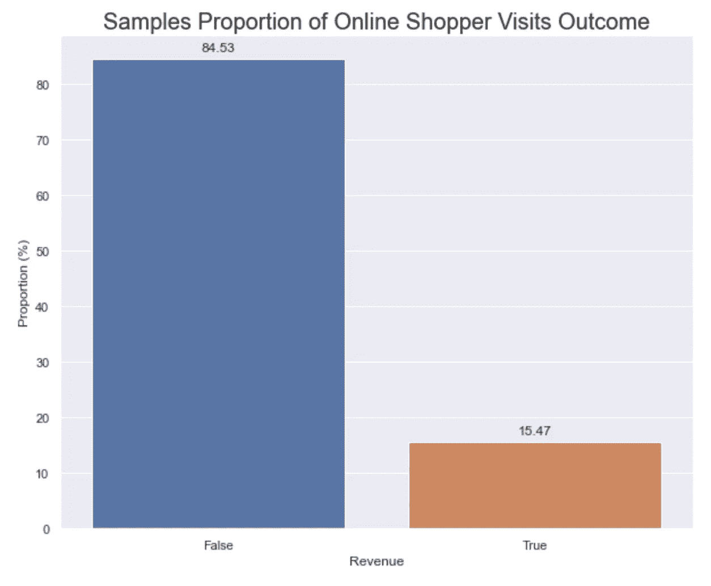
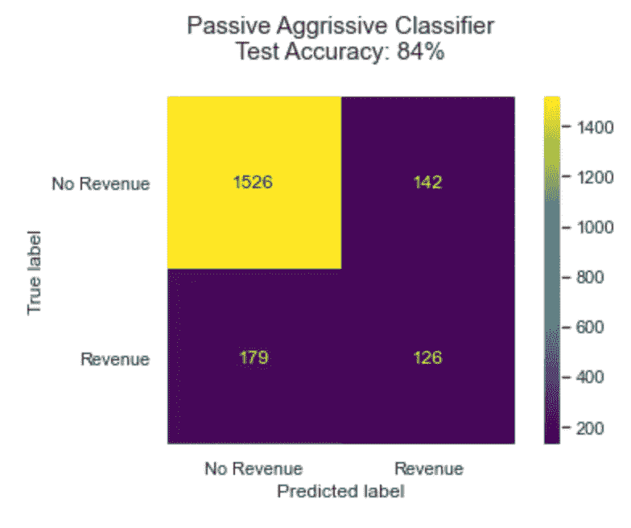
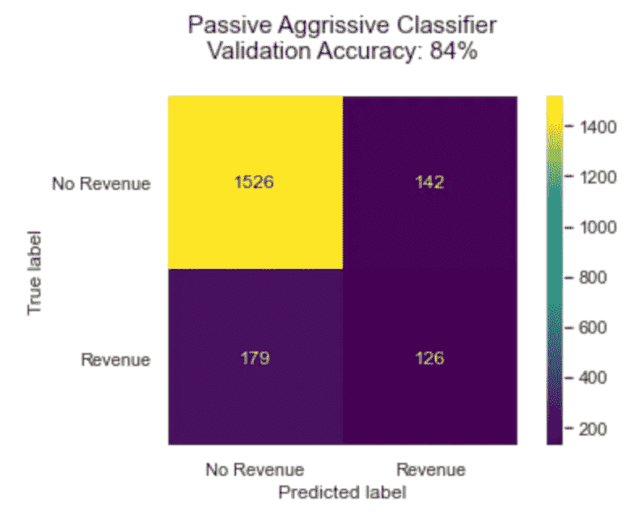
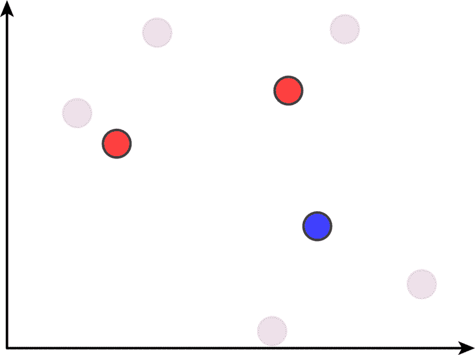
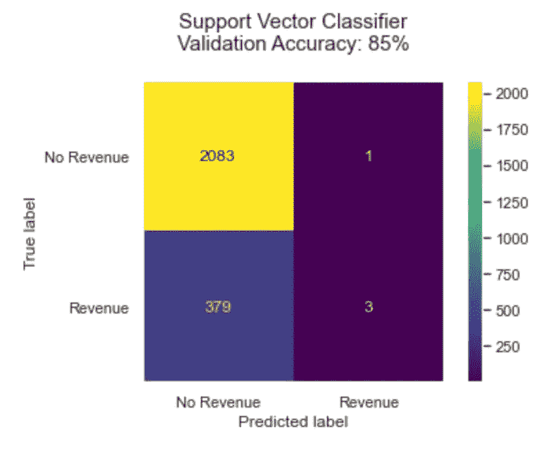
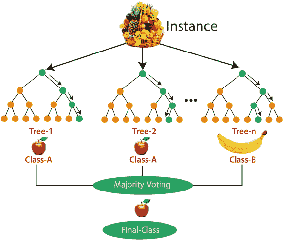
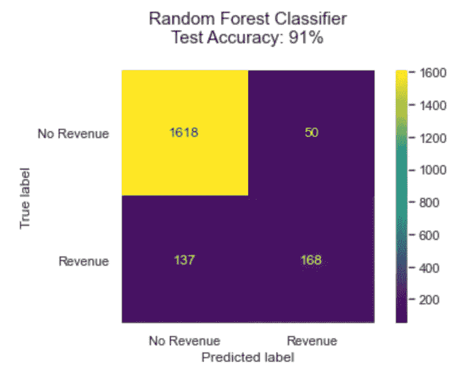
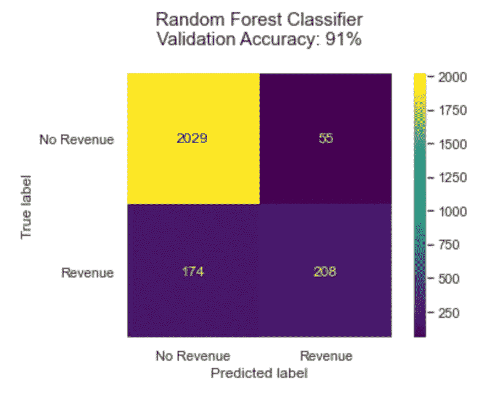

# 网上购物者的购买意愿

> 原文：<https://medium.com/analytics-vidhya/online-shoppers-purchasing-intention-c757e4ff6bbe?source=collection_archive---------9----------------------->

最近网上购物的爆发为商业领域增加了一个新的层面。人们倾向于在网上寻找他们需要的物品，并通过网上交易购买。这让他们的生活变得更加轻松和舒适。与此同时，了解不同类型的在线客户的模式和意图已成为卖家的一大需求。通过分析顾客的历史可以预测顾客的购买意向。对网上购物行为的数据进行分析，建立分类模型来预测他们的购买意向。已经分析了不同的分类模型，例如被动攻击、SVM 和随机森林，以预测访问在线商店的网页的顾客最终是否会购买。结果表明，随机森林的准确度和精确度最高。

数据集由属于 12，330 个会话的特征向量组成。它的形成是为了使每个会话在 1 年内属于不同的用户，以避免任何倾向于特定的活动、特殊的日子、用户配置文件或时期。在数据集中的 12，330 个会话中，85% (10，422)是不以购物结束的负类样本，其余(1908)是以购物结束的正类样本。数据集由 10 个数值属性和 8 个类别属性组成。收入属性将被用作分类标签。

# 被动主动分类器

被动攻击算法是在线学习算法。这种算法对于正确的分类结果保持被动，而在误算、更新和调整的情况下变得主动。与大多数其他算法不同，它不收敛。其目的是进行修正损失的更新，使得权重向量的范数变化很小。被动积极算法非常适合对海量数据流进行分类(例如 Twitter)。它易于实现，速度非常快，但不像支持向量机(SVM)那样提供全局保证。

测试和验证集上的被动积极分类器混淆矩阵

在我们的案例中，被动主动分类器在测试集和验证集上的准确率都达到了 84%。

# 支持向量分类器

支持向量机分类过程

支持向量机(SVMs)是一种监督学习方法，主要用于分类，也适用于某些回归任务。基本的 SVM 算法是一种二元线性分类器，它根据一组带标签的“训练”点将看不见的数据点分为两组，在两个类别之间画出一条线性分界线。

测试集和验证集上的支持向量分类器混淆矩阵

支持向量分类器在测试集和验证集上获得了 85%的准确率，略高于被动积极分类器。

# 随机森林分类器

随机森林分类过程

正如其名字所暗示的，随机森林由大量个体决策树组成，这些决策树作为一个整体运行。随机森林中的每棵树都给出一个类别预测，拥有最多票数的类别成为我们模型的预测。

测试和验证集上的随机森林分类器混淆矩阵

随机森林分类器在测试集和验证集上获得了 91%的准确率，这优于之前的两个模型(被动攻击和支持向量分类器)。

那么，我们将来能做些什么，怎样才能改进呢？我们可能想优化精度，而不是精度。我们可以尝试超参数调整，尽量不要在我们的目标功能(收入)上一直预测错误。此外，我们可以通过查找更多真实案例的实例、上采样真实类和/或下采样多数类(假)来调整训练集中收入类的比例。额外的特征工程可以产生更好的性能。应考虑随机森林的特征重要性。对于对减少树中的杂质没有贡献的特征，我们可以减少它们，这可能使模型更容易预测。

在 GitHub 上查看[源代码](https://github.com/mokainzi/machine_learning/blob/main/final_project/online_shoppers_purchasing_intention.ipynb)！