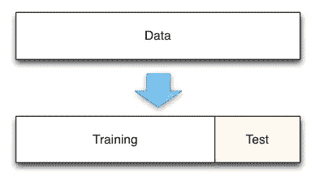
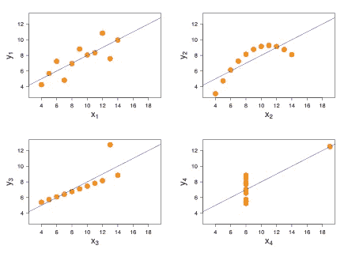
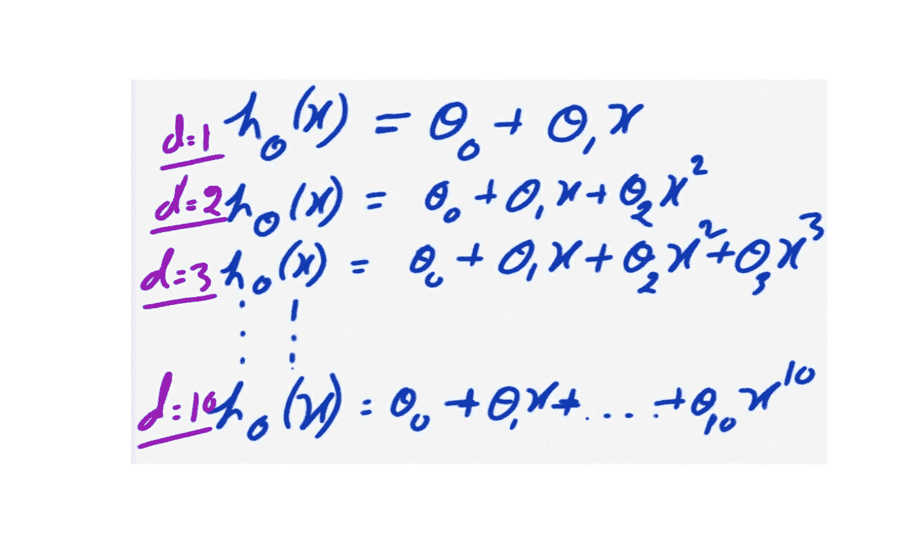
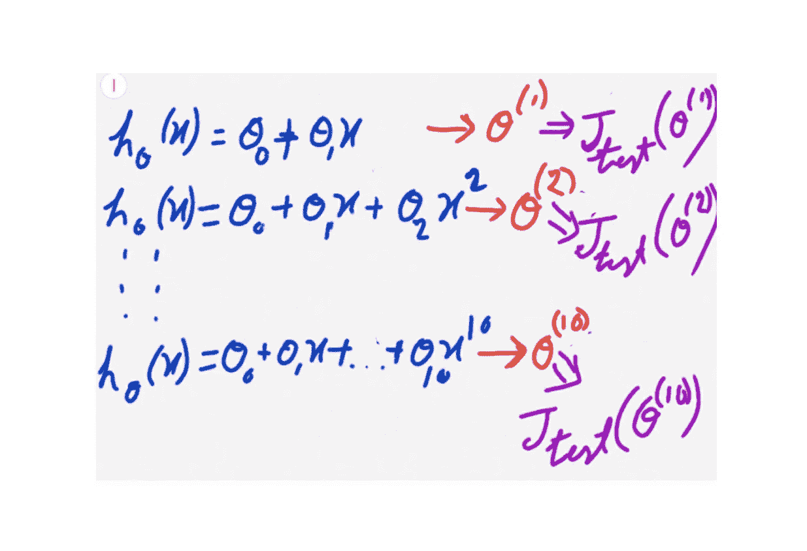
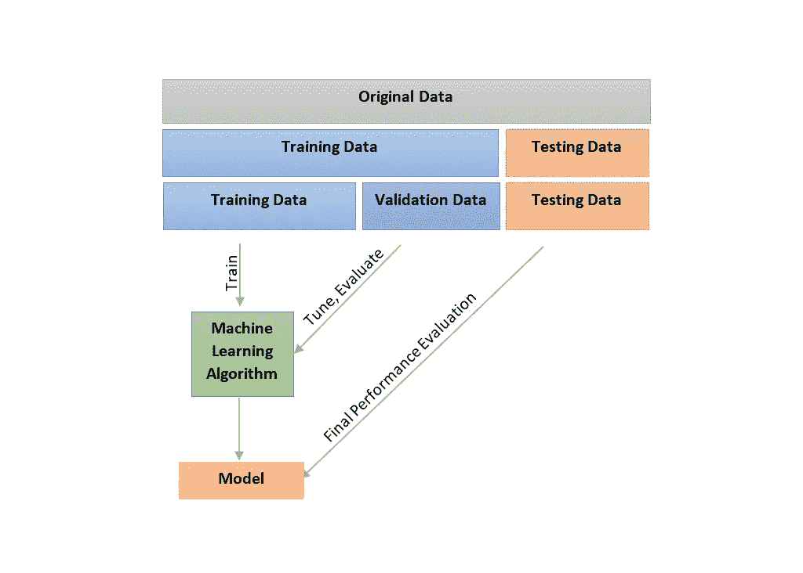
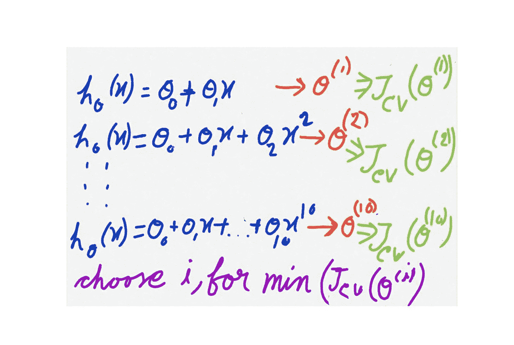
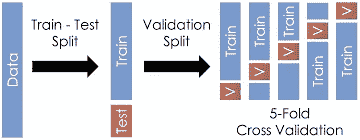

# 为什么只有训练和测试集不足以概括一个 ML 模型？验证集的重要性。

> 原文：<https://medium.com/analytics-vidhya/only-train-and-test-set-is-not-enough-for-generalizing-ml-model-significance-of-validation-set-cf68bb26881a?source=collection_archive---------14----------------------->

为机器学习模型的训练和测试使用相同的数据可以避免我们检测模型是否过度拟合，因为它肯定会表现准确，因为它是在训练时已经看到的东西上进行测试的。因此，我们将训练集和测试集中的数据按 70-30%的比例分开，它们的名称不言自明。

**这就是问题所在。**仅在训练集和测试集中拆分数据并不总是足够的，主要是当我们在某个 ML 算法的各种假设之间周旋时。对于这篇博客，我将考虑线性回归，一种基本的机器学习算法。

如今# **来自 sk learn . linear _ model import linear regression**#在应用机器学习的初学者中如此著名，我们大多数人都没有遇到这样一个事实，即在预定义函数的背后，有一个假设(基本上是一个多项式函数)，必须正确选择它才能实现尽可能高的精度。

为了便于假设，我们假设只有一个特征。然后，最初的方法是使用一次多项式，但由于显而易见的原因，一次多项式将在任何现实生活的数据集上欠拟合。因此，我们将尝试更多的高次多项式，如下所示。

现在，为了从所有这十个假设中选择最好的一个，将在训练集上训练每个假设，并且使用每个假设的训练权重在测试集上计算成本函数。最后，在测试中给出最小成本值的假设将被考虑。

比如说，这里五次多项式的代价函数**‘J’**似乎是最少的一个。所以它被认为是最终的假设，与之相关的θ值是最终的权重。现在，最终模型的 ***【广义】*** 误差必须在测试集上再次计算。

**但是最后的误差怎么能一般化呢？？？**模型之前已经看过测试数据，同时在多个假设之间进行选择。这看起来与我们使用训练数据来训练和测试模型时是一样的。

**验证集的重要性来了。**我们将把整个数据集分成三个片段而不是两个，分别命名为**训练集**，V **验证集**和**测试集**。一般情况下，分流比分别为**60–20–20**。

现在，将在先前解释的过程中应用的小变化是**在多个假设中选择时使用验证集，而不是使用测试集**。

然后选择在验证集上具有最小成本值的假设。**最后，使用测试集计算所选假设的广义误差。**

这一次，在验证集上计算了每个可选假设的初始成本，在选择最终假设后，在测试集上观察到了广义误差。因此，由于该模型从未对任何以前使用的数据进行评估，现在它有望对看不见的数据进行正确预测。

k 倍交叉验证比保留验证有更高级的概念。在之前讨论的验证过程(即保留验证)中，我们永远保留验证集，这将减少大约 20–30%的训练数据。所以在 [**K-fold 交叉验证**](https://towardsdatascience.com/why-and-how-to-cross-validate-a-model-d6424b45261f) 过程中，排除测试数据后剩余的数据集在训练&验证拆分中并不存在强划分。而是计算每个折叠的验证平均值，这导致模型偏差较小。

非常感谢你的阅读。如果有任何更正/建议，请告诉我。请吧👏如果你喜欢邮报。提前感谢…