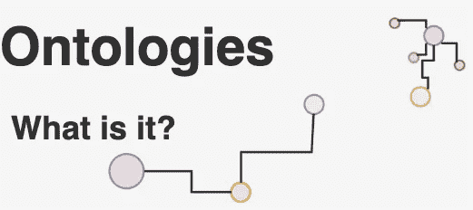
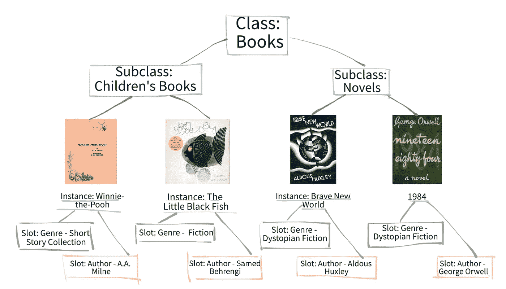
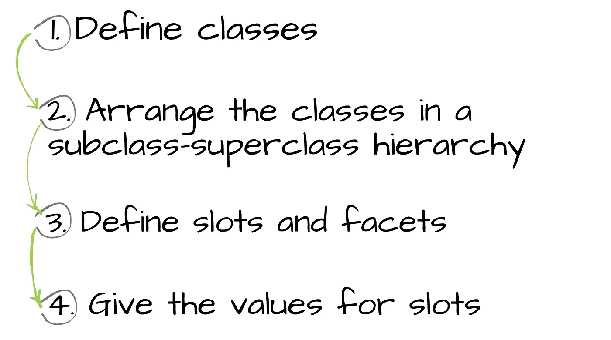

# 本体论:概述

> 原文：<https://medium.com/analytics-vidhya/ontologies-an-overview-b23ccc7e976?source=collection_archive---------5----------------------->

## 什么是本体？

在我之前的帖子中，我们对[本体](/analytics-vidhya/protégé-d533f024087b?source=friends_link&sk=3d01041de62641a30773999abd740e65)做了一个简单的介绍，并且主要谈到了一个编辑器来检查一个现有的本体以查看大图。在这篇文章中，我们将深入本体的细节，并理解我们为什么使用以及如何使用它们。

## 什么是本体？

本体是一组概念，包括概念和它们之间关系的明确的形式规范。本体的开发主要由领域专家完成，随着万维网的发展，本体的使用变得更加普遍。

[万维网联盟](https://www.w3.org/) (W3C)，这是一个开发开放[标准](https://www.w3.org/TR/)以确保网络长期增长的国际社区，已经开发了[资源描述框架](https://en.wikipedia.org/wiki/Resource_Description_Framework) (RDF)。RDF 是一种用于对网页上的知识进行编码的语言，目的是使其能够被机器理解。另一方面，W3C 和[国防高级研究计划局](https://www.darpa.mil/) (DARPA)开发了 [DARPA 代理标记语言](http://DARPA Agent Markup Language (DAML)) (DAML)。DAML 是一种基于 RDF 的代理标记语言，旨在促进 Web 上的代理交互。随着这些语言的使用，许多学科现在能够开发标准化的本体，用于共享和注释它们领域中的信息。

## 为什么我们需要本体论？

一个本体定义了一个特定领域的公共词汇，包括机器可解释的概念定义以及它们之间的关系。本体首先被定义为领域中术语的*明确的形式规范以及它们之间的关系* (Gruber 1993)，更具体地说，*是共享概念化的*明确的形式规范(Studer et al. 1998)。那么，为什么我们需要发展一个本体论呢？以下是一些原因:

*   *在人或软件代理之间共享对信息结构的共同理解*(木森 1992；格鲁伯 1993)。例如，几个网站可能提供类似的服务，如果这些网站使用共同的本体，那么计算机代理可以从这些网站提取和聚集信息，以便回答用户的查询。
*   实现领域知识的重用。假设需要开发一个大的本体，人们应该简单地为大领域的相应部分集成现有的小本体。
*   *分析领域知识。当试图重用现有的本体并扩展它们时，术语的形式分析是非常有价值的(麦克吉尼斯等人，2000)。*

因此，开发一个本体并不是真正的目标。实际的目标是定义一组数据及其背后的结构，以便其他程序可以使用这些数据。

## 一个本体是什么样子的？

正如我们之前所说的，本体是属于基于**类/概念**的论域的概念的正式明确描述。一个类可以有**个子类**，在这些子类中可以表示更多的概念。

一个类有**个槽/角色/属性**描述各种特性和属性。

插槽可能有被称为**方面/角色限制的限制。**

下图显示了一个示例层次结构。超类 *Books* 有两个截然不同的子类，分别是*童书*和*小说。也有这些子类的实例，比如小黑鱼和美丽新世界。*而且，每个实例都有两个不同的槽；*体裁*和*作者。*显然，槽点的限制是；它们必须是字符串，并且每个槽最多只能有一个值。

Books 类的层次结构示例。

当一组单独的类实例集合在一起时，一个知识库就创建了。要开发一个本体，我们需要:

应该注意，本体实际上是一个图。因此，本体的组件之间可能有多向关系。例如，类之间可能有各种类型的关系，比如*是*的一部分或者*是*的一部分。或者，一个类可能有几个父类。关于图的更多信息，可以参考我之前的帖子；[图表介绍](/analytics-vidhya/introduction-to-graphs-44c4356212c7)。

## 总而言之…

在这篇文章中，我们描述了什么是本体以及如何使用它们。现在，你可以对一个本体进行更详细的检查，或者你可以开始在 Protegé上创建一个你自己的本体。

## 参考

*   RDF-Brickley 和 Guha，1999 年
*   DAML —亨德勒和麦克吉尼斯 2000
*   本体开发 101:[protege.stanford.edu](https://protege.stanford.edu/publications/ontology_development/ontology101-noy-mcguinness.html)
*   格鲁伯(1993 年)。一种可移植本体规范的翻译方法。*知识获取***5**:199–220。
*   诺伊和麦克吉尼斯博士(2001)。本体开发 101:创建第一个本体的指南。技术报告，KSL，2005 年 1 月，斯坦福知识系统实验室。可从[https://protege . Stanford . edu/publications/ontology _ development/ontology 101 . pdf](https://protege.stanford.edu/publications/ontology_development/ontology101.pdf)获取。
*   斯图德、本杰明和芬塞尔(1998 年)。知识工程:原理与方法。*数据&知识工程*，25(1–2):161–198。
*   使用 [Sketch.io](https://sketch.io/) 创建图纸。