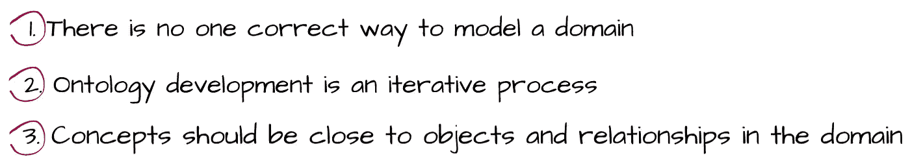

# 本体论:详细地

> 原文：<https://medium.com/analytics-vidhya/ontologies-in-detail-2916f9226133?source=collection_archive---------1----------------------->

## 如何开发一个本体？

在之前的帖子中，我们对本体做了一个概述，并讨论了如何[使用](/analytics-vidhya/ontologies-an-overview-b23ccc7e976?source=friends_link&sk=b816f2f444986e134923fd658d34da9c)和[可视化](/analytics-vidhya/protégé-d533f024087b?source=friends_link&sk=3d01041de62641a30773999abd740e65)它们。在这篇文章中，我们将看到如何设计一个的细节。

在 Protegé和 Chimaera 这样的环境中，有很多开发本体的方法。使用这些环境使我们免于用像 [UML](https://en.wikipedia.org/wiki/Unified_Modeling_Language) 和 [OWL](https://en.wikipedia.org/wiki/Web_Ontology_Language) 这样的语言实现。一旦我们有了本体的模型，我们就可以很容易地创建它。

## 简单的方法

没有一种正确的开发本体的方法。这里我们将看到一个迭代的方法:我们首先创建一个本体，然后我们修改和提炼本体。在这样做的时候，我们需要做出设计决策，以及解决方案的利弊。我们还应该提到创建本体的基本原则:

也就是说，我们需要决定我们的本体的目标，以及在对其建模时，本体将有多详细或多一般。此外，应记住现实的概念，即我们试图在本体中反映现实世界的概念，因此我们可以评估在应用程序中使用它。

## 显色法

下图显示了我们作为示例创建的一个*图书*层次结构。超类 *Books* 有两个截然不同的子类，分别是*童书*和*小说。也有这些子类的实例，比如小黑鱼和美丽新世界。*

书籍的层次结构示例

我们来看看如何开发一个图书本体。我们可以将本体开发过程分成 7 个步骤:

建议通过定义本体的**域**和**范围**来开始本体开发过程。例如，如果您的本体将用于自然语言处理领域，您可能需要在您的本体中包含概念的词性信息。对于图书本体，我们需要问“*我们要为了什么目的使用图书本体？*”然后执行进一步的开发。

除此之外，确定你的本体的范围的一个可能的方法是列出你的本体应该能够回答的问题。这些问题被称为**(Gruninger and Fox 1995)。比如，对于书的本体，我们应该可以回答“*1984 是小说还是童书*的问题？”**

****

**应该始终考虑改进和扩展先前开发的可能对我们的任务有帮助的资源。使用本体开发环境很容易导入现有的本体。有几个可重复使用的本体库，如 [DAML 本体](http://www.daml.org/ontologies/)和[本体语言本体](http://www.ksl.stanford.edu/software/ontolingua/)库。**

****

**建议创建一个我们希望向用户解释的所有术语的列表。例如，不同类型的书籍，如小说和诗歌，内容，作者，等等。**

****

**开发一个类的层次结构有几种可能的方法(Uschold 和 Gruninger 1996 ),如自顶向下、自底向上和组合。**

*   **在自顶向下的开发过程中，首先定义一般概念，然后定义后续的专门化。例如，我们可以从图书类开始，然后我们用小说和儿童图书类来专门化图书类。**
*   **在自底向上的开发过程中，首先定义特定的类，然后我们将这些类分组为更一般的概念。就像在图书本体中一样，我们首先为图书 1984 和新颖的《美丽新世界》定义一个类，然后为这两个类创建一个超类，即 Book。**
*   **在组合开发过程中，首先定义更突出的概念，然后我们对它们进行概括和专门化。**

****

**一旦我们定义了类，我们还必须描述内部结构，即这些类中概念的属性。一个对象属性成为这个类的一个槽。例如，图书本体有*流派*和*作者*槽。**

****

**允许有不同的方面来描述一个槽的值类型。例如，“*反乌托邦小说*”类型是一个字符串。以下是一些方面:**

*   ***槽基数*定义了一个槽可以有多少个值。**
*   ***Slot-value type* 描述了什么类型的值可以填充 Slot，比如字符串、数字、布尔、枚举和实例。**
*   **插槽的*域*是描述插槽的属性。**
*   **插槽的*范围*是该插槽允许的类型实例的类。**

****

**开发本体的最后一步是在层次结构中创建类的单个实例。要做到这一点，你需要:**

1.  **选择课程**
2.  **创建单个实例**
3.  **填充插槽**

## **总而言之…**

**在这篇文章中，我们描述了一个简单的本体开发方法，并列出了本体开发过程中的步骤。然而，不要忘记没有一个正确的方法来创建一个单一的本体。重要的是本体开发是一个不断发展的过程，我们只能通过在应用程序中使用它来评估它的质量。**

## **参考**

*   **DAML —亨德勒和麦克吉尼斯 2000**
*   **本体开发 101:[protege.stanford.edu](https://protege.stanford.edu/publications/ontology_development/ontology101-noy-mcguinness.html)**
*   **Bermejo J. (2007 年)。创建本体的简化指南。技术报告 R-2007–004。马德里大学自治系统实验室。**
*   **Horridge M .，Knublauch H .，Rector A .，Stevens R .，Wroe C. (2004)使用 Protégé-OWL 插件和 COODE Tools 版构建 OWL 本体的实用指南，曼彻斯特大学斯坦福大学。**
*   **诺伊·n .、麦克吉尼斯·d .，(2001)本体发展 101:创建你的第一个本体的指南。**
*   **乌斯霍尔德博士和格鲁宁格博士(1996 年)。本体论:原理、方法和应用。知识工程。评论，11，2，第 93-155 页。**
*   **使用[草图创建图纸。](https://sketch.io/)**