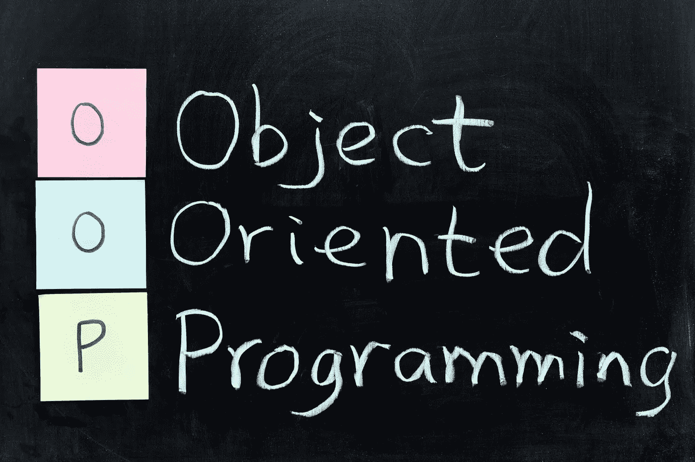

# Python 的 OOP 基础

> 原文：<https://medium.com/analytics-vidhya/oop-basics-with-python-ec4f0abe0500?source=collection_archive---------38----------------------->



## 类别和实例属性

由于 Python 是一门优秀的面向对象编程语言，所以迫切需要了解 OOP 的概念，掌握一些其中的基础知识作为入门。

# 让我们回答什么？为什么呢？

## **什么是 OOP？**

> 面向对象编程(OOP)是一种基于“对象”概念的编程范式，它可以包含字段形式的数据(通常称为属性或特性)和过程形式的代码(通常称为方法)
> 
> -维基百科

## 为什么要学习 OOP？

众所周知，在软件扩展和维护复杂性方面，使用您定义的对象更加有效和简单。在这种背景下，Python 的 OOP 概念应运而生，它专注于创建可重用的代码；一个又叫干的概念(代表不要重复自己)。

# ABC 的

## **一类:**

简单地说，一个类就是一种类型，它包含了从这个类中创建的所有对象的属性。

## **一个物体:**

一个存在的具有行为的实体，例如一个对象是一个 Iphone，它有它的颜色和价格，同时它能够执行一些任务，如打电话或玩游戏。

让我们用面向对象的术语来说，这个例子中的类是 phone。这里的对象 Iphone 是类 phone 的一个 ***实例*** 。这个实例有特殊的数据或者也叫 ***属性*** (颜色、大小、价格…)，行为也叫方法(打电话、玩游戏、录音…)。

## **类属性:**

属于整个类的变量；同一个类中的对象共享这个属性，因此必须在构造函数之外定义它(__init__(self，..)..).

## **实例属性:**

与 class 属性不同，它是属于单个对象的变量，因此必须在构造函数内部定义。

## 类别和实例属性之间的差异:

与类属性不同，实例属性如果被改变，只会影响实例本身，而不会影响整个类，同时第一个属性会导致修改同一个类中的所有实例。

## 创建它们的方法以及 Pythonic 的实现方式是什么:

下面是一个非 Pythonic 方式的例子:

```
class Employee:def __init__(self, first, last):
        self.first = first
        self.last = last
        self.self.email = first + '.' + last + '[@email](http://twitter.com/email).com'emp_1 = Employee('Jim', 'Carry')
print(emp_1.first)
print(emp_1.email)
emp_1 = 'Jimmy'
print(emp_1.first)
print(emp_1.email)
```

这段代码中的问题是，如果我们碰巧想要修改名字属性，修改将不会影响电子邮件属性，因此我们将得到一个错误的输出:

```
Jim
Jim.Carry@email.com
Jimmy
Jim.Carry@email.com
```

这里我们陈述了使用属性装饰器的 Pythonic 方式的干预，setter 方法将代码附加到属性，以便用新的修改来保持它的更新，ti 看起来如下:

```
class Employee:def __init__(self, first, last):
        self.first = first
        self.last = last
        self.email = first + '.' + last + '[@email](http://twitter.com/email).com'[@property](http://twitter.com/property)
    def email(self):
        return self.email@email.setter
    def email(self):
        self.email = self.first + '.[' +  self.last + '@email](http://twitter.com/email).com'emp_1 = Employee('Jim', 'Carry')print(emp_1.first)
print(emp_1.email)
emp_1.first = "Jimmy"
print(emp_1.email)
```

这将给出以下正确的输出:

```
Jim
[Jim.Carry@email.com](mailto:Jim.Carry@email.com)
Jimmy
[Jimmy.Carry@email.com](mailto:Jim.Carry@email.com)
```

## Python 如何使用 __dict__ 处理对象和类属性:

Python 中的 Dictionary 是数据值的无序集合，用于像 map 一样存储数据值，这与其他只保存单个值作为元素的数据类型不同。每个实例都存储在具有一个或多个属性的字典中。