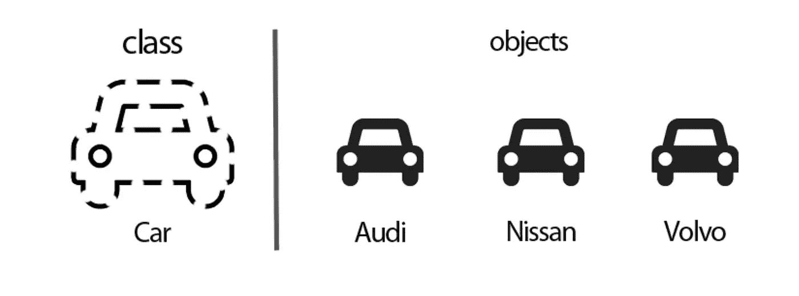
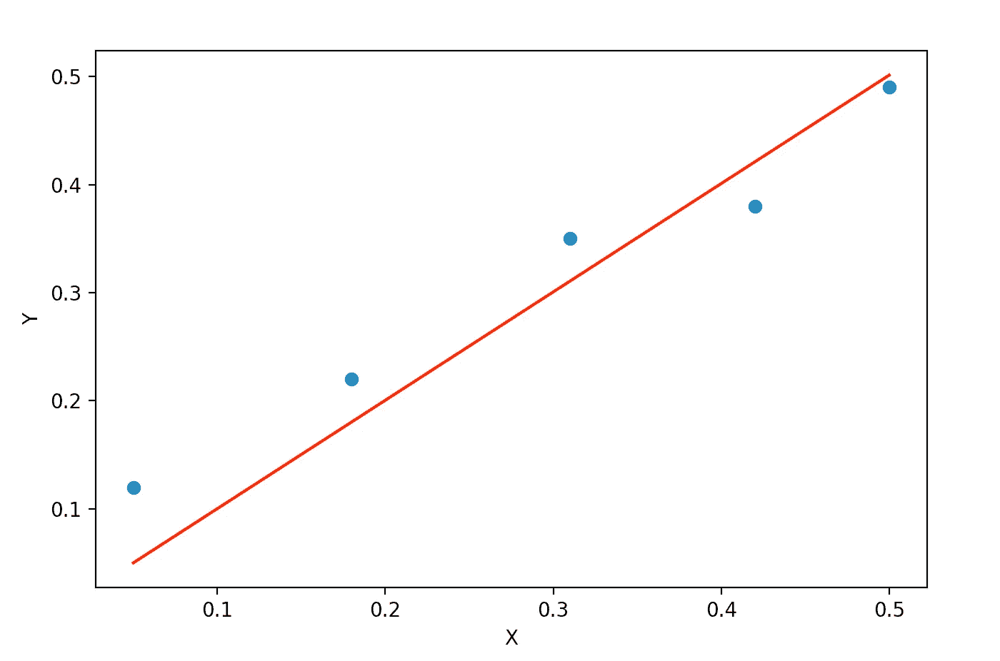

# OOP +机器学习=强大

> 原文：<https://medium.com/analytics-vidhya/oop-machinelearning-powerful-a9b936a8db48?source=collection_archive---------9----------------------->



[图像](https://javatutorial.net/java-oop)

成为一名数据科学家并不容易，有时还会让人精疲力尽。这个领域有如此多的方面，对它们中的每一个都进行标记可能是乏味的。对于刚开始接触数据科学、python 编程或机器学习概念的人，尤其是那些没有编程背景的人，事情可能会困难得多。

当我开始的时候，甚至现在在某种程度上，我还在为 OOP(面向对象编程)概念而挣扎。它的有用性和有效性让我很想学习它，但我总是想要一些有趣的例子来掌握一个概念。这正是我在这里的意图。我不得不尝试用一个简单的线性回归的例子来演示 OOP 的核心概念。所以让我们开始吧:

让我们先试着得到一个数据集和一些预测:

```
**from** numpy **import** array
**from** numpy.linalg **import** inv
**import** matplotlib.pyplot **as** plt
data = array([
   [0.05, 0.12],
   [0.18, 0.22],
   [0.31, 0.35],
   [0.42, 0.38],
   [0.5, 0.49],
   ])
#separate out X and y and reshape
X = data[:,0]
y = data[:,-1]
X = X.reshape(-1,1)
y = y.reshape(-1,1)#let's try to calculate coef using linear algebra, to predict the y #which is = coef*X (not including the intercept at this moment)coef_ = inv(X.T.dot(X)).dot(X.T).dot(y)
yhat = X.dot(coef_)#Finally let's plot the dataplt.scatter(X, y)
plt.plot(X, yhat, color=**'red'**)
plt.xlabel(**'X'**)
plt.ylabel(**'Y'**)
plt.show()
```

上面的代码导致了下面的情节:



其中散点图表示实际数据，直线表示预测值

添加这个简单的线性回归实现的全部意义在于，现在我将通过上面的线性回归实现来探索 OOP 概念。

让我们从创建我们的线性回归类开始，我们将从头开始编写:

```
**import** numpy **as** np
**from** numpy **import** array
**from** numpy.linalg **import** inv
**import** matplotlib.pyplot **as** plt**class** LinearRegression():
    **def** __init__(self):
       '''initializes the variables coef and pred'''
        self.coef = **None** self.pred = **None

    def** fit(self,X,y):
        '''calculate the coef ''
        self.X = X
        self.y = y
        **if** len((self.X).shape) == 1:
            self.X = (self.X).reshape(-1, 1)

       self.coef=inv(self.X.T.dot(self.X)).dot(self.X.T).dot(self.y)

    **def** predict(self):
        '''predict the y values using the coef calculated above'''
        **if** len((self.X).shape) == 1:
            self.X = (self.X).reshape(-1, 1)

        self.pred=  self.X.dot(self.coef)
        **return** self.pred

    **def** plt_prediction(self):
        '''generates some plot'''
        plt.scatter(self.X, self.y)
        plt.plot(self.X, self.pred, color  = **"red"**)
        plt.show()
```

**__init__** :默认的构造函数，当我们试图创建 LinearRegression 类的实例时，这个函数就会被调用。在这种情况下，它将初始化两个占位符: **coef** 和 **pred** ，稍后当我们调用 fit 方法和 predict 方法时，它们将具有值。

**fit(X，y)** :这是一个使用 X 和 y 值计算 **coef** 的实际工作的方法。

**predict()** :该方法在被调用时，预测值，并将它们存储在之前初始化的 **pred** 变量中。

**plt_predict()** :最后，该方法生成如上图所示的相同图形。

现在有趣的部分，让我们做一个例子，看看神奇之处:

```
mylinearreg = LinearRegression()

mylinearreg.fit(X,y)
print(mylinearreg.predict())**output**:[0.05011661 0.18041981 0.310723   0.42097955 0.50116613]
```

现在，让我们创建一个基类，我的 LinearRegression 将从这个基类派生。我能把我的基类做成什么？？？一门叫做度量的课。？？我们确实需要评估我们的模型，对吗？？？？让我们这样做:

```
**class** Metrics:

    **def** sse(self):
        squared_errors = (self.y - self.pred) ** 2
        self.sq_error_ = np.sum(squared_errors)
        **return** self.sq_error_

    **def** sst(self):
        *'''returns total sum of squared errors (actual vs avg(actual))'''* avg_y = np.mean(self.y)
        squared_errors = (self.y - avg_y) ** 2
        self.sst_ = np.sum(squared_errors)
        **return** self.sst_

    **def** r_squared(self):
        *'''returns calculated value of r^2'''* self.r_sq_ = 1 - self.sse() / self.sst()
        **return** self.r_sq_

**class** LinearRegression(Metrics):
    **def** __init__(self):
        self.coef = **None** self.pred = **None

    def** fit(self,X,y):
        self.X = X
        self.y = y
        **if** len((self.X).shape) == 1:
            self.X = (self.X).reshape(-1, 1)

        self.coef = inv(self.X.T.dot(self.X)).dot(self.X.T).dot(self.y)

    **def** predict(self):
        **if** len((self.X).shape) == 1:
            self.X = (self.X).reshape(-1, 1)

        self.pred=  self.X.dot(self.coef)
        **return** self.pred

    **def** plt_prediction(self):
        plt.scatter(self.X, self.y)
        plt.plot(self.X, self.pred, color  = **"red"**)
        plt.show()
```

这里有几点需要注意:

1.  我的基类(“Metrics”)没有 __init__ 方法，因为当我创建 LinearRegression 的实例时，它将自动获取基类(“Metrics”)中定义的所有方法，并且基类现在将使用派生类(“LinearRegression”)的 __init__ 方法。

2.当我调用基类中的方法时，它会自动从派生类中获取变量。

让我们现在打几个电话:

```
mylinearreg = LinearRegression()

mylinearreg.fit(X,y)
print(mylinearreg.predict())
print(**"The sse is: "** , mylinearreg.r_squared())**output:** The sse is:  0.8820779000238227
```

这不是很有趣吗？现在，我们可以在 metrics 类中添加我们的定制度量，并通过创建单独的类并使它们都从基类继承来将它们用于其他模型，而不仅仅是线性回归。:)

请随意使用更大的数据集和更复杂的方法进行尝试，例如添加一个处理梯度下降的方法。

最后，感谢你阅读这篇文章，如果你喜欢它，请留下评论或反馈。:)

*参考文献*:

[](https://dziganto.github.io/classes/data%20science/linear%20regression/machine%20learning/object-oriented%20programming/python/Understanding-Object-Oriented-Programming-Through-Machine-Learning/) [## 通过机器学习理解面向对象编程

### 面向对象编程(OOP)并不容易理解。你可以一个接一个的看教程，筛选…

dziganto.github.io](https://dziganto.github.io/classes/data%20science/linear%20regression/machine%20learning/object-oriented%20programming/python/Understanding-Object-Oriented-Programming-Through-Machine-Learning/) 

[*https://machine learning mastery . com/solve-linear-regression-using-linear-代数/*](https://machinelearningmastery.com/solve-linear-regression-using-linear-algebra/)