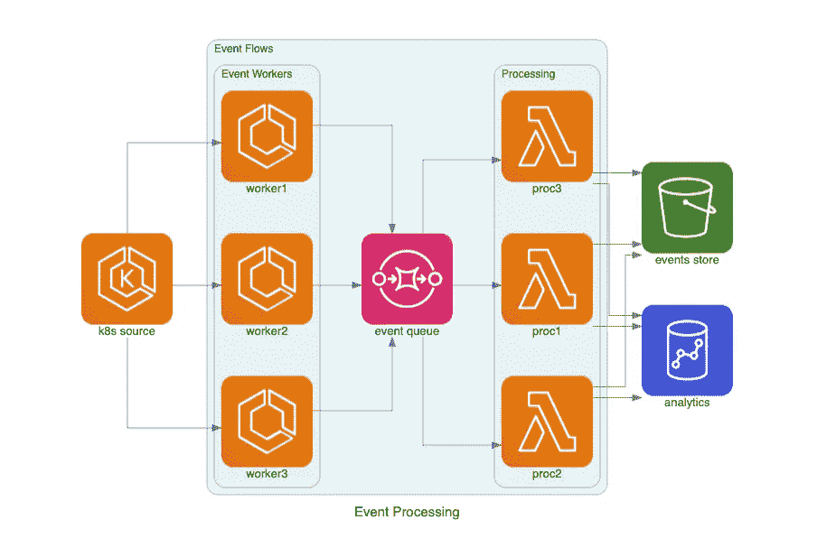

# 开源展示:图表

> 原文：<https://medium.com/analytics-vidhya/open-source-showcase-diagrams-8cc5a5edb656?source=collection_archive---------16----------------------->

以编程方式构建解决方案架构图！

斯文·米克在 [Unsplash](https://unsplash.com?utm_source=medium&utm_medium=referral) 上的照片

# TL；速度三角形定位法(dead reckoning)

*   解决方案架构图非常有用，是软件工程的重要组成部分。然而，画它们很糟糕。
*   [Diagrams](https://github.com/mingrammer/diagrams) 提供了一个 Python SDK 来编程声明和编译这些解决方案架构图。
*   与 AWS、GCP、Azure 和其他一些开源工具和技术一起工作。

# 介绍

每个软件工程师项目的一个重要部分是[解决方案架构](https://en.wikipedia.org/wiki/Solution_architecture) (SA)图。它们不仅是代码的高效、简洁和抽象的表示，也是与非技术观众交流技术概念的一种简单方式。几乎我着手的每个项目都是从设计和绘制解决方案架构图开始的。

正如你可能在我的其他文章中看到的，我是敏捷开发运动的忠实拥护者。我相信与瀑布过程相比，它总体上提供了更好的解决方案。这些 SA 图经常成为真正敏捷的阻碍因素。体系结构中的基本变化——开发过程中该点的潜在微小变化——使图表变得无用，迫使工程师或项目经理手动进行这些变化以保持文档的相关性。插入或替换体系结构的某些部分可能会对精心安排的图表产生连锁的不利影响，这意味着必须重新安排大部分内容，以便为新组件腾出空间。

你可以看到老派的编制解决方案架构图的方式完全跟不上我们目前在行业中看到的软件的快速变化。一些敏捷极端主义者宣称，无文档化运动是行业的正确方向，但是如果“把婴儿和洗澡水一起倒掉”,失去一个与团队成员和非技术利益相关者交流我们的解决方案的非常有价值的工具，那将是一种耻辱。这就引出了一个问题:

如果您能在一个解决方案架构图中获得所有的灵活性、可重用性和源代码的抽象，那不是很好吗？

幸运的是，已经有人提出并解决了这个问题！

介绍开源软件包 D [图](https://github.com/mingrammer/diagrams)。通过图表，您可以使用 Python SDK 以编程方式定义您的解决方案架构。它与所有 AWS、Azure 和 GCP 服务以及一些其他流行的开源工具(如 RabbitMQ、Terraform、Airflow 等)一起开箱即用。)来构建您的图表。漂亮的 API 让脚本看起来像伪代码，这些图表可以编译成你喜欢的格式:`.png`、`.jpg`、`.svg`或`.pdf`。

# 源代码示例

图表文档中提供的例子做得很好，很容易理解。与其重新发明轮子，我复制了下面的例子。

## 示例# 1—AWS 上的简单后端 Web 服务器

单个负载平衡器后面的一组 AWS 工作线程的简单示意图。

运行此代码时，将生成下图。

原始代码和图像可以在这里找到[。](https://diagrams.mingrammer.com/docs/getting-started/examples#grouped-workers-on-aws)

## 示例 AWS 中的事件处理架构

这段代码生成的结果图如下所示。

查看原文[此处](https://diagrams.mingrammer.com/docs/getting-started/examples#event-processing-on-aws)。

## 示例 3——GCP 的信息收集系统

生成的图表如下所示。

# 强项

## 惊人的开发者体验

仅从这些例子中，你几乎可以完全理解如何编译你自己的图。我想，即使是非技术项目经理也可以毫不费力地对这些源代码进行小的调整。这个惊人的 API 使得构建图看起来和感觉起来都像伪代码。

## 现成的图标

我最初期望我需要为我的图下载、安装和引用所有的节点图标。当我发现这些都被打包在源代码中时，我感到非常惊喜！作者最初安装软件包中所有图标的努力对我这个新用户来说非常有用，帮助提供了一个更干净的 API。

## 内聚 API

该 API 似乎遵循一种良好的、逻辑的、结构化的和内聚的模式。不像其他一些流行的软件包，有时会有不直观和不一致的 API 怪癖(看着你[熊猫](https://pandas.pydata.org/)),图在整个软件包中是一致的，就像你如何完成事情一样。我认为这是因为有一位首席开发人员，他是最大的贡献者，贡献超过 100 倍。

## 出色的文档

这个包的学习曲线很小。这主要与作者写的令人惊叹的文档有关。不仅有上面显示的快速入门示例，而且它们还深入介绍了每个主题对象，并解释了如何执行您想要采取的常见操作。

# 弱点

## 有点难看

看啊。在一天结束的时候，必须有人来看这些图表。开发人员会忽略图表的原始状态，并意识到它的意图和它所传达的信息。高管和商业利益相关者没有这么宽容。

## 不擅长循环架构

当我最初摆弄这个包时，我试图画出一些我以前为客户建立的解决方案。其中一个是“循环”ML 系统，它从写入的同一个数据库中读取数据。我试图用图表来表达这一点，但效果并不理想。大多数系统都有某种形式的循环依赖和数据流。如果它想成为一个更主流的包，图表将需要找到一种方式来雄辩地表达这些。

## 没有(本机)自定义节点

图表目前没有任何方法来创建自定义节点/图标。您可以很容易地扩展源代码(由于其良好的设计)，但是没有本地方法来创建新的节点类型。

## 无 IaC 集成

软件工程的一个基本原则就是不要重复自己(干)。我已经在我的项目中使用了基础设施即代码(IaC ),所以我希望能与我的 Terraform 源代码直接集成。这项功能目前还不可用，但 Github 上有一些引用它的请求，所以它可能很快就会出现。

# 潜在应用

## 解决方案架构图的 CI/CD

您可以对您的图进行版本化、集成和部署，就像您对源代码所做的那样。想象一下，在你的组织中有一个集中的“知识中心”。项目的新手可以立即参考软件架构的当前状态，并且知道它是 100%准确的。围绕这个功能建立一个框架和模板，你将永远不会再有一个未记录的软件项目。

## 可组合架构

向云计算的转变导致组织以分布式方式构建软件。假设您最好的后端工程师提出了一个所有 web 服务器都遵循的设计模式。也许它是一个特殊的 Kubernetes 集群，带有负载平衡器、日志服务、ML 系统和 RESTful API 本身。这难道不是你投入到所有项目中的“烹饪大师”式的安排吗？

图可以促进可组合的设计模式。您的初级工程师可以使用主题块解决问题，使用最终编译的工件作为他们设计的蓝图。

## 统一的文档外观

每个建筑师都有自己的“风格”。我知道我的是什么样的，它与我以前合作过的其他建筑师非常不同。强制使用编程的方式来构建图表，可以使最终的工件具有更加统一的外观，并有助于从您组织的项目中移除个人品牌。这是样式表的一个概念，你可以在你的图表上打上公司的商标，而不需要你的架构师知道或者担心。

# 结论

解决方案架构图很难构建。它们不利于改变，它们耗费时间来构建，并且它们是一种真正的“艺术”。通过将问题转移到工程领域——您的团队在这方面有丰富的经验和熟练程度——这些问题变得容易解决。

[Diagrams](https://github.com/mingrammer/diagrams) 已经做了很好的工作，使得创建图表的用户体验直观且易于使用。曾经需要我花一个小时来计划和绘制的 SA 图现在可以在 5 分钟内完成，而项目中的微小变化过去会让我花费几个小时，现在只需几秒钟就可以完成。

让图表变得漂亮和 C-Suite 就绪还有很长的路要走，但我看到了正在构建的东西的巨大潜力。

感谢阅读我的文章。你怎么想呢?我们能走向编程图的未来吗？我们能做些什么来教一个电脑“美”？请给我留下你的想法！

如果你喜欢这篇文章，不要忘记留下一些掌声或评论，因为它有助于其他人找到我的作品。如果你想要更多这样的文章，请在[媒体](/@kale.miller96)上关注我。我谈论数据科学、软件工程师、区块链和金融科技。我也在[推特](https://twitter.com/KaleLewisMiller)和 [LinkedIn](https://www.linkedin.com/in/kalelewismiller/) 上。再次感谢阅读！