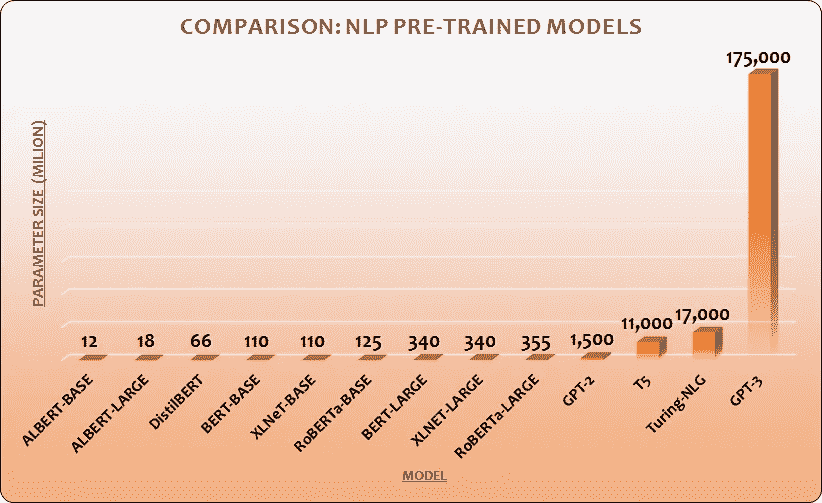

# OpenAI GPT-3:语言模型是一次性学习者

> 原文：<https://medium.com/analytics-vidhya/openai-gpt-3-language-models-are-few-shot-learners-82531b3d3122?source=collection_archive---------0----------------------->

O [penAI](https://openai.com/) 最近发表了一篇论文，描述了自然语言处理的深度学习模型 [GPT-3](https://github.com/openai/gpt-3) ，拥有**1750 亿**个参数(！！！)，**比上一版多 100x** ，GPT-2。该模型对近 5000 亿个单词进行了预训练，并且在几个 NLP 基准上实现了 SOTA 性能，而无需微调。

## 你注意到了吗？“未经微调”

比较:模型之间的参数大小。