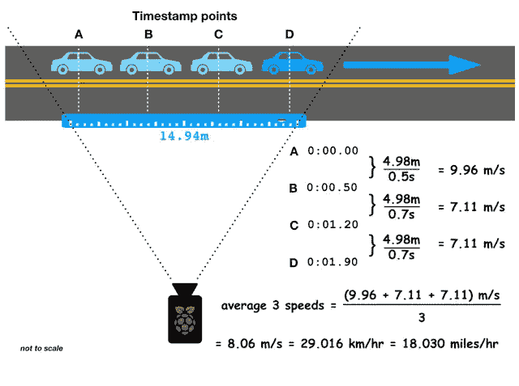
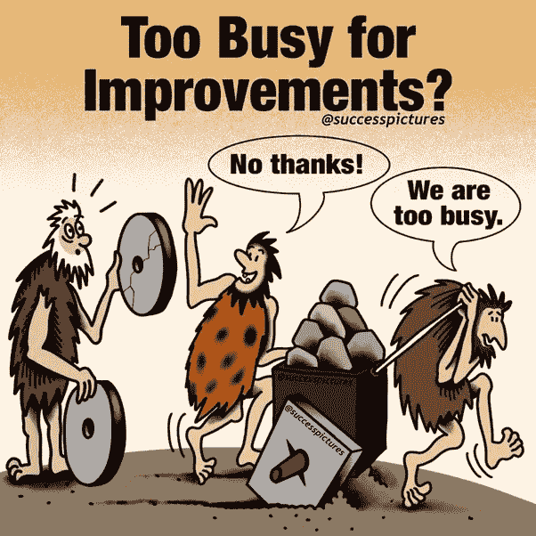

# OpenCV 和运输工程师

> 原文：<https://medium.com/analytics-vidhya/opencv-and-transportation-engineers-e9ab689b055b?source=collection_archive---------28----------------------->

# 简介:

在本文中，让我们看看什么是 OpenCV，以及它与运输工程师的关系。一旦解释了 OpenCV 的基础知识，本文将介绍它对运输工程师的帮助。

# OpenCV 部分:

这部分是**专为对 OpenCV**一无所知的运输工程师准备的。如果你知道 OpenCV 的基础知识，那么你可以跳过这一部分。

OpenCV 是一个用于计算机视觉应用的函数/方法库。它最初由**英特尔**开发，后来由**柳树车库**(机器人研究实验室和技术孵化器)以及 **Itseez** 支持。最后英特尔又买了。

这个库的功能允许计算机像人一样看东西。它不止于此。作为一个人，一旦你看到一个物体，你就开始分析和处理关于它的信息，不是吗？考虑下面的图像

在上图中你看到了什么？

你们中的一些人会说“史蒂夫·乔布斯”，不认识他的人可能会说“一个坐在电脑前的人”，其他人可能会说“一个年轻的史蒂夫·乔布斯穿着西装坐在电脑前”

从以上回答中你推断出什么？每个答案彼此相似但是在细节上有所不同不是吗？答案中的这种差异可能归因于人类的知识和记忆。

你看到图像时发生了什么？你开始处理图像，并且能够得到关于图像的信息。以类似的方式，计算机看到图像并处理图像。处理的细节也取决于我们对计算机训练的数量和质量。

话虽如此，要让“计算机看到并处理图像”并从中提取细节还有很长的路要走，为此 OpenCV 是不可避免的

OpenCV 库与 Mac、Windows 和 Linux 操作系统兼容，并在 C、C++和 Python 编程语言上工作。

如果你对计算机如何读取图像感到好奇，在这里找到它

# OpenCV 在交通工程中的应用；

由于文章的这一部分涉及核心运输，**这是为事先没有运输工程知识的 OpenCV 人员准备的**

交通调查被认为是至关重要的，因为许多其他因素，如路面寿命、城市停车位的设计、起点和终点研究等..依靠交通调查。现在让我们看看 OpenCV 的一些应用

# 1.分类车辆数量:

分类车辆计数是根据车辆类别来计算车辆数量的一种方法。例如，如果通过给定兴趣点的车辆总数为 10，000 辆，其中 60%可能是商用车辆，剩余的 40%可能是非商用车辆。

对商业和非商业数量进行分类的重要性之一是，在计算设计交通量时，只考虑每天的商业车辆(cvpd ),因此有必要了解商业车辆的数量。

# 2.车速检测

你能用 OpenCV 找到车速吗？是的，OpenCV 结合深度学习和数据分析以及适当的硬件配置，可以为我们提供比物理方法更准确的车辆速度

作为运输工程师，你知道车速是其他参数所依赖的重要参数。无论是曲线半径的设计、超高的计算、事故分析、道路的预防性维护、服务水平的确定，都离不开上述提到的车速

希望上面的文章对 OpenCV 在运输工程中的重要性有所帮助

# 3.数据收集

如果你在交通规划领域，那么你知道脚步的重要性。使用 OpenCV，我们可以得到一个准确的客流量统计。不仅在交通规划领域，而且在道路安全领域，您可以分析路标、防撞护栏和中央分隔带的数量是否足以满足给定的条件，研究路段是否存在坑洞等..使用 OpenCV

根据弯道的物理特征，在一个区域内应设置多少弯道标志有标准指南，道路标线也是如此。将 OpenCV 用于这些目的将会减少所消耗的时间，并且增加数据的准确性，如果使用物理方法的话

# 为什么选择 OpenCV？

现在，有些人可能想知道为什么我应该使用 OpenCV，因为上面提到的所有应用程序甚至在 OpenCV 存在之前就已经在运行了。

如果你在阅读这篇文章时也有这样的想法，这是一个很好的问题。我用下图来回答一下吧。

希望你已经从上图中找到了答案。在这个数据驱动的数字世界中，如果你仍然采用传统的方法让自己忙碌，你将落后于你的竞争对手。

多想想为 AADT 进行的调查(年平均日流量)，结果会有多准确，手动处理数据的速度有多快？想想自动化这些任务，**随着准确性的提高，将节省大量时间**。

# 结论:

请注意，仅仅通过学习 OpenCV，你无法完成上述所有任务，但是如果不学习 OpenCV，这将是一条艰难的道路。因此，对 OpenCV 有一个很好的了解将有助于从婴儿阶段走向巅峰。

如前所述，OpenCV 与深度学习和数据分析相结合，为运输工程领域的众多可能性开辟了道路

> **免责声明**:本免责声明旨在告知读者，文中表达的观点、想法和意见仅属于作者，不一定属于作者的雇主、组织、委员会或其他团体或个人。

如果这篇文章在任何方面对你有用(即使它有助于你在公共汽车/火车/机场消磨时间😛)别忘了留两个拍手

问候，

[维格内什·卡希尔卡马尔](https://www.linkedin.com/in/vigneshkathirkamar/)

[艾皮利努斯](https://aipylinux.quora.com/)