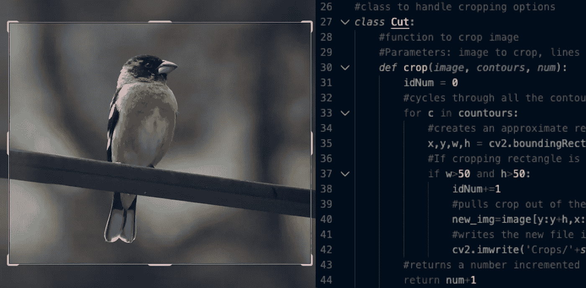

# OpenCV 基本和有用的工具:裁剪(Python)

> 原文：<https://medium.com/analytics-vidhya/opencv-basic-and-useful-tools-cropping-python-7ea671f7baf9?source=collection_archive---------2----------------------->

OpenCV →裁剪入门和轮廓介绍

令人惊讶的是，在我的 OpenCV 项目中，最困难的任务之一是找出如何裁剪图像。首先，给大家一些背景知识，我开发这个项目是为了实时跟踪和识别物体。因为我想看到每个对象识别的结果，我决定为每个对象分别创建一个单独的裁剪，并将它们保存到一个文件夹中。