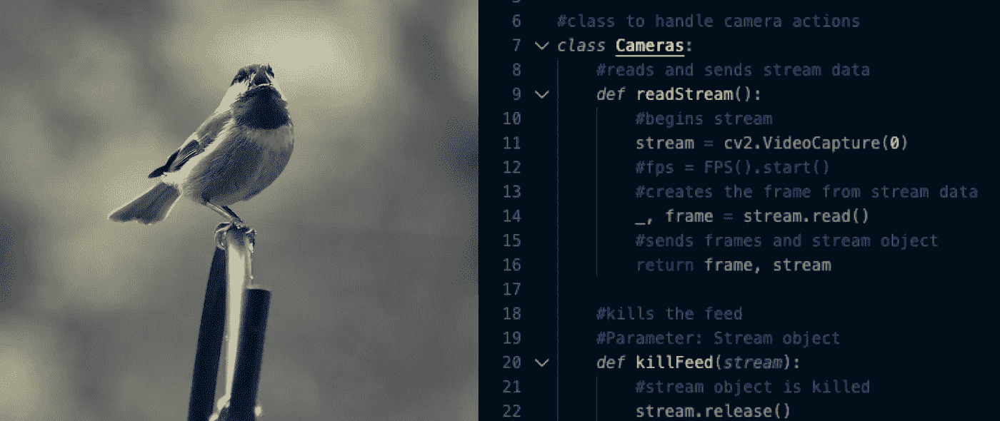

# OpenCV 基本和有用的工具:视频源(Python)

> 原文：<https://medium.com/analytics-vidhya/opencv-basic-and-useful-tools-video-feeds-python-5ef1cadc2fb0?source=collection_archive---------18----------------------->

OpenCV 入门→流、窗口和导入

我发现学习 OpenCV 的一些最基本的工具是分散的，有时是不必要的挑战，所以在这篇短文中，我将介绍 OpenCV Python 中一些最基本的特性和命令。

在我开始之前，有一个简短的说明…我在我的 MacBook Pro 2017 上使用 VS Code 作为代码编辑器编写了我的所有代码，无论是 VS Code 终端，还是我的 Mac 的…