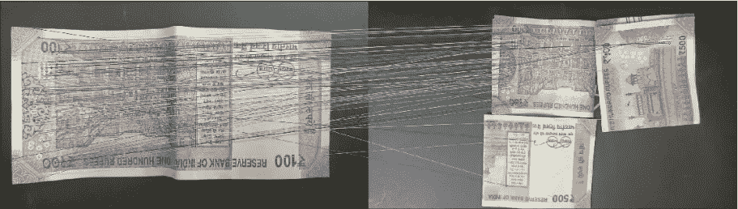
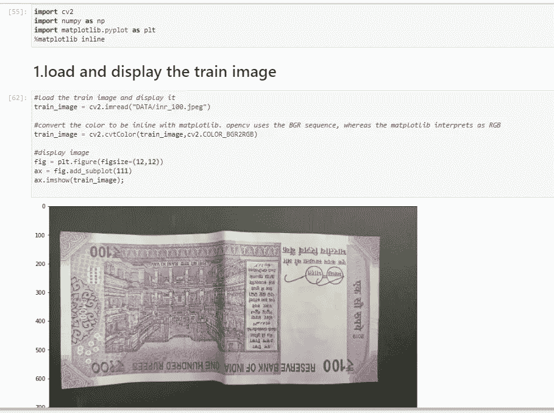
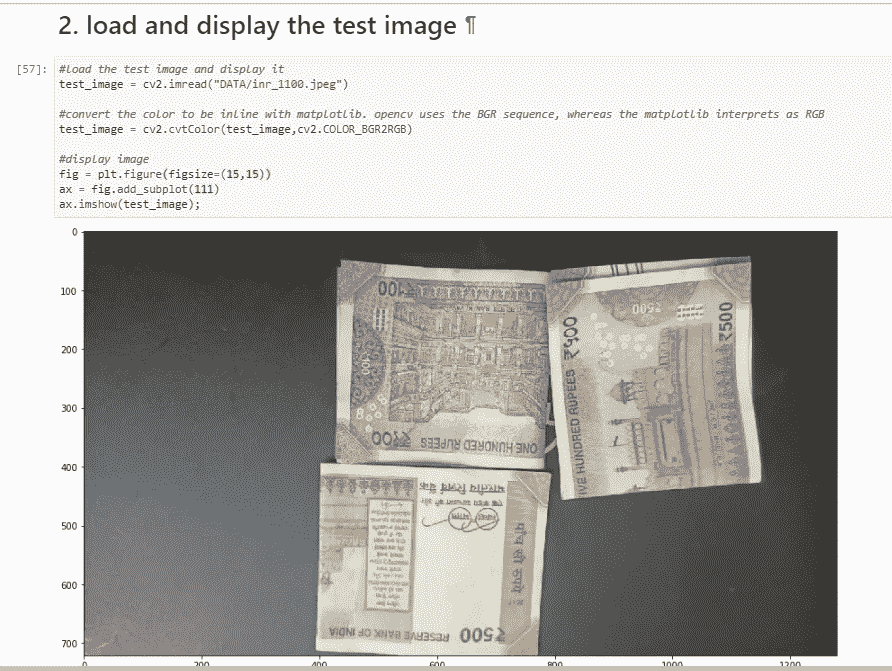
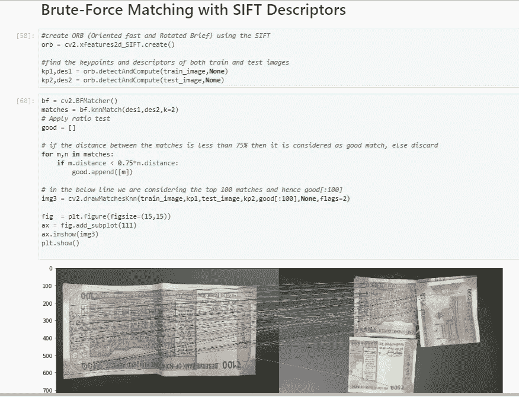

# OpenCV 特征匹配— SIFT 算法(尺度不变特征变换)

> 原文：<https://medium.com/analytics-vidhya/opencv-feature-matching-sift-algorithm-scale-invariant-feature-transform-16672eafb253?source=collection_archive---------6----------------------->

尺度不变关键点的独特图像特征

[这里](/analytics-vidhya/opencv-object-detection-using-template-matching-methods-63ac15d74742)我们已经讨论了用于对象检测的模板匹配方法。模板匹配方法大部分是静态的，并且该过程仅在模板/子集图像完全包含在完整/目标图像中时才起作用。像方向改变、图像强度改变、比例改变这样的微小偏差将不会很好地进行模板匹配，并且导致非常差的结果。这使得对象检测的模板匹配方法不太有用，并且不适用于现实世界的应用。

为了克服模板匹配方法的上述缺陷，可以使用 SIFT(尺度不变特征变换)。SIFT 算法解决了具有变化的尺度、强度和旋转的特征匹配问题。这使得该过程更加动态，并且模板图像不需要精确地包含在完整/主图像中。这被认为是特征匹配的最佳方法之一，并被广泛使用。

使用 OpenCV 和 SIFT 在 python 中执行对象检测的步骤

1.  加载训练图像和测试图像，在 RGB 通道之间进行必要的转换，使图像在使用 matplotlib 显示时兼容
2.  使用底层 SIFT 算法创建 ORB(快速定向和旋转简报)
3.  分别计算训练和测试图像的关键点和描述符
4.  创建具有所需参数的强力匹配器，这里我们使用 KNN(K-最近邻)匹配，它基于相似性距离产生匹配，让我们进一步过滤掉它，只考虑两个匹配之间的距离是否一样好，如果它们之间的距离是 75%
5.  使用在上述步骤中计算的良好匹配来绘制并突出显示匹配区域

以上步骤的代码和结果显示在下图中。这里，模板图像是一张印度纸币，测试图像也包含纸币。这里要注意的要点是模板图像通用，格式、强度、对齐完全不同，但该算法仍然可以在测试图像中找到模板的最佳匹配

*图像中* ***关键点*** *的检测无非是选择图像上被认为是良好特征的点，描述符是点的局部邻域的*表示

列车图像

测试图像

对象匹配结果— SIFT