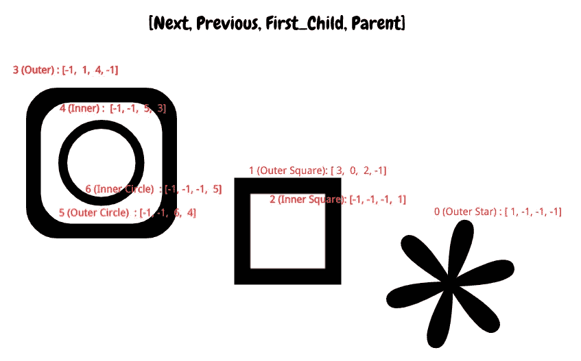

# OpenCV (findContours)详细指南

> 原文：<https://medium.com/analytics-vidhya/opencv-findcontours-detailed-guide-692ee19eeb18?source=collection_archive---------0----------------------->

OpenCV 有许多图像处理功能，有助于检测边缘，消除噪声，阈值图像等。经常让许多初学者感到困惑的一个特性是( **findContours** )。在这篇文章中，我将试着介绍 findContours 中涉及的所有主题，以及它如何对你有所帮助。

简而言之，findContours 检测图像颜色的变化，并将其标记为轮廓。例如，写在纸上的数字图像将被检测为轮廓。


1.原始图像— 2。灰度-3。二进制阈值反转— 4。查找轮廓


1.原始图像— 2。灰度-3。二进制阈值— 4。查找轮廓

从上面两幅图像中我们可以看到，由于我们计算二值图像的方式不同，findContours 对同一幅图像的检测也不同。上面那个是二进制阈值反转 **(cv2。THRESH_BINARY_INV)** 显示以白色突出显示的数字，下图就是二进制阈值 **(cv2。**THRESH _ BINARY】

你想检测的部分应该是白色的，就像上面第一张图片中的数字一样。

```
import cv2def show_image(image):
    cv2.imshow('image',image)
    c = cv2.waitKey()
    if c >= 0 : return -1
    return 0image = cv2.imread('./Photos/num.png')
img_gray = cv2.cvtColor(image, cv2.COLOR_BGR2GRAY)
ret, im = cv2.threshold(img_gray, 100, 255, cv2.THRESH_BINARY_INV)
contours, hierarchy  = cv2.findContours(im, cv2.RETR_EXTERNAL, cv2.CHAIN_APPROX_SIMPLE)
img = cv2.drawContours(res_img, contours, -1, (0,255,75), 2)
show_image(res_img)
```


# 参数—模式(**检索模式)**

findContours 函数检索图像中它能找到的所有轮廓。图像中可以有多种呈现轮廓的方式。有些可能嵌套在其他轮廓中，等等。为了便于找到我们感兴趣的轮廓，以及了解轮廓嵌套的层次 [**检索模式**](https://docs.opencv.org/master/d3/dc0/group__imgproc__shape.html#ga819779b9857cc2f8601e6526a3a5bc71) 非常重要。[s*source*](https://docs.opencv.org/master/d9/d8b/tutorial_py_contours_hierarchy.html)

检索模式的输出是数组**层次结构**，它显示了各种轮廓如何相互链接，它们与其他轮廓的关系，父子关系



正如你从图片中看到的，OpenCV 从右下方开始标记层次结构。

> **0 : Star [1，-1，-1，-1]**
> …下一个—外方块(1)
> …上一个—无轮廓(-1)
> …子—无子(-1)
> …父—无父(-1)
> 以同样的方式标记所有其他轮廓。上述方法是 RETR 树，其中所有轮廓及其出现层次都得到维护。我们将在下面更详细地讨论它

**RETR _ 树— Python: cv。RETR _ 树**


检索所有轮廓并重建嵌套轮廓的完整层次结构。 [*来源*](https://docs.opencv.org/master/d3/dc0/group__imgproc__shape.html#ga819779b9857cc2f8601e6526a3a5bc71)下面已经展示了等高线是如何被创建的及其层次结构

*父子关系也在树中创建*


**RETR _ 外部— Python: cv。RETR _ 外部**


仅检索最外轮廓。如你所见，只创建了三个轮廓，即外部轮廓。

*未给出父子关系。所有外部轮廓都在同一层级*


**RETR _ 列表— Python: cv。RETR _ 列表**


它类似于树，但它不建立任何父子关系。
检索所有轮廓，不建立任何层次关系。

*因为所有子代都没有建立关系，父代都是(-1 )*


**RETR_CCOMP — Python: cv。RETR_CCOMP**


检索所有轮廓并将它们组织成两级层次结构。在顶层，有组件的外部边界。在第二层，有孔的边界。如果在连接元件的孔内有另一个轮廓，它仍会被放在顶层。


# 参数法(轮廓近似法)

这是您想要存储轮廓的方法。如果设置为 **CHAIN_APPROX_NONE** 绝对存储所有轮廓点。如果设置为 **CHAIN_APPROX_SIMPLE** 压缩水平、垂直和对角线线段，只留下它们的端点。 [*来源*](https://docs.opencv.org/master/d3/dc0/group__imgproc__shape.html#ga4303f45752694956374734a03c54d5ff)


使用 CHAIN _ approximate _ NONE，存储的轮廓长度为 524，即所有的点都存储在数组中


使用 CHAIN _ approximate _ SIMPLE 存储的轮廓长度为 4，即只有四个角点存储在数组中


参考:[https://docs . opencv . org/master/d9/d8b/tutorial _ py _ contours _ hierarchy . html](https://docs.opencv.org/master/d9/d8b/tutorial_py_contours_hierarchy.html)