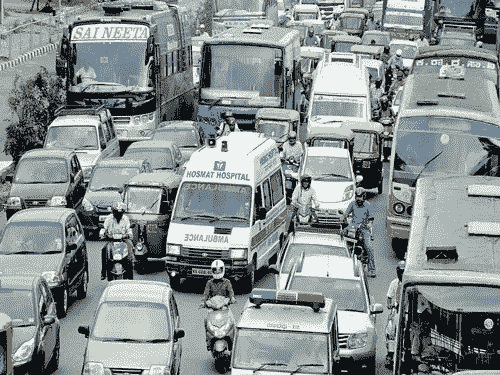
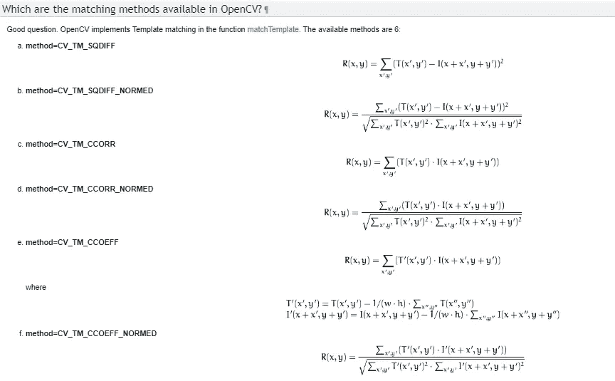
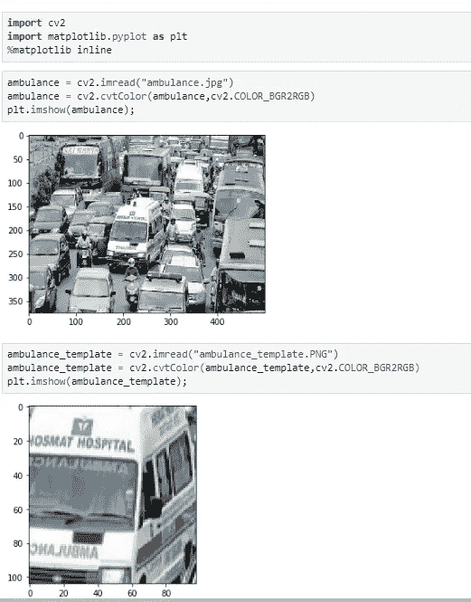
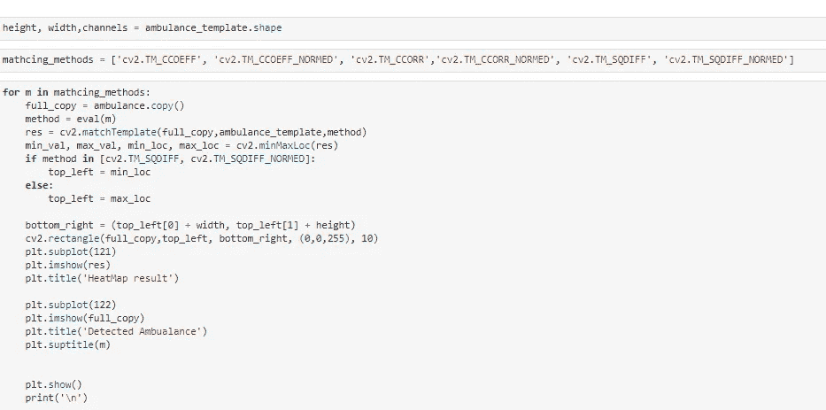
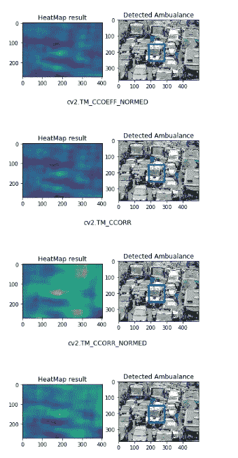

# 使用模板匹配方法的 OpenCV 对象检测

> 原文：<https://medium.com/analytics-vidhya/opencv-object-detection-using-template-matching-methods-63ac15d74742?source=collection_archive---------15----------------------->

对象检测的最基本的形式是使用 OpenCV 的模板匹配过程，并且可以是进一步进行的很好的学习点。这个过程通常有两个图像，一个是完整图像，另一个是完整图像的子集部分，可以称为模板。

模板匹配方法简单地扫描完整/完整图像，并在完整图像上滑过模板/子集图像，并将匹配区域识别为热图。为了便于讨论，让我们有一个不同车辆以及路上救护车的完整图像，模板图像是只包含救护车的完整图像的一部分。

完整/完整图像

模板/替代图像

模板匹配依赖于不同的相关性度量。OpenCV 中提供了多种匹配方法，可用于模板匹配过程。完整文档请参考 [OpenCV 模板匹配方法](https://docs.opencv.org/2.4/doc/tutorials/imgproc/histograms/template_matching/template_matching.html)。

OpenCV 模板匹配方法

导入所需的库并显示主图像和模板图像

导入库并显示图像

让我们通过将方法的名称存储在一个数组中来测试所有 6 种模板匹配方法，并使用 for 循环来迭代它们，然后将这些方法应用于模板匹配并可视化结果。这种模板匹配方法的实际结果是一个热图，它们需要一小段代码来转换热图中确定的最小-最大位置，并在确定的目标周围绘制方框。

模板匹配代码

此模板匹配过程的结果如下图所示

识别救护车的模板匹配过程结果