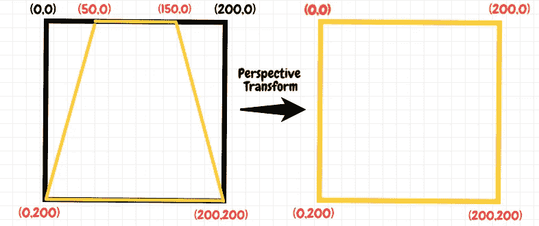
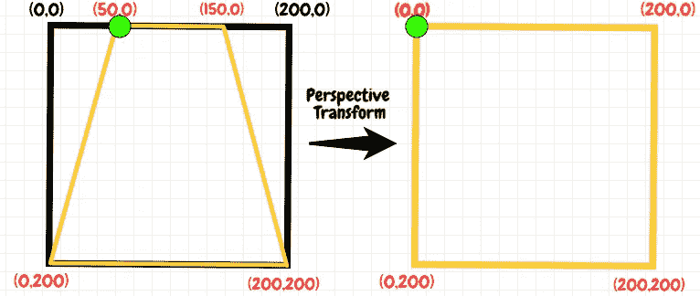
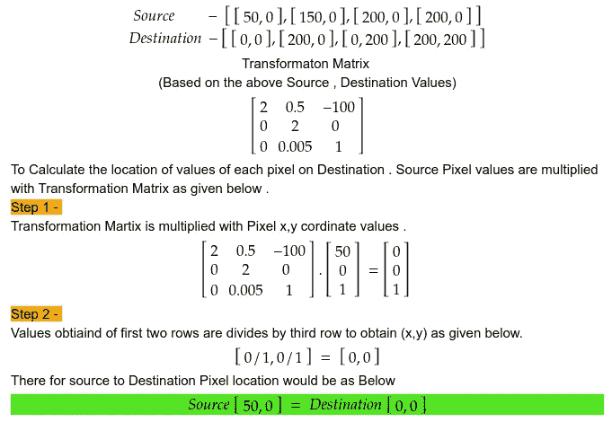
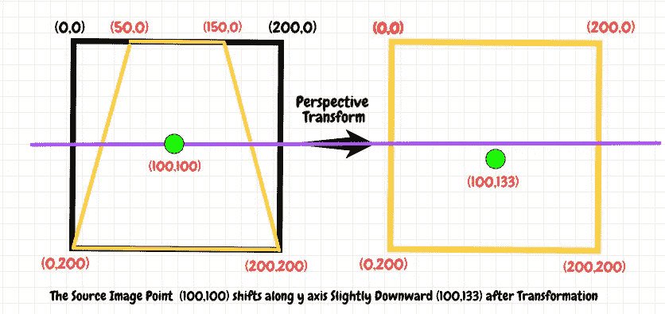
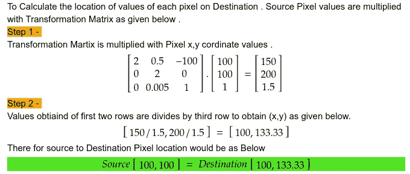
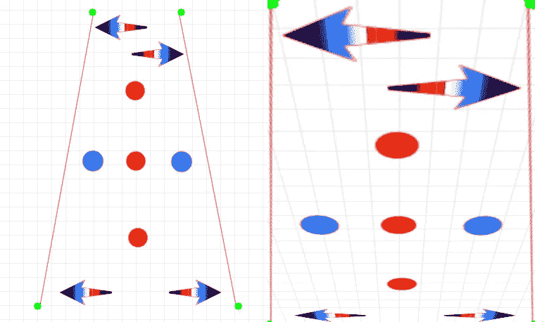
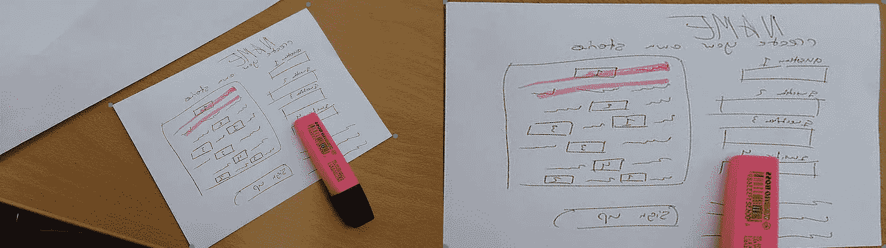
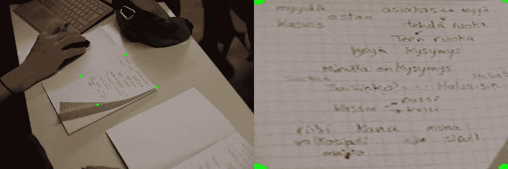
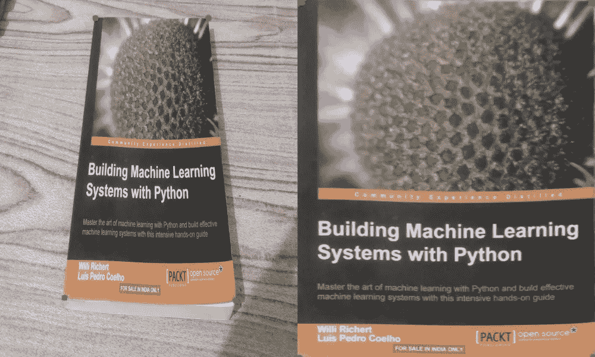

# OpenCv 透视变换

> 原文：<https://medium.com/analytics-vidhya/opencv-perspective-transformation-9edffefb2143?source=collection_archive---------0----------------------->

如果您想要正确对齐图像，透视变换是一个非常有用的功能。在应用透视变换后，它以直线方式变换图像。
这种情况的一个典型例子是，将表格上的页面变换为仅选择页面并进行变换，使其显示为图像的俯视图

在我们进入 OpenCv 透视变换函数之前，我们将稍微了解一下公式、算法的样子以及幕后的情况。



上图左边有—
*坐标[[50，0]，[150，0]，[0，200]，[200，200]]* 需要转换到新坐标— *新坐标[[0，0]，[200，0]，[0，200]，[200，200]]*

**下面给出的计算示例—**



**下面是第二个计算示例**



从图中可以看出，所有水平平行线在变换后都保持平行。变换后垂直平行线不平行。

## OpenCv 中透视变换的实现

```
import cv2
from operator import itemgetter
from glob import glob
import matplotlib.pyplot as pltpaper = cv2.imread('./Photos/book.jpg')
# Coordinates that you want to Perspective Transform
pts1 = np.float32([[219,209],[612,8],[380,493],[785,271]])
# Size of the Transformed Image
pts2 = np.float32([[0,0],[500,0],[0,400],[500,400]])
for val in pt1:
    cv2.circle(paper,(val[0],val[1]),5,(0,255,0),-1)
M = cv2.getPerspectiveTransform(pt1,pts2)
dst = cv2.warpPerspective(paper,M,(500,400))
plt.imshow(dst)
```



从上图中可以看出，透视变换函数如何保持图像中的水平线，并设法获得纸张的俯视图。下面给出了更多的示例图像



参考—
[https://opencv-python-tutroals . readthedocs . io/en/latest/py _ tutorials/py _ imgproc/py _ geometric _ transformations/py _ geometric _ transformations . html](https://opencv-python-tutroals.readthedocs.io/en/latest/py_tutorials/py_imgproc/py_geometric_transformations/py_geometric_transformations.html)
[http://jlouthan . github . io/perspective-transform/examples/test-ui/index . html](http://jlouthan.github.io/perspective-transform/examples/test-ui/index.html)