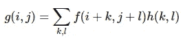
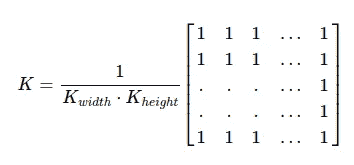
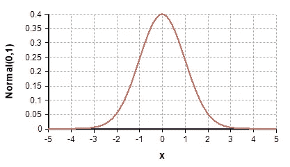
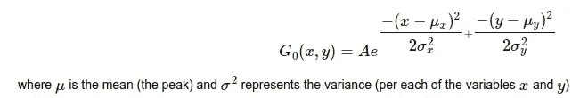
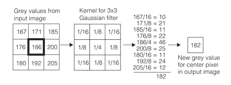
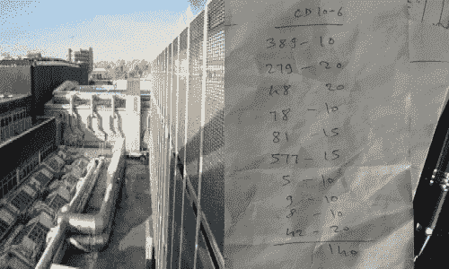
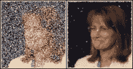
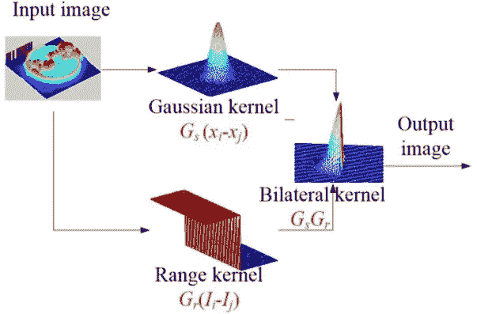
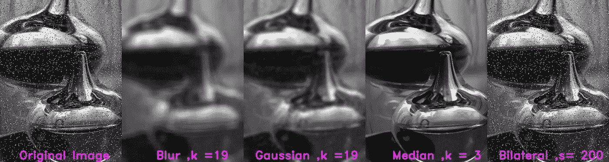

# OpenCV 平滑图像过滤器

> 原文：<https://medium.com/analytics-vidhya/opencv-smoothing-image-filters-a758f0f13be9?source=collection_archive---------7----------------------->

我们在图像中会遇到各种各样的噪声，这些噪声会给图像检测带来很多问题。很多时候，当在图像中寻找轮廓时，由于噪声，在图像中检测到不想要的轮廓，或者图像失真，并且图像变得难以通过我们的机器学习算法来预测。

OpenCV 有各种各样的过滤器，帮助模糊图像，用各种方法填充图像中的小噪声。像用相邻像素的平均值计算像素值等。在下面的文章中，我们将探索各种图像平滑的方法。下面是 OpenCV 中平滑图像的各种方法

## **1)模糊滤镜(cv2.blur() )**

为了执行平滑操作，我们将应用一个*过滤器*到我们的图像上。最常见的滤波器类型是*线性*，其中输出像素值(即(I，j))被确定为输入像素值的加权和(即 f(i+k，j+l)):



来源—[https://tinyurl.com/yda4vr83](https://tinyurl.com/yda4vr83)

h(k，l)称为*核*，无非就是滤波器的系数。

[](https://docs.opencv.org/master/dc/dd3/tutorial_gausian_median_blur_bilateral_filter.html) [## OpenCV:平滑图像

### 上一篇教程:随机生成器和 OpenCV 文本下一篇教程:侵蚀和扩张在本教程中，你将…

docs.opencv.org](https://docs.opencv.org/master/dc/dd3/tutorial_gausian_median_blur_bilateral_filter.html) 

以上是应用于像素以获得平均值的核，平均值是基于周围像素根据核大小计算的。下面是不同内核大小的规格化盒子的效果


```
import cv2def show_image(image):
    cv2.imshow('image',image)
    c = cv2.waitKey(300)
    if c >= 0 : return -1
    return 0image  = cv2.imread('test.jpeg')
for i in range(1,50,2):
    blur = cv2.blur(image,(i,i),0)
    t = show_image(blur)
    if t !=0 :
        break
cv2.destroyAllWindows()
```

## 2)高斯滤波器(cv2。GaussianBlur)

不像归一化盒状滤波器，其中像素的值是基于取决于内核大小的周围像素的平均值来计算的。在高斯滤波器中，像素值的强度随着我们远离中心而变化，类似于高斯分布。



来源—[https://tinyurl.com/y84fmsh2](https://tinyurl.com/y84fmsh2)



source—[https://docs . opencv . org/master/DC/dd3/tutorial _ Gaussian _ median _ blur _ binary _ filter . html](https://docs.opencv.org/master/dc/dd3/tutorial_gausian_median_blur_bilateral_filter.html)

上面是二维高斯滤波器的公式。这些过滤器倾向于比标准化的箱式过滤器更好地保留边缘。因为核中的值并不相等，而是考虑高斯分布，该高斯分布给予中心像素更多的权重，因此更多地保留了边缘信息



来源—[https://tinyurl.com/ydb2qdm9](https://tinyurl.com/ydb2qdm9)

从上面使用 3×3 高斯滤波器的例子中可以看出，中心像素(1/4)的权重更大，角点像素(1/16)的权重更小，这样像素的信息保留得更多



```
import cv2def show_image(image):
    '''function just to display images simultaneously '''
    cv2.imshow('image',image)
    c = cv2.waitKey(300)
    if c >= 0 : return -1
    return 0image  = cv2.imread('test.jpeg')
for i in range(1,50,2):
    blur = cv2.GaussianBlur(image,(i,i),0)
    t = show_image(blur)
    if t !=0 :
        break
cv2.destroyAllWindows()
```

# 3)中值滤波器(cv2.medianBlur)

像模糊滤镜一样，中值滤镜采用内核中所有值的中值，并应用于中心像素。它有助于消除图像中的噪声，如椒盐噪声。

通过以升序排列核中的所有值，然后取最中间的值，即中值，来计算中值。

> eg — [5，13，9，7，1，9，2，9，11]
> 升序排列
> 【1，2，5，7，9，9，9，11，13】
> 取中间值= 9


来源—[https://tinyurl.com/y7fu3jf7](https://tinyurl.com/y7fu3jf7)

从上面的例子中，我们可以看到，中心像素的值，即 255，将被 96，即中值所取代。因此，噪声将从图像中去除



来源—[https://tinyurl.com/y8jj3ub6](https://tinyurl.com/y8jj3ub6)

在左边你可以看到盐噪声在中值滤波器的帮助下从图像中被去除了


```
import cv2def show_image(image):
    '''function just to display images simultaneously '''
    cv2.imshow('image',image)
    c = cv2.waitKey(300)
    if c >= 0 : return -1
    return 0image  = cv2.imread('test.jpeg')
for i in range(1,50,2):
    blur = cv2.medianBlur(image,i,0)
    t = show_image(blur)
    if t !=0 :
        break
cv2.destroyAllWindows()
```

双边过滤器

许多滤波器的问题是它滤除了噪声，但有时边缘也是一个问题，这是对象检测等中的机器学习。为了解决这个问题，双边滤波器考虑高斯滤波器和范围(强度滤波器)。高斯滤波器去除图像的噪声成分，范围滤波器保留边缘



来源—[https://tinyurl.com/ycwebk25](https://tinyurl.com/ycwebk25)


```
import cv2def show_image(image):
    '''function just to display images simultaneously '''
    cv2.imshow('image',image)
    c = cv2.waitKey(300)
    if c >= 0 : return -1
    return 0image  = cv2.imread('test.jpeg')
for i in range(1,50,2):
    blur = cv2.bilateralFilter(image, i, i * 2, i / 2)
    t = show_image(blur)
    if t !=0 :
        break
cv2.destroyAllWindows()
```

**不同核大小的滤波器对盐噪声的比较**

下面是图像噪声可以通过实验滤波器的各种参数来降低的示例表示



**参考** -
1。[*https://docs . opencv . org/master/DC/dd3/tutorial _ Gaussian _ median _ blur _ bias _ filter . html*](https://docs.opencv.org/master/dc/dd3/tutorial_gausian_median_blur_bilateral_filter.html) *2 .*[https://www . researchgate . net/figure/flow trade-of-a-双边-filter _ fig 2 _ 318968983](https://www.researchgate.net/figure/Flowchart-of-a-bilateral-filter_fig2_318968983) *3 .*[https://www.southampton.ac.uk/~msn/book/new_demo/median/](https://www.southampton.ac.uk/~msn/book/new_demo/median/) *4。*[https://support . cognex . com/docs/CVL _ 900/web/EN/CVL _ vision _ tools/Content/Topics/vision tools/Gaussian _ convolution . htm](https://support.cognex.com/docs/cvl_900/web/EN/cvl_vision_tools/Content/Topics/VisionTools/Gaussian_Convolution.htm)5 .[https://wiki.analytica.com/index.php?title =正态分布](https://wiki.analytica.com/index.php?title=Normal_distribution)