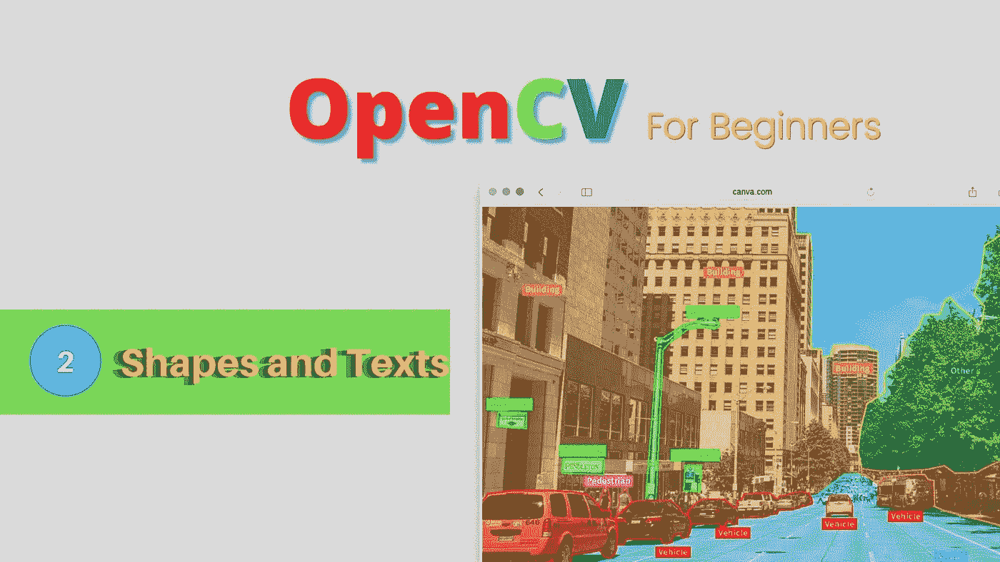
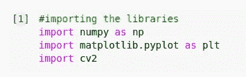
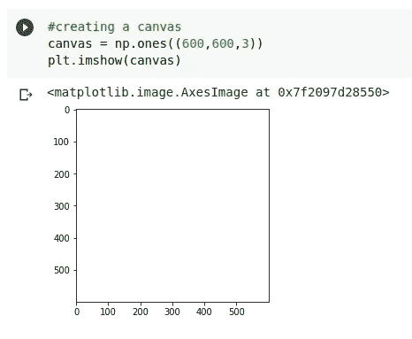
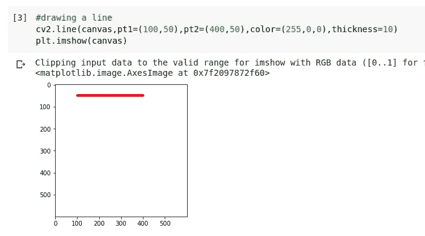
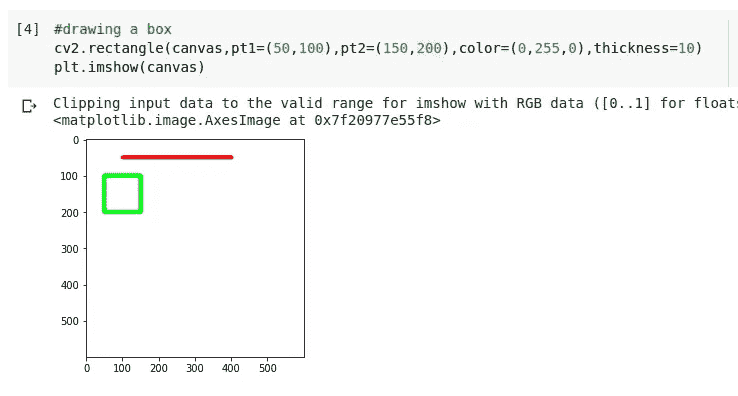
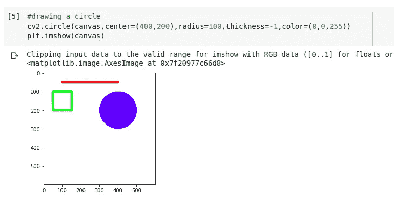
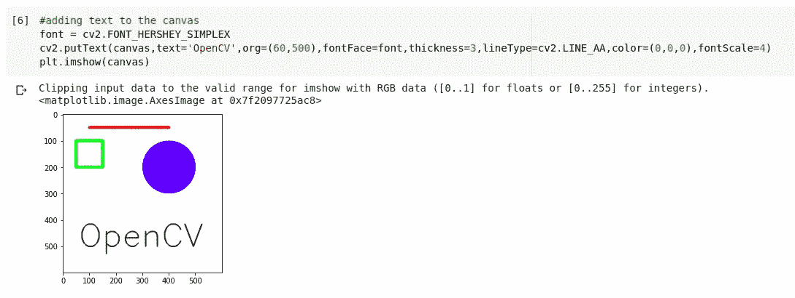
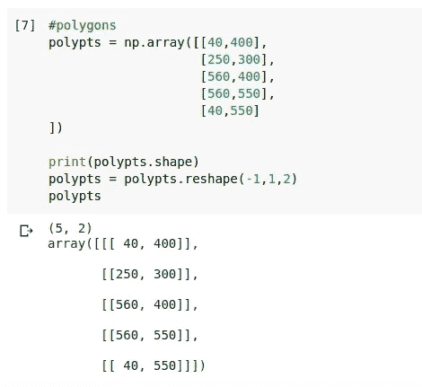
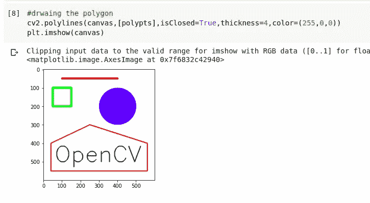

# OpenCV 教程—绘制形状和文本

> 原文：<https://medium.com/analytics-vidhya/opencv-tutorial-drawing-shapes-and-texts-5cba52c76cd0?source=collection_archive---------13----------------------->

# 介绍

在之前的帖子中，我们看到了 opencv 的介绍和一些基本的图像加载之类的东西。在这篇文章中，我们将通过在空白画布上绘制形状和文本来创建我们自己的图像

# 为了更好地理解，让我们直接进入代码

1.  **导入一些库**

**2。创建一个空画布**

亮度低的像素为黑色，亮度非常高的像素为白色。因为我们知道图片可以用矩阵来表示，所以我们初始化一个充满元素 1 的三维矩阵。因此，我们得到一个简单的白色图像。

**0 →黑色
1 →白色**

**3。画一条线**

*在我们开始使用 opencv 的函数之前，我想说的是 opencv 的所有函数都是就地执行的。这意味着我们不必将返回值赋给一个新变量。*

cv2 的 line 函数接受上面显示的参数，根据起点( **pt1** )、终点( **pt2** )、线条颜色和粗细创建一条线条，并在空白画布上绘制它(**输入图像**)。

**4。画一个盒子**

这和 line 很像。但是，它接受的参数是矩形的属性。它们是左上角的坐标和右下角的坐标。

**5。画一个圆**

到目前为止，理解这些东西是如何工作的就很容易了。
这个圆形唯一的不同是我指定了厚度为-1，这将用边框的颜色填充圆形。

6。短信

这也和我们之前看到的形状非常相似。
这里，org 参数取文本的左下方坐标，我们需要定义文本的字体。 **FONT_HERSHEY_SIMPLEX** 是 opencv 中最简单的字体之一。所以，我选择了它。

7。绘制自定义多边形

在绘制多边形之前，我们必须以列表格式定义多边形每条边的位置。但是，cv2 需要一个三维数组。所以，我们用 numpy 把它转换成三维。

我们使用折线函数在画布上绘制多边形，并将多边形作为参数传入数组。只是，为了更好地理解，要不断尝试这些值。

# **结论**

就是它用来画形状和文字的。当涉及到深度学习时，我们通常不会使用多边形绘制。我们将主要使用矩形。

本系列完成后，github 上将提供代码文件。
github:[https://github.com/tensorshock](https://github.com/tensorshock)推特:[https://twitter.com/ShockTensor](https://twitter.com/ShockTensor)

# 谢谢你