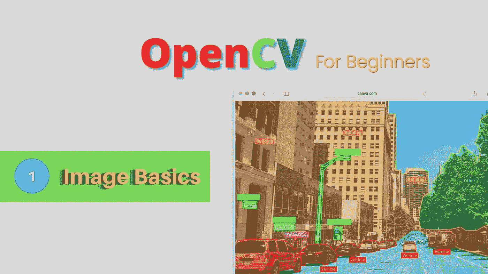
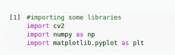
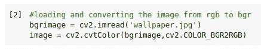
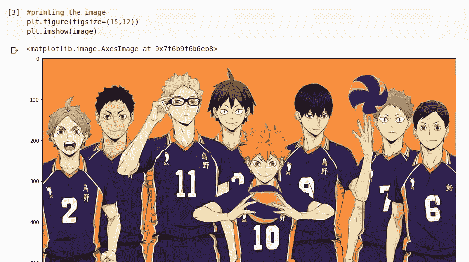
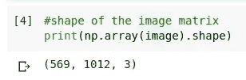

# OpenCV 教程—简介和图像基础

> 原文：<https://medium.com/analytics-vidhya/opencv-tutorial-introduction-and-image-basics-7675866eb95a?source=collection_archive---------16----------------------->



# 介绍

这是一个名为“初学者 OpenCV”的新系列的开始。在这篇博文中，我们将了解图像的基础知识，以及如何用 python 中的 cv2 模块处理它们。
访问代码文件，查看我的 github 简介:[我的 Github 简介](https://github.com/tensorshock)。
该库将在整个系列完成后更新。

# 先决条件

Python
matplotlib
numpy

# OpenCV 是什么？

OpenCV 是一个计算机视觉库，具有可用于处理图像和视频数据的功能。

# 安装 OpenCV

**对于 Linux 用户:**

```
pip3 install opencv-python
```

**对于 windows 用户:**

```
pip install opencv-python
```

# 图像的矩阵表示

图像也是数据。因此，它们可以用矩阵的形式来表示。
在你上学的时候，你可能已经学过将红、绿、蓝以不同比例混合会产生不同的颜色，这三种颜色可以用来创造世界上的每一种颜色。

图像由像素组成。因此，我们将使用不同强度的红色、绿色和蓝色像素来创建一种颜色，并使用大量这些像素来最终创建一个图像。


图像的形状将是高*宽*3。
这三个代表 3 层(红、绿、蓝)。该矩阵中的每个元素表示某一颜色的像素强度，这取决于该元素所在的层。因此，我们可以认为图像只是三维矩阵。

# 获取和显示图像数据

我将向您展示代码并解释每一行的作用

1.  **让我们导入一些必要的库**



**2。将图像载入变量**



**cv2.imread** 是一个获取图像路径并将其加载到 python 变量中的函数。

默认情况下， **imread** 以蓝、绿、红格式加载图像。但是，出于各种原因，我们希望图像是 reg，green，blue 格式。所以，为了转换它，我们使用 **cv2.cvtColor 函数。**

**3。显示加载的图像**



来自 Haikyuu 的 karasuno 团队的图像(动漫)

我们将使用 matplotlib 的 imshow 函数来显示这张图片。请记住:彩色图像是三维矩阵，黑白图像是二维矩阵。

**4。作为矩阵的图像形状**



我们已经知道图像是一个三维矩阵。因此，我们使用 numpy 数组打印图像形状。我们看到 569 * 1012 是图像的大小(分辨率), 3 代表 RGB 的 3 层

# 结论

在这篇博文中，我们看到了如何用矩阵形式表示图像，以及一些基本的 openCV 函数来使用它们。在即将到来的帖子中，我们可以看到更多的图像处理和视频处理，以及一些深度学习技术。
在推特上关注定期更新:[https://twitter.com/ShockTensor](https://twitter.com/ShockTensor)

# 谢谢你