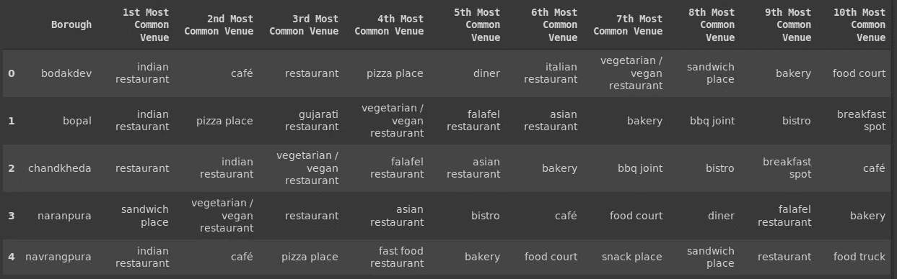

# 在艾哈迈达巴德市开餐馆

> 原文：<https://medium.com/analytics-vidhya/opening-a-restaurant-ahmedabad-city-46218dc25515?source=collection_archive---------10----------------------->


> 给定艾哈迈达巴德各种类型餐馆的位置数据，本博客旨在预测城市的哪个部分最适合开设特定类型的餐馆。

# 简短的介绍

艾哈迈达巴德是印度古吉拉特邦最大的城市和前首都。它位于萨巴马蒂河畔，距离该州首府甘地讷格尔 30 公里，甘地讷格尔是它的姐妹城市。

艾哈迈达巴德最受欢迎的食物之一是典型的古吉拉特塔利。Dhoklas、theplas 和 dhebras 也是艾哈迈达巴德非常受欢迎的菜肴。饮料包括酪乳和茶。艾哈迈达巴德禁止饮酒。

这里有许多餐厅，供应各种印度和国际美食。大多数食物店只供应素食，因为城市的耆那教和印度教社区保持着素食主义的强大传统。在 Bhatiyar Gali、Kalupur 和 Jamalpur 等老地区，很少有餐馆供应典型的 Mughlai 非素食食物。

# 数据！！！

没有包含艾哈迈达巴德市行政区/地区的可用数据集。所以我搜索了艾哈迈达巴德 10 个随机行政区的坐标，并为其创建了一个 csv 文件。


然后，我首先使用 FourSquare API 查找每个区的餐馆。我将限制设置为 50 个地点，每个区的半径为 1 公里，从它们给定的经纬度信息和类别 id 到食物的信息(如 Foursquare 网站上所述)。

从 Foursquare 返回的数据与最初的区数据合并。该表现在由区、区纬度、区经度、地点、地点纬度、地点经度、地点类别组成。这张桌子的主人是这样的:


数据集有几个问题。首先，餐馆的名字不在一个单独的案例中。一些餐馆的名字全是大写的，一些餐馆的名字中有一些单词是大写的，等等。所以我把所有的名字都转换成小写，在整个数据集中创造一个一致性。

第二，很多通过 FourSquare API 获得的餐厅已经永久关闭。因此，为了获得更高的准确性，我必须从数据集中删除这些餐馆。

第三，有一些餐馆位于不同的街区，API 返回了不同的名称。例如:“Gwalia”餐厅位于 4 个区，其中一个区提到了“Gwalia Sweets”。因此，我必须确保在数据集中，如果餐馆名称重复，那么它必须是相同的。这确保了数据集的一致性。

# 探索性数据分析

了解一些数据的秘密。


我们看到 Bodakdev 的餐厅数量最多，而 Bopal 的餐厅数量最少。其余的行政区大约有 4- 30 家餐馆。

没有一个区符合我们 50 个区的限制。但这并不意味着这个查询是错误的。这取决于给定的纬度和经度信息，这里我们只为每个区运行一个纬度和经度对。我们可以用更多的纬度和经度信息来增加邻域信息的可能性。


Foursquare API 返回了 26 个不同类别的餐馆，其中“印度餐馆”类别最高。有很多种类的餐馆，在整个城市只有一家。


咖啡馆咖啡日和赛百味餐厅数量最多，麦当劳和达美乐披萨紧随其后。市内拥有 2 家以上餐厅的本地餐厅也很少。

找出每个行政区最常见的餐馆类别，我们得到



# 使聚集

K-Means 算法是无监督学习中最常用的聚类方法之一。K-means 聚类旨在将 n 个观察值划分为 k 个聚类，其中每个观察值属于具有最近均值的聚类，作为该聚类的原型。通过这种方法创建的群集不会相互重叠。

用肘法找出我们模型的最佳 K 值。


我们可以看到，K = 3 是我们的聚类模型的最佳 K。

```
k = 3# abad_grp_cluster is a dataframe that consists of probability of a category of restaurant to be present in a boroughkmeans = KMeans(n_clusters=k, random_state=0).fit(abad_grp_cluster)kmeans.labels_[0:9]
```

在执行 K-Means 聚类之后，这是我的合并表，其中包含每个区的聚类标签。


将所有餐厅按照各自的聚类进行映射。


# 结果

分析每个聚类并推荐可以在聚类中存在的区中开业的餐馆。

我们可以从下图中看到，在聚类 0 中，印度餐馆和咖啡馆远远高于其他类别。


人们可以在以印度餐馆和咖啡馆为主的集群 0 中开设餐馆、披萨店、小酒馆、烧烤店甚至快餐车。从提到的类别中开一家餐馆会使餐馆脱颖而出，带来好的生意。

在集群 1 中，只有一个印度餐馆和餐厅。


如果想开咖啡馆、比萨饼店、三明治店或快餐店，集群 1 是合适。这些将吸引周边地区的大量人群。该餐厅将是集群中的一个独特的餐厅，人们在某一天将没有其他选择来满足他们的渴望。

在聚类 2 中，印度餐馆是其他类别的两倍。


集群 2 由印度餐馆、比萨饼店和古吉拉特餐馆组成。因此，你可以开一家这两种类型的餐馆，因为它们都不在这个群体中占主导地位。还有一种选择是开一种新的餐馆，比如咖啡馆、三明治店、一些特别的美食餐馆等。成为第一批开这种餐馆的人之一。

# 结论

艾哈迈达巴德是印度最聪明的城市之一，并被评为该国最适宜居住的城市之一。在这样一个禁酒的城市，人们寻找新的去处，开一家餐馆满足了人们的需求和商业需求。

有了这样的分析，选择开餐馆的地点就变得容易多了。一家餐厅的成功取决于它的独特性，以及它如何补充特定集群或区内现有的餐厅。

对于所有想在艾哈迈达巴德开一家餐馆的人来说，这项分析有助于他们轻松快速地做出重大决定。