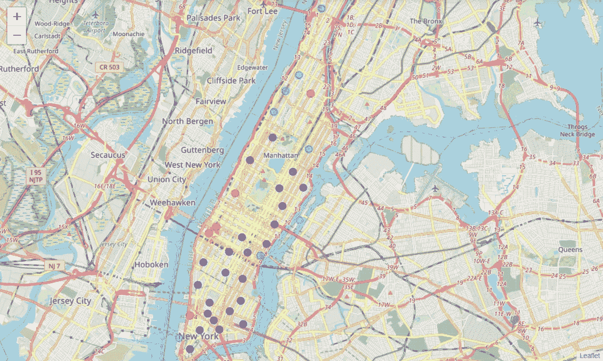

# 在曼哈顿开餐馆

> 原文：<https://medium.com/analytics-vidhya/opening-a-restaurant-in-manhattan-ba4a241be2da?source=collection_archive---------31----------------------->

我们大多数人只能通过看照片来欣赏这个地方的美丽，但只有少数人有机会参观这个美丽的地方。嗯，这个地方…是啊！不是别人，正是纽约市。尤其是这个地方，是这个城市的五个区之一，名为曼哈顿。女士们先生们，这是曼哈顿的地平线！！

因此，足够的建设，让我们直入主题。曼哈顿被认为是世界金融中心。有很多人移民到这里是为了寻找一种好的生活方式。但是，这里的生活也不容易，一个人必须经历很多困难才能在这里过上正常的生活。这里有很多竞争，无论是在商业领域，工作等。今天我们将试着为那些想在这里开餐馆的人解决一个问题。

***商业问题***

我们在这里要讨论的商业问题是，如果一个人愿意在这里开一家餐馆，他/她应该开哪种类型的餐馆，在哪个确切的位置，这样餐馆面临的竞争最少，最终这笔生意会成功。让我们看看，作为一名数据科学爱好者，我能做些什么来帮助这些人。

***关于数据集***

我们有一个代表纽约市所有五个区的社区的数据集。将数据转换成熊猫数据帧后，数据看起来像这样…

这只是数据集的前 5 行。

现在，我们将要依赖的另一个东西是 Foursquare API。这将有助于我们获得某一范围内所有场馆的列表。

***方法论***

现在让我们讨论一下我们将要遵循的方法。

1.  我们会得到纽约市所有街区的列表。然后我们将展示纽约市的地图，所有的街区都用标签标出。
2.  然后我们将继续前往曼哈顿，我们将获得曼哈顿所有街区的列表，并绘制叶地图。
3.  然后使用 Foursquare API，我们将获得曼哈顿附近所有场馆的列表。
4.  然后，我们将使用称为 K-Means 聚类算法的机器学习算法将邻域分成五个聚类。
5.  然后，我们将检查所有这些集群，并建议一个有利的位置开设一家餐馆，使其面临的竞争最小。

***结果和讨论***

首先，我们得到了纽约市及其所有街区的地图，它看起来像这样:

这是针对整个纽约市的，但我们需要将我们的研究仅限于曼哈顿。

因此，我们将从父数据集提取曼哈顿的数据集。提取后曼哈顿的街区看起来像这样:

现在，我们得到了所有的街区，我们将使用 Foursquare API 来调用获取曼哈顿所有场馆的列表。结果数据在。json 格式，所以我们必须将它转换成 pandas 数据帧，然后，我们将设计数据帧，以便每个街区的前 5 个场馆都可用。数据框将如下所示:

我们将对所有邻域进行聚类并对其进行标注，标注后的数据框如下所示:

然后，我们将应用 KMeans 聚类，并相应地标记所有邻居。总的来说，我们将把曼哈顿的街区分成五个集群。然后，我们将使用叶库在曼哈顿地图上绘制聚集的邻域。最终结果如下所示:

所以，这里我们可以看到相似的邻域有相似的颜色标签。

***结论***

为了得出结论，我们必须了解所有这些集群的特征，也就是说什么样的场馆在哪个区域是常见的。

下面这五个数据框中显示了集群 1 至 5:

**集群 1 上的*报告***

我们可以清楚地看到，在地图上用红色表示的这个集群有很多意大利餐馆。因此，在这个地区开一家意大利餐馆是一个非常糟糕的主意。如果你只是想开一家咖啡馆或咖啡店，这可能是一个好地方，因为在这个领域没有太多的竞争。

***集群 2 上的报告***

这个集群覆盖了曼哈顿的大部分地区，很明显，它有很多餐馆，数量如此之大，所以这个地区不应该考虑开设任何餐馆或咖啡馆。

***集群 3 的报告***

这个地区没有很多餐馆，尤其是如果有人想开一家意大利餐馆…这是这样做的最有利的地区。尤其是在 116 街的哥伦比亚大学附近。它没有太多的竞争，而且这个地区人口也很多。

***集群 4 的报告***

所以，这个地方可能不适合开餐馆，因为这个地区基本上由造船厂组成，来这个地区的人最有可能去享受他们在船上的时光。然而，如果有人想开一家外卖餐馆，这可能是一个好地方，因为要上船的人可能喜欢随身携带一些食物。

***汇报集群 5***

该区域距离住宅区稍远，因此该区域可能不会有太多客户。所以，我不会建议在这里开餐厅。

***最终由我推荐***

如果有人真的想在曼哈顿开一家餐馆，并想从中获利，他们应该开一家意大利餐馆，而且也是在集群 3 的区域。

**为什么是意大利语？因为上面的数据让我们得出结论，纽约人爱吃意大利菜。**

**最佳地点是哪里？据我所知，最好的地点是哥伦比亚大学附近的 116 街附近。**

领英:[https://www.linkedin.com/in/shashank-verma-5a671316b/](https://www.linkedin.com/in/shashank-verma-5a671316b/)

github:[https://github.com/Shashank1816](https://github.com/Shashank1816)