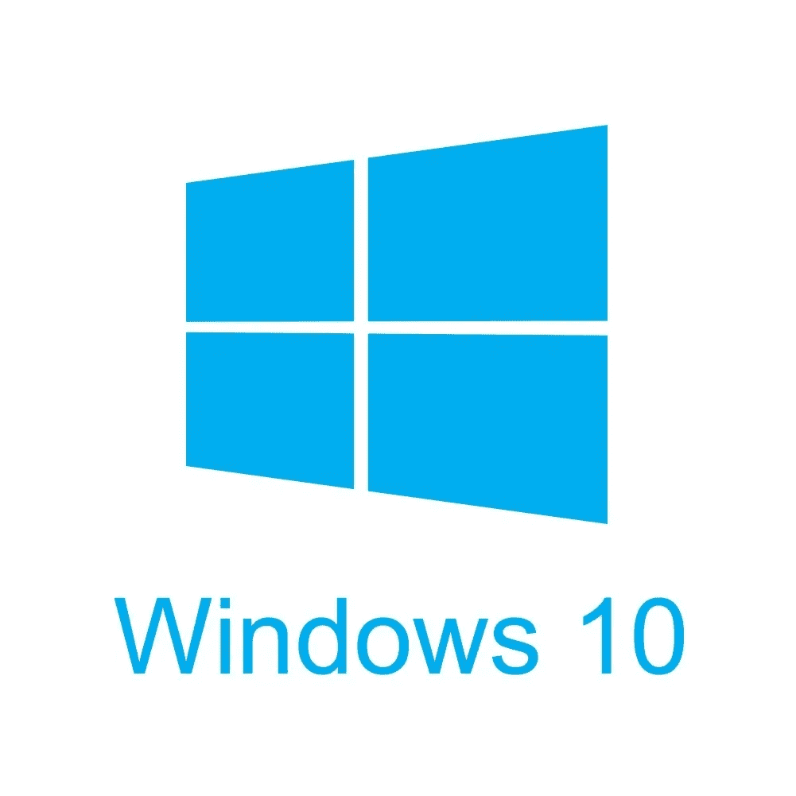
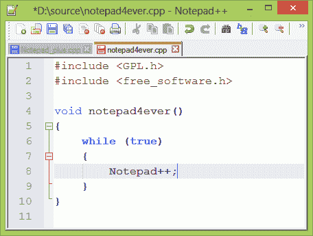
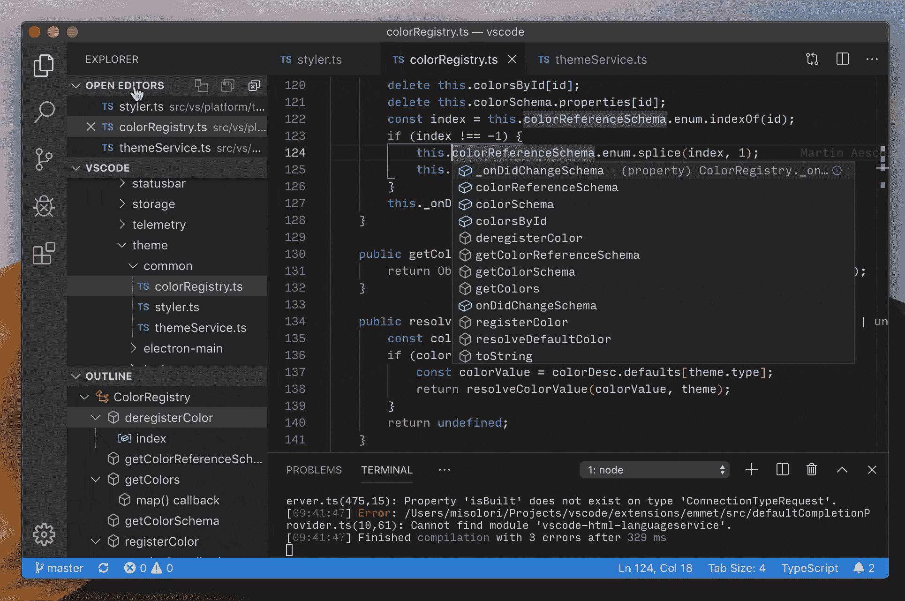
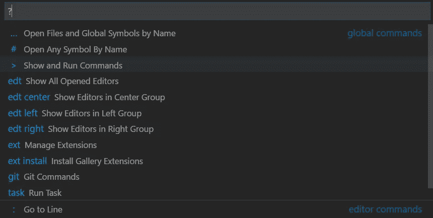
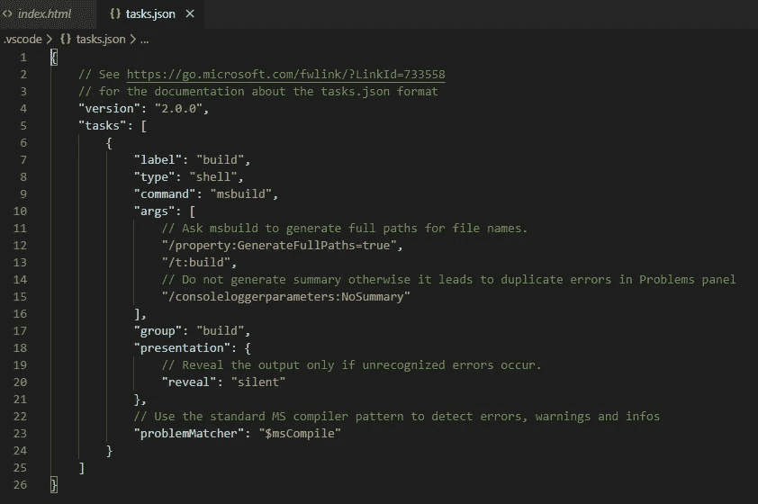

# 在浏览器中从 VSCode 打开 JS 和 HTML 文件(适用于 Windows)

> 原文：<https://medium.com/analytics-vidhya/opening-js-and-html-files-in-the-browser-from-vscode-for-windows-70f102b3dadc?source=collection_archive---------10----------------------->

当从初学者的角度开始编码或编程时，经常会遇到一些问题，这些问题不仅仅是基于您的语法或编写优秀 JavaScript 的能力。这真的很烦人！当你只想知道自己是否在编写像样的代码时，无法打开文件、阅读特定文档或运行应用程序可能是一个紧迫的问题。

信不信由你，这让我们成为更好的程序员。所有这些与创建更好的代码或编写更简洁的算法无关的枝节问题对你的技能集来说都是极其重要的；这在职业环境中也会对你有很大的帮助。我立即遇到的一个主要问题是，当我成为 IOS 用户一年多后开始在 Windows 上编程时。

我不知道如何在浏览器中打开我项目中的 index.js 或 html 文件来查看我的项目！造成这种情况的主要原因是什么？通常情况下，这与你在电脑上工作和在 Mac 上工作有着不同的参数这一事实有关。今天，如果我们使用虚拟工作室代码(不同于虚拟工作室!),我们将解决这个问题。)作为我们的文字编辑。

# 指挥任务

程序员学习如何编写代码的一个常见方法是使用 Notepad 或 Notepad++ for windows。它非常简单、免费，并且允许用户在浏览器中快速查看他们的 HTML。虽然可以在一个

VS 代码

虽然我鼓吹每个人都应该使用 VS 代码，但我也知道它有一些用户界面问题，这让新程序员的生活相当恼人。虽然一开始它们可能看起来是隐藏的，但当我切换到 windows 时，我遇到的一个紧迫问题是能够使用终端命令打开我的 index.js 或 index.html 文件。一个标准而简单的命令，它允许用户打开他们的文件到浏览器来查看他们的程序。

当试图这样做时，终端会说“没有这样的命令”这是为什么呢？这是由于 Windows 的 VS 代码中的 JSON 文件和最初设置的代码。我们如何检查这一点？

# 原始 JSON 文件

这是您的原始 JSON 文件的样子；包括评论。我们如何到达那里？首先，我们或者按下 **cntrl+shift+p** 或者简单地按下 **F1** 来打开命令面板。**命令面板**向我们展示了用户可以使用的所有键盘快捷键，并给出了 VS 代码中所有潜在功能的列表。这是一个下拉菜单，可以在 VS 代码中做任何事情！

在这里，我们可以通过输入**任务进行搜索:配置任务**到达我们需要去的地方。

> 注意:在旧版本中，键入配置任务运行器

当我们选择这个选项时，它将打开我们的 tasks.json 文件。这正是我们想要去的地方；好极了。它看起来就像这样:

正如您可以通过预制的注释和代码看到的那样，这个 JSON 文件有自己的文档和说明，告诉您应该做些什么来让它为您想要的东西工作。我在这里删除所有的阅读，并告诉你如何解决这个简单的问题。就像大多数固执己见的程序员说的——“删除一切”。

我是认真的。

删除文件中的所有内容(*但不删除文件本身！*)所以我们有一个空的 tasks.json 文件。现在，我们可以输入代码，以便能够在浏览器中打开我们的项目。这是要复制的代码:

> {
> "version": "0.1.0 "，
> "command": "explorer "，
> " windows ":{
> " command ":" explorer . exe "
> }，
> "args": ["${file}"]
> }

然后嘣！我们修好了！需要注意的一点是:请看这段新代码的“args”部分。在其中，我们可以简单地把我们想要显示的文件放在括号和引号中。假设我们想在浏览器中显示我们的 index.html 文件；这意味着我们将把“args”值改为**[“index . html”]**。在这里，我把它命名为 **["${file}"]** 是有原因的。

通过使用这种语法，我们可以将文件插入到参数中，这样它就可以打开我们当前在程序中打开的任何文件！这在处理多个不同的视图或文件时非常有用。注意,$符号位于花括号外的*;如果没有，我们将收到一个错误。*

# 终于可以看到了！

现在一切都搞定了！哒哒。要打开我们当前的文件，或者我们硬编码到“args”中的文件，我们键入命令 **ctrl+shift+b** 在浏览器中打开我们的文件。

> 注意:这可能会在命令面板中调出更多的命令。没关系！只要在每个下拉菜单的第一个选项中输入一到两个选项，它就会很好地工作。

一旦到了这里，我们就不需要反复运行这个命令来查看我们的页面了。我们可以在更新代码后简单地刷新浏览器来查看不同之处！一些框架像 ReactJS 一样可以热渲染，但是如果我们只是为这些程序使用 HTML 和/或 JS，刷新页面就可以了。

干得好！

