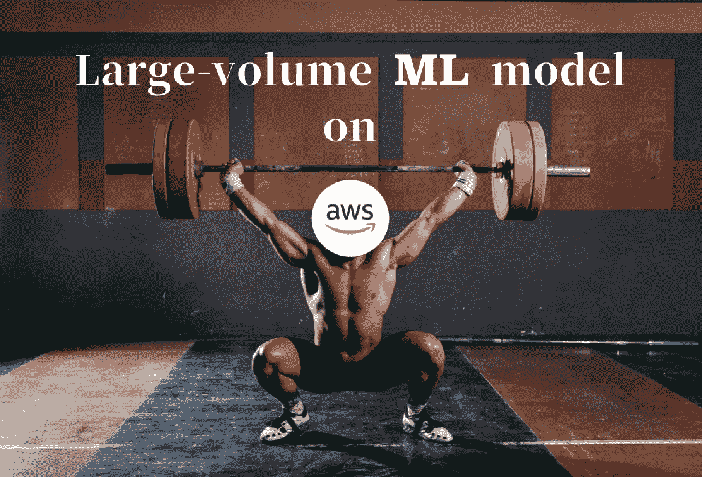

# 在 AWS 上运行大量机器学习模型

> 原文：<https://medium.com/analytics-vidhya/operate-large-volume-machine-learning-models-on-aws-ac7dc87def62?source=collection_archive---------9----------------------->

(修改后的[与壮汉健身的照片](https://www.freepik.com/free-photo/bodybuilding-gym-with-strong-man_1265854.htm)由 [freepik](https://www.freepik.com/) 创作)

本文介绍了一个使用大容量机器学习模型文件(以下称为“大容量模型”和“ML 模型”)的 AWS 无服务器架构的模型案例，以及如何构建它。

目标受众是那些有以下希望的人。

*   希望在新服务上运行大批量模型