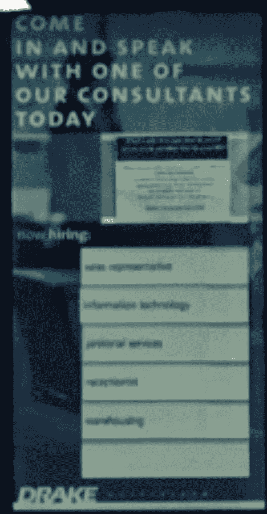

# 使用(Py)宇宙魔方的光学字符识别(OCR ):第 2 部分

> 原文：<https://medium.com/analytics-vidhya/optical-character-recognition-ocr-using-py-tesseract-part-2-39f656c03e7d?source=collection_archive---------13----------------------->

在 [part1](/@mistrynirav123/optical-character-recognition-ocr-using-py-tesseract-part-1-29ba8104eb2b?source=friends_link&sk=c480f1d27c3aba061fc3c3f90c6753a7) 中，我们已经看到，从教科书页面图像和噪声图像中，我们如何使用 tesseract 提取文本。

在这一部分，我们将看到如何从照片中提取文本。

让我们尝试一个新的例子，并带来一些我们已经学到的东西。

这是一个店面的图像，让我们加载它，并尝试从图像中获取商店的名称。

```
from PIL import Image
import pytesseract
# Lets read in the storefront image I've loaded into the course and display it
image=Image.open('../input/OCR1/storefront.png')
display(image)
# Finally, let's try and run tesseract on that image and see what the results are
pytesseract.image_to_string(image)
```


' fa | INTERNATIONAL \ n \ n \ nEe oat \ n \ n \ n \ nK \ n \ n | bile \ n \ n-_ \ n = \ nE " ee—\ n . \ n \ n | PE 1800 GO 德雷克·PTV·哲尔 I I \ n \ n 注意\ n \ n \ n \ n 我是他 ie '

我们看到在最底部有一个我们不容易识别的字符串。宇宙魔方无法提取这个图像和名字。通过裁剪图像，它将能够识别文本。所以让我们试着通过裁剪掉某些部分来帮助宇宙魔方。

首先，让我们设置边界框。在此图中，商店名称在一个方框中。

```
bounding_box=(470, 150, 1020, 320)# Now lets crop the image
title_image=image.crop(bounding_box)# Now lets display it and pull out the text
display(title_image)
pytesseract.image_to_string(title_image)
```


德雷克\ n \国际

很好，我们看到了如何通过减少一些问题来实现这一点。现在，我们已经能够获取一幅图像，在我们希望看到文本的地方对其进行预处理，并将文本转换成 python 可以理解的字符串。

如果你回头看看这张图片，你会看到商店外面有一个小标志，上面有商店的网站。我想知道我们是否能认出那个标志上的文字？让我们试一试。

首先，我们需要为这个标志确定一个边界框。为此，让我们使用我决定的边界框。

```
# Now, lets crop the image
little_sign=image.crop((1000, 548, 1215, 690))
display(little_sign)
```


好吧，这是个小信号！OCR 在处理分辨率更高的图像时效果更好，所以让我们使用 pillow resize()函数来增加该图像的大小。

让我们在一个(w，h)元组中将宽度和高度设置为现在的十倍

```
new_size=(little_sign.width*5,little_sign.height*5)
display(little_sign.resize( new_size, Image.NEAREST))
```


```
pytesseract.image_to_string(little_sign.resize( new_size, Image.NEAREST))
```

德拉金特尔。' COM '

随着尺寸的增加，我们能够提取文本。

如果你回头看看这张图片，你会看到商店外面有一个小牌子，上面有标语。我想知道我们是否能认出那个标志上的文字？让我们也试一试。

我们将再次裁剪该图像。

```
little_sign=image.crop((570, 490, 690, 720))
display(little_sign)
```


我们将调整此图像的大小以获得更好的视图。

```
new_size=(little_sign.width*5,little_sign.height*5)
display(little_sign.resize( new_size, Image.NEAREST))
```


'今天与\ n \ n 我们的顾问之一见面'

我想我们应该能找到更好的。我可以读，但它看起来真的像素化。让我们看看所有不同的调整大小选项是什么样子的。

```
options=[Image.NEAREST, Image.BOX, Image.BILINEAR, Image.HAMMING, Image.BICUBIC, Image.LANCZOS]
for option in options:
    # lets print the option name
    print(option)
    # lets display what this option looks like on our little sign
    display(little_sign.resize( new_size, option))
```

0


4


2



5


3


1


由此，我们可以注意到两件事。首先，当我们打印出一个重采样值时，它实际上只是打印一个整数！这真的很常见:API 开发人员编写一个属性，比如图像。双三次，然后将它赋给一个整数值来传递。一些语言使用值的枚举，这在 Java 中很常见，但在 python 中，这是一种非常正常的做事方式。

我们学到的第二件事是，图像重采样有许多不同的算法。在这种情况下，图像。双三次过滤器做得很好。让我们看看我们是否能够从这个调整大小的图像中识别出文本。

```
# First lets resize to the larger size
bigger_sign=little_sign.resize(new_size, Image.BICUBIC)
# Lets print out the text
pytesseract.image_to_string(bigger_sign)
```

noua \今天\n 进来和我们的顾问之一\n\n 交谈

嗯，不完美，但我们可以看到句子。

这是清理 OCR 数据的一个不错的方法。在实践中使用一种语言或特定领域的字典是很有用的，特别是如果您正在为一种专门的语言(比如医学知识库或位置)生成一个搜索引擎。如果你向上滚动，看看我们正在处理的数据——挂在商店外面的这块小板子——情况还不算太糟。

至此，您已经学会了如何处理图像并将它们转换成文本。

*原载于 2020 年 7 月 15 日*[*【https://www.numpyninja.com】*](https://www.numpyninja.com/post/optical-character-recognition-ocr-using-py-tesseract-part-2)*。*