# 最佳运输— 1

> 原文：<https://medium.com/analytics-vidhya/optimal-transportation-1-61fe0dda03ba?source=collection_archive---------14----------------------->

与深度学习的关系

## 介绍

最近，我跟随石溪大学的 David Gu 教授做了一些计算几何方面的工作。基础数学对计算机科学和机器学习有如此深远的影响，这很有启发性。由于我的背景是代数几何/拓扑学，我发现这个领域很顺利，也很令人兴奋。我决定根据我所学到的写一系列的文章，并展示一些关于最佳运输的酷东西(第一)。

我会尽量不要在第一个帖子里说得太专业，因为我不想把人们吓跑。我将简要地展示最优运输如何改进深度学习，特别是在 GAN 案例中。

## 深度学习和模型崩溃

GAN 代表生成性对抗网络。网上有很多介绍甘模型的文章，我就不赘述了。简而言之，GAN 是由两个神经网络组成的生成模型，一个是鉴别器，另一个是生成器。鉴别器网络用于判断一幅图像是“假”还是“真”，通常是预先训练好的。生成器模型将从*潜在空间*获取输入点来生成图像，并输出图像。*潜在空间是向量空间，需要训练*。GAN 模型将发生器和鉴别器堆叠在一起，随机点流入发生器，然后流入鉴别器。来自生成器模型的输出被手动标记为“真实的”，然而，在开始时，鉴别器将认为它是“虚假的”,并且大的误差将迫使反向传播更新生成器权重以输出更好的图像。在这个过程中，潜在空间将被赋予意义，并最终代表输出分布。

让我们更广泛地了解深度学习。当我们训练一个 DL 模型时，例如 NLP 模型，我们经常使用嵌入。一个单词或一个物体被嵌入到一个高维矩阵或空间中，使得每个点都由某个空间中的高维向量来表示。然后训练该模型以赋予该空间一个意义，以便我们的训练样本数据将相应地分布在该空间中。现在，我们似乎可以回答这个问题:深度学习真正学到了什么？*它学习流形上的概率分布*。

然而，潜在空间中潜在点的分布可能不是连续的。这可能会导致问题，例如，如果我们的输入点位于潜在空间的间隙区域呢？那么模型就无法判断它来自哪个分布，并且会产生非常差的结果。让我们用一个具体的例子来说明这个问题:MNIST 数字数据集。使用 GAN，我们可以从一个大潜在空间，比如说 100 维向量空间中产生数字图像。通过选择适当的学习率和历元数，鉴别器可以很好地分辨“真实”和“虚假”图像

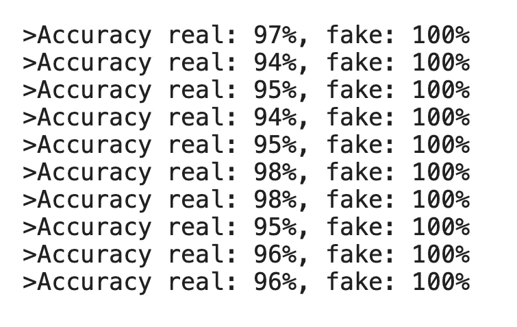

鉴别器模型的准确性

但是 GAN 模型损失(二进制交叉熵)甚至在 100 个时期后仍保持在相当高的水平。这表明即使经过长时间的训练，发生器也不能欺骗鉴别器。

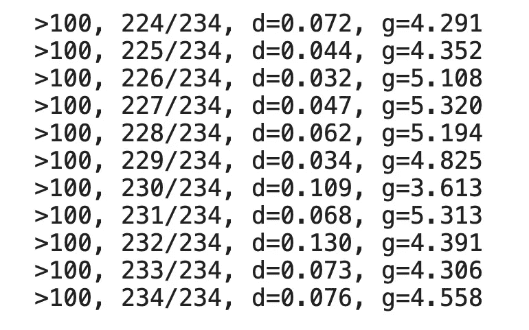

让我们用 UMAP 把潜在空间投影到一个低维空间(2 维)后，画出这个潜在空间。

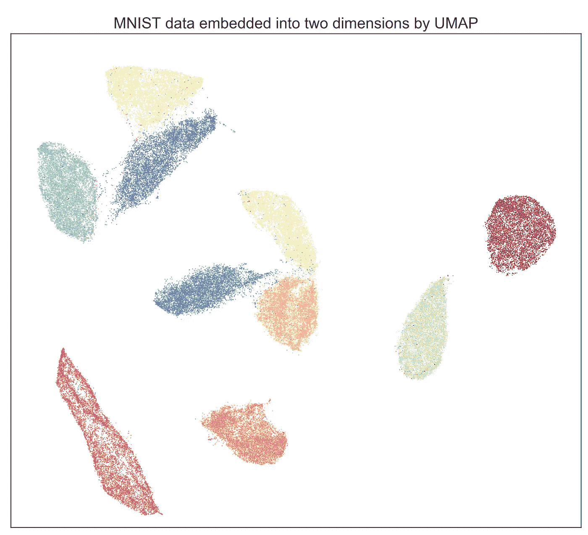

我们立即看到，分布是高度不连续的，有很大的差距。如果我们仅仅使用这个二维空间作为潜在空间来生成数字图像会发生什么？

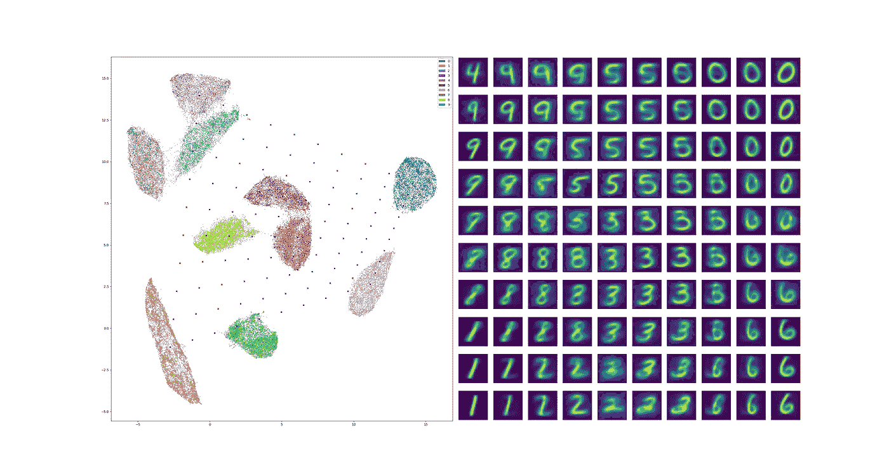

显然有许多模糊的输出，其中一些是不可识别的。难怪鉴别者不上当，轻易抓到“假”的。

## 最佳运输

我们可以通过使用最佳运输来解决这个问题。最佳运输理论试图解决以下问题:我们有两个可测空间

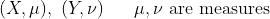

带有概率分布函数

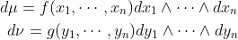

概率分布函数

我们说一个从 *X* 到 *Y* 的映射 *T* 测度保持如果

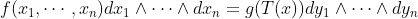

测度保持映射

然后给定一个成本函数 c

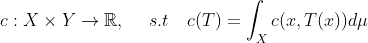

价值函数

我们要计算使成本最小的保运输措施 *T* (称为最优运输)

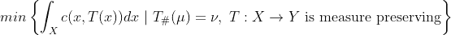

蒙日问题

我们试图最小化的积分通常被称为**瓦瑟斯坦距离**，上面的表达式被称为**蒙日问题**。通过一些数学操作，我们可以将蒙日问题转化为白来尼问题(我希望在这个系列中给出更多的数学细节！):

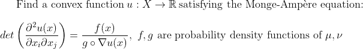

白来尼问题

如果我们取二次成本函数，可以证明白来尼问题是有解的

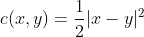

白来尼成本函数

白来尼问题中的函数 *u* 被称为白来尼势(见下图)，其梯度给出了运输图 *T* 。

我们将来自白来尼观点的最佳运输理论应用于上面给出的二维潜在空间。首先，我们赋予二维潜在空间一个均匀的分布，即每个点的权重相等，这就是我们的 *Y* 空间。然后我们建立白来尼势如下:

1.  我们对 *Y* 和相应的 Voronoi 图进行三角剖分(Delaunay ),并计算每个 Voronoi 单元的面积。
2.  我们通过将 Voronoi 单元提升到三维空间作为超平面并计算它们的上包络来构建白来尼势。
3.  这个上包络的勒让德对偶到 2D 空间的投影给出了 *Y* 空间的加权 Delaunay 三角剖分。
4.  迭代地调整提升和上包络的高度，使得其到 2D 空间的投影给出 Voronoi 分解，使得单元的面积等于给定的权重。这给了 *X* 空间。

以这种方式获得的白来尼势将是分段线性空间，并且投影将给出 *X* 空间的 Voronoi 图，使得每个单元测量目标重量，即，在我们的情况下，均匀分布的空间。

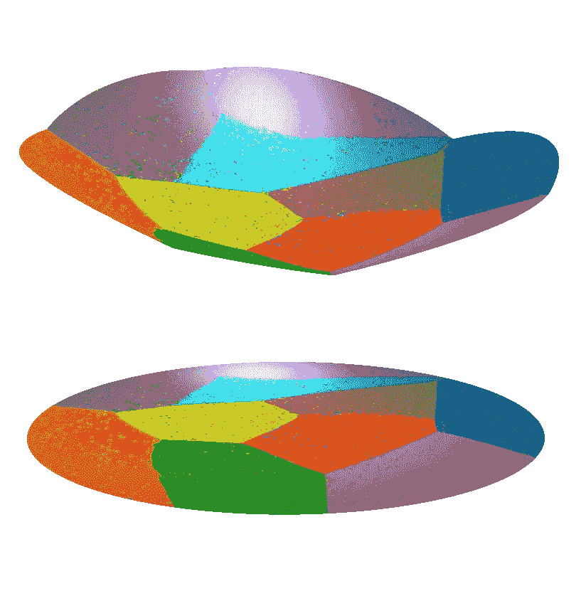

白来尼势

我们看到，这样得到的投影空间在分布之间没有间隙，奇点的测度为零。如果我们从这个空间而不是原始的 2 维潜在空间运行 GAN，那么模型崩溃问题将得到显著改善。

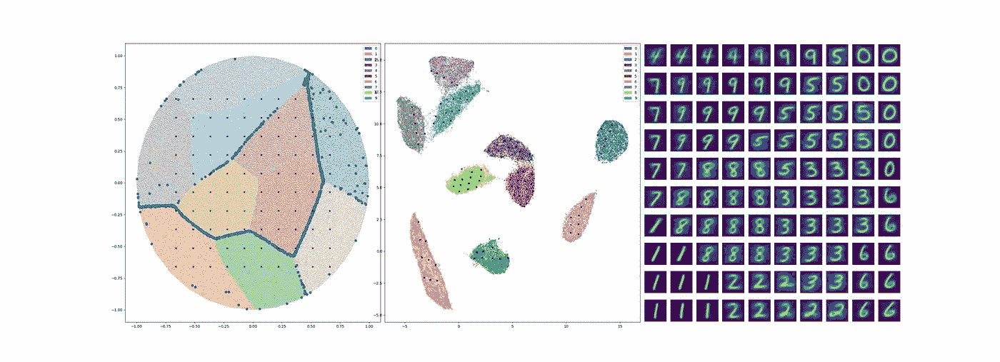

加班后的甘

值得注意的是，大部分生成的数字是清晰明确的，但仍有一些是模糊的，例如，底部第三行右侧。原因是 OT 潜在空间中的数据点位于两个分布的边缘，也称为奇点。虽然奇点有零测度(在我们的空间中是余维 1)，但可能会发生一些点位于这个零测度集中。但是，这已经是对原有潜伏空间的巨大提升了。