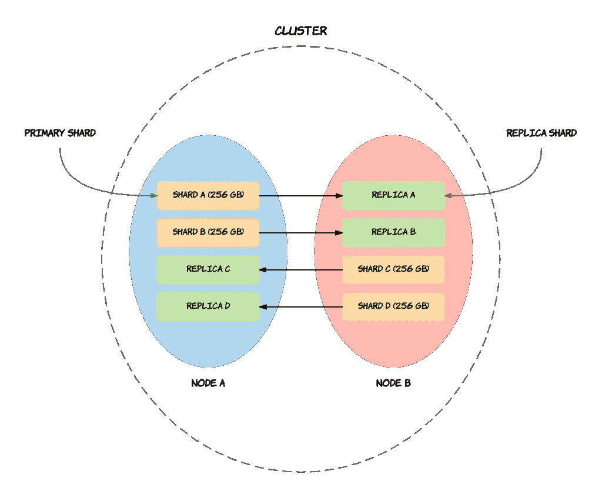
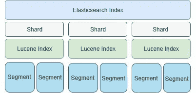

# 优化弹性搜索—更强、更好、更快。

> 原文：<https://medium.com/analytics-vidhya/optimising-elasticsearch-stronger-better-faster-e56fed2bcc8b?source=collection_archive---------14----------------------->

Elasticsearch 是目前最热门的开源数据存储解决方案之一，它通过提供分布式架构和并行处理功能来简化数据分析，从而为我们提供了大量用例及功能。Elasticsearch 是一个分布式数据存储和搜索引擎，具有容错和高可用性功能。

为了充分发挥 Elasticsearch 的作用，正确配置它是很重要的。单一的通用配置可能不适合所有用例，因此首先理解一个用例，然后基于这个用例配置集群是非常重要的。

本文将关注 Elasticsearch 的搜索密集型初始和动态配置，以及使用指标检测可伸缩性问题。

在我们开始之前，让我们清楚地理解几个术语

1.  **索引**:在 Elasticsearch 中，索引是文档的集合。
2.  **节点**:单个 Elasticsearch 实例。在大多数环境中，每个节点运行在单独的机器或虚拟机上。
3.  **集群**:一个 Elasticsearch 集群由一个或多个节点组成，可以通过它的集群名来识别。
4.  **SHARD** :因为 Elasticsearch 是一个分布式搜索引擎，所以一个索引通常被分割成多个元素，称为 SHARD，分布在多个节点上。Elasticsearch 自动管理这些碎片的排列。它还会根据需要重新平衡碎片，因此用户无需担心细节。
5.  **副本**:默认情况下，Elasticsearch 为每个索引创建五个主分片和一个副本。这意味着每个索引将由五个主要碎片组成，每个碎片将有一个副本。

默认情况下，一个 Elasticsearch 索引有 5 个主分片和 1 个副本。然而，这并不适合每一个用例。为了有效地维护索引，正确计算分片配置是非常重要的。

# **了解分片限制**

碎片大小对于搜索查询非常重要。如果分配给一个索引的分片太多，Lucene 片段就会很小，这会导致开销增加。当同时进行多个查询时，大量的小碎片也会降低查询吞吐量。另一方面，太大的碎片会导致搜索性能下降和更长的故障恢复时间。因此，Elasticsearch 建议一个碎片的大小应该在 20 到 40 GB 左右。

例如，如果您的索引将存储 800 GBs 的数据，您将为该索引分配 20 到 40 个主碎片。

现在，根据集群的大小，假设集群中有 25 个节点，您将为该索引选择 25 个主碎片，以便在集群的节点之间平均分配碎片。

弹性搜索索引拆分架构

> 确定最佳大小的最佳方法是用您自己的数据和查询进行测试。

# **本地负载均衡**

Elasticsearch 自动处理负载平衡。但是，我们应该确保碎片总数(主碎片+次碎片)与节点数成比例。

这确保了负载在集群中不同节点之间的均匀分布。假设一个集群中有 10 个节点，碎片的数量应该是 10 的倍数。

如果节点之间的负载分布不均衡，则碎片较多的节点上的资源使用率会较高，并且瞬时平均负载会高于其他节点。换句话说，其他节点上的资源将被较少使用，而具有更多碎片的节点将被较多使用。

节点上索引的分片

这里您可以看到，我们有 12 个主碎片，其中有 3 个副本。因此，我们总共有 36 个碎片分布在 6 个节点上。

36/6 = 6(每个节点的碎片数)

当请求集群上的这个索引时，我们必须通过访问至少 3 个节点来搜索所有碎片(0 到 11)。我们应该访问最少数量的节点来快速满足请求。

# **配置弹性搜索集群**

配置 Elasticsearch 集群时，最主要的考虑之一是确保至少一半的可用内存用于文件系统缓存，以便 Elasticsearch 可以在物理内存中保留索引的热区域。

在设计集群时，还应该考虑物理可用堆空间。Elasticsearch 建议基于可用堆空间的碎片分配应该最大为 20 碎片/GB，这是一个很好的经验法则。例如，一个堆容量为 30gb 的节点最多应该有 600 个碎片，以保持集群的良好状态。一个节点上的存储可以用下面的公式表示:

一个节点可以支持的磁盘空间= 20 *(每 GB 的堆大小)*(以 GB 为单位的碎片大小)

由于在高效集群中常见大小在 20 到 40gb 之间的碎片，因此具有 16gb 可用堆空间的节点最多可以支持 12tb 的磁盘空间。了解边界有助于为更好的设计和未来的扩展操作做准备。

> Elasticsearch 可以使用的总内存是有限的，大约是 32GB ( [堆大小](https://www.elastic.co/guide/en/elasticsearch/guide/current/heap-sizing.html#compressed_oops))。备用内存用于操作系统缓存和 Lucene 内存数据结构。如果单个节点的索引总计大于 32GB，那么 GC 收集会更频繁。

# **基于索引行为的优化**

1.  **读取密集索引**

如果索引被读取的频率远远高于它们被修改的频率，那么这个索引就被称为读密集型的。例如，电子商务产品搜索目录。

对于这样的索引，建议使用嵌套文档。与子文档相比，嵌套文档可以提高搜索性能。但是，将数据写入嵌套文档的成本非常高。

增加副本的数量可以在一定程度上提高性能。但是，由于硬件限制，性能会下降。可以通过逐个增加副本的数量来找到这个断点。可以使用 JMeter、Apache Bench ab 之类的工具，在增加副本数量的同时测量搜索性能。

当索引设置为只读时，可以执行强制合并操作，通过合并段来减少段的数量。因此，优化的段将导致更好的搜索性能，因为每个分片的开销取决于段的数量和大小。不要将此应用于读写索引，因为这将导致产生非常大的段(每个段大于 5Gb)。此外，该操作应该在非高峰时间进行，因为这是一个昂贵的操作。

2.**写密集索引**

如果索引被修改的频率比被读取的频率高得多，那么这个索引就是读密集型的。在包含此类索引的集群中，资源通常用于写入数据。

对于写密集型索引，您应该定期重建索引。这是因为更新了文档。事实上，在 elasticsearch 中，文档不会更新，因为它们是不可变的。因此，用新数据创建了另一个文档，并且该文档的版本增加了 1。当您重新编制索引时，新索引将包含最新版本的文档。因此索引大小将会减小。

3.**过滤不查询**

如果在搜索中不需要评分功能，请避免使用查询。您应该更喜欢过滤器上下文。因为过滤器被缓存并且不影响分数，因此比查询更快。

4.**分度后复制**

当您索引一个文档时，首先将它写在主碎片上，然后复制到副本上。复制到副本是一项开销很大的操作，并且会限制初始索引。因此，在初始索引完成之前，应该禁用副本。

5.**主动监控集群**

您应该使用一个好的性能监控工具来监控您的集群。比如 ElasticHQ。这将允许您监视集群运行状况和更改后的响应。

6.**基于时间的索引**

您应该使用基于时间的索引来管理数据和更好地组织数据。如果对过去的索引没有写操作，可以将过去的每月索引设置为只读模式，以提高对这些索引的搜索性能。

这些是我在阅读其他媒体文章、技术博客和我自己的工作经验时发现的一些事实。

希望你们觉得有帮助。

谢了。