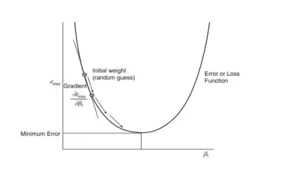

# 最佳化

> 原文：<https://medium.com/analytics-vidhya/optimization-acb996a4623c?source=collection_archive---------1----------------------->

数据科学的三大支柱是:

*   线性代数
*   统计数字
*   最佳化
*   什么是优化？

> “优化问题包括通过系统地从允许的集合中选择输入值并计算函数值来最大化或最小化真实函数。”

它在寻找问题的最佳解决方案(可能是最小化或最大化函数形式 f(x))时很有用。这里 x 代表决策变量。我们选择 x 的值，使得函数 f 要么最大化，要么最小化。在解决优化问题时，可能需要满足 x 上的某些约束，即我们只能在某些区域或值集中选择 x。

***为什么要优化？***

在现实生活中，优化有助于提高系统的效率。它应用于无数领域，包括医药、制造、运输、供应链、金融、政府、物理、经济、人工智能等。在优化模型中，目标可以是最小化生产系统中的成本。在医院中，目标可以是使患者在被医生看到之前在急诊室中的等待时间最小化。在市场营销中，目标可以是在预算和运营条件下，通过瞄准正确的客户来实现利润最大化。人道主义行动的目标是通过设计最佳路线，尽可能快地向尽可能多的灾民分发资源水、食物和医疗服务。它也是数据科学算法的主干。它是数据科学中几乎所有机器学习和统计技术的核心。

它有助于找到问题的最小误差或最佳解决方案。例如，在回归中，误差计算如下:

优化有助于找到损失函数的最小值。

我们再举一个例子。

如果我们有关于 y 和 x 的数据，并且我们想在 y 和 x 之间拟合一个函数，比如 y=a1+a2*x。我们有 x 和 y 的多个样本，(x1，y1)，(x2，y2)等等。我们可以把这个概括为:yn=a1+a2*xn。正如我们所见，有 n 个方程，但只有 2 个变量。几乎不可能解出所有这些方程。所以我们将误差函数定义为:

e=y1-a1-a2*x1

一般情况下，en=yn-a1-a2*xn

如果对决策变量的取值没有限制，我们就有一个无约束优化问题。这是线性回归中遇到的一类问题。它也被称为函数逼近问题，广泛应用于数据科学中。

此外，如果我们查看来自不同类别的数据点，并希望找到一个超平面来分隔这些数据点，那么问题是找到有效分隔这些类别的最佳超平面。

答案在于优化。超平面必须以这样的方式选择，即类被有效地分类，并且决策变量是表征超平面的参数。

因此，正如我们所见，几乎所有的机器学习算法都可以被视为优化问题的解决方案。对优化问题的更深入理解可以更好地理解机器学习，并有助于使算法的工作合理化。

***组件优化***

1.目标函数(最大值或最小值)

2.决策变量

3.限制

第一部分是一个目标函数f(x ),我们试图将它最大化或最小化。一般来说，我们谈论最小化问题是因为如果你有一个关于 f(x)的最大化问题，它可以被转换成一个关于-f(x)的最小化问题。

决策变量(x):第二个组成部分是决策变量，我们可以选择最小化功能。所以，我们通常把这个写成 min f(x)。

约束(a ≤ x ≤ b):第三个组件是将这个 **x** 约束到某组值的约束。

***优化的类型***

根据目标函数、约束和决策变量的类型，优化可以是各种类型的。

1.线性规划:如果决策变量是连续的，函数形式是线性的，所有约束也是线性的，则称为线性规划问题。

2.非线性规划:如果决策变量保持连续，而目标函数或约束条件是非线性的，则称为非线性规划问题。

在许多情况下，决策变量可能不是连续的，而是整数。例如:f(x1，x2)和

x1 *∈* [0，1，2，3]

x2 *∈* [0，1，2，3]

如果目标函数和约束是线性的，决策变量是整数，则称为线性整数规划问题。

如果目标函数或约束条件是非线性的，而决策变量是整数，则称之为非线性整数规划问题。

一个特殊的情况可能是决策变量只能取二进制值(0，1)，那么这就叫做二进制整数规划问题。

混合整数线性规划问题:如果决策变量(x)是一个混合变量，如果目标函数(f)是线性的，并且所有的约束也是线性的，那么这类问题称为混合整数线性规划问题。因此，在这种情况下，决策变量是混合的，目标函数是线性的，约束也是线性的。

混合整数非线性规划问题:如果决策变量(x)保持混合；然而，如果目标函数(f)或约束是非线性的，那么这种类型的问题称为混合整数非线性规划问题。因此，如果目标或约束变得非线性，规划问题就变得非线性。

让我们简单地谈谈凸优化。

单变量优化是一个没有约束的非线性优化问题。在单变量优化中，只有一个决策变量。

最小 f(x)

x *∈* R，

其中 x 是决策变量，f 是目标函数。x 是连续的，因为它可以有无穷多的值。

单变量优化在 2D 中很容易可视化，如下所示:

x 轴代表决策变量( *x* )的各种值，y 轴代表目标函数 f(x)。该图显示了该函数达到最小值的点。通过在 x 轴上放一条垂线，我们得到 *x** ，这是函数达到最小值时 *x* 的值。y 轴上的相应值， *f*，*是该函数可能采用的最佳值。这是一个凸函数，因为只有一个极小值。这个最小值是局部的也是全局的最小值，即函数值比附近的点小，也是最佳解或比所有可行点小。

然而，在某些情况下，局部和全局最小值可能不一致。函数值可能小于附近点的值(局部最小值)，但不一定是最优解。这样的函数被称为非凸函数。它们可能有多个局部最小值。换句话说，本地附近可能没有更好的点/解决方案，但可能有更远的点/解决方案。

***渐变下降***

梯度下降是一种优化算法，可用于在给定具有输入和输出的数据集的情况下估计回归参数的值。

线性回归模型的成本函数是所有 N 条记录的总误差(均方误差),由下式给出:

梯度下降使用以下步骤找到使损失函数最小的最佳β0 和β1 值:

1.随机猜测β0(偏差或截距)和β1(特征权重)的初始值。

2.针对偏差和权重的初始值，计算结果变量ŷi 的估计值。

3.计算均方误差函数(MSE)。

4.通过计算误差函数的梯度来调整β0 和β1 值。

5.重复步骤 1 到 4 几次迭代，直到误差停止进一步减小或者成本变化非常小。