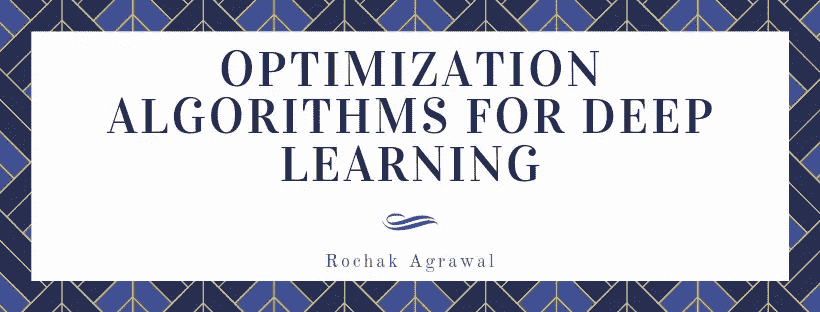

# 深度学习的优化算法

> 原文：<https://medium.com/analytics-vidhya/optimization-algorithms-for-deep-learning-1f1a2bd4c46b?source=collection_archive---------0----------------------->

深度学习是一个高度迭代的过程。我们必须尝试超参数的各种排列，以找出最佳组合。因此，我们的深度学习模型在更短的时间内进行训练而不牺牲成本是至关重要的。在这篇文章中，我将解释深度学习中最常用的优化算法背后的数学原理。

# 最优化算法