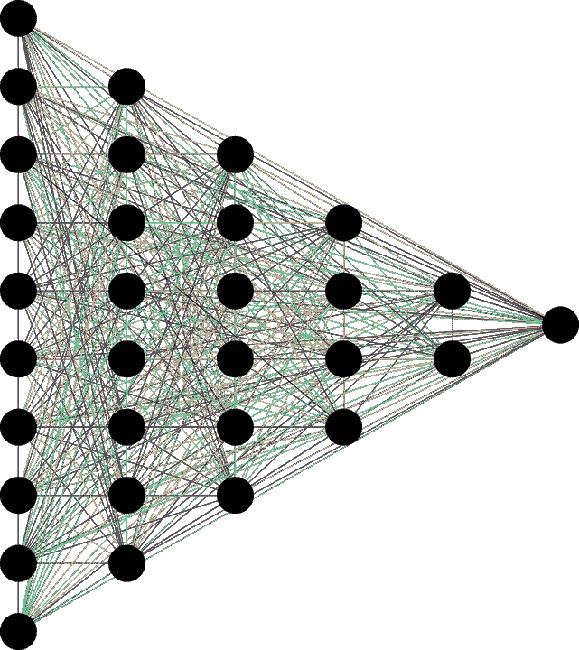
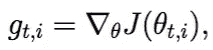
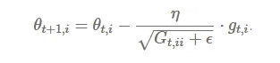
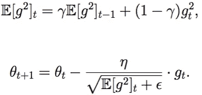
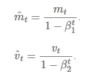
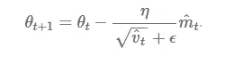

# 神经网络中的优化

> 原文：<https://medium.com/analytics-vidhya/optimization-in-neural-networks-d315dc2c8e46?source=collection_archive---------8----------------------->

来源:pix abay[[https://pix abay . com/vectors/neural-network-thought-mind-mental-3816319/]](https://pixabay.com/vectors/neural-network-thought-mind-mental-3816319/)

读者们好，在这里我将讨论神经网络中的优化器和误差反向传播。

**什么是优化器？**

神经网络中的优化器有助于在误差 E 的相反方向上更新权重，以实现具有最小可能误差的最佳结果。

每个优化器在优化权重方面都有自己的策略。

如果一切都很好，我们以尽可能少的错误获得了伟大的成果，**错误反向传播的概念是在哪里以及为什么**出现的？****

**因为当优化器试图通过记住误差来更新权重时，他们通过使用从最终层流向初始层的反向传播来这样做，这就是为什么这种方法被称为误差反向传播。现在，这种方法也存在一些问题，这些问题可能会遇到，将在本文中进一步讨论。首先，让我们来看看优化器。我们将要讨论的优化器是:**

# ****1。梯度下降:****

**梯度下降是最基本的，但在优化算法中使用最多。它在回归和分类算法中被大量使用。这是一种一阶优化算法，依赖于损失函数的一阶导数。**

****为什么叫渐变下降？****

**想象一下，我们正从山顶向一个低谷行进。众所周知，只有当我们到达最底的可到达点时，这个旅程才算完成。这就是梯度下降的工作原理，它将误差从很高的值降低到尽可能小的值。**

**它计算出应该改变权重的方式，以便函数可以达到最小值**。在反向传播过程中，损耗从一层转移到另一层，并且模型的参数(也称为权重)根据损耗进行修改，从而可以从最终层到初始层最小化损耗/误差。****

****算法:**δw = -α⋅∇e******

****有不同类型的梯度下降，它们在算法的工作方式上有所不同。****

****梯度下降算法是有利的，因为它易于计算、易于实现并且易于理解。****

****但是坏处呢？****

****1.)首先，梯度下降找到的**最小值**有很多机会，**不是保证的最小值，**可以被称为**坏局部最小值，因为一旦到达它，它将被卡在那里。******

****2.)由于权重是在对整个数据集进行计算之后计算的，因此在处理大型数据集时这是耗时的，需要很长时间才能收敛到最佳结果。****

****3.)由于权重对于一个周期/ **历元**仅更新一次，因此计算梯度下降算法需要大的存储器。****

****(Epoch 是神经网络在训练过程中查看我们整个数据集的次数)。****

****那么如何克服上述陷入坏的局部极小值和巨大的计算时间的风险呢？****

******随机梯度下降** **(SGD)** 来救援了！****

****随机=随机。它从随机点开始，并开始更新权重，在这种情况下，与每个时期仅更新一次的普通梯度下降不同，它会更频繁地更新权重。例如，如果我们有 **100 个数据点**，则 **SGD 在每个时期更新权重 100 次。******

******但是就整组数据来看，哪个是正确的？******

****显示一个输入->调整权重，显示另一个输入->再次调整权重，以此类推，直到覆盖最后一个点，然后，如果需要，从输入 1 开始。****

****同样，显示输入训练直到收敛，显示第二个，训练直到收敛。****

****观察到当模型参数频繁更新时，由于数据包含在一些地方具有一些高值的数据点，在不同强度的损失函数的权重更新和波动期间，参数将具有高方差，这是一个缺点。****

******优点**:****

****1.)模型参数的频繁更新因此，在更短的时间内收敛。****

****2.)需要较少的存储器，因为不需要存储损失函数值。****

****3.)可能会得到新的更好的极小值。****

******缺点**:****

****1.2)模型参数中的高变化，这可能延迟全局最小值的快速实现。****

****2.)甚至可能在达到全局极小值后拍摄。****

****3.)要得到和梯度下降一样的收敛性需要慢慢降低学习率的值。****

****由于训练一个历元需要很多次的权重更新，可以做些什么来减少时间消耗吗？当然是的…****

# ****2.**批量训练:******

****使用一批样本来更新权重，而不是一次使用一个样本。****

****这个过程就是**批量 SGD。******

******优势**:****

****1.)频繁地更新模型参数，并且也具有较小的变化，因为这些是作为批量更新的一部分完成的。****

****2.)由于面向批处理的更新，需要中等大小的内存。****

******所有类型的梯度下降都有一些挑战:******

****1.2)选择学习率的最佳值。如果学习率太小，梯度下降可能需要很长时间才能收敛。****

****2.)对于所有参数都具有恒定的学习速率。可能有些参数我们不想以同样的速度改变。****

****3.)可能陷入局部最小值。****

****但是，您是否一直想知道重量更新和流程？****

****为了更好地理解，我们必须了解动量。****

******动量是对梯度方向变化的阻力。******

****复杂语句？好吧…****

********

****《黑客帝国》中的三位一体倾斜的自行车****

****当你驾驶摩托车时，当你将它倾斜到一个角度(最好是向左)，观察至少 1 秒钟，当转弯时，你感觉到摩托车向倾斜角度方向的拉力，使你感觉速度增加了一秒钟，你试图抵抗这种拉力，以避免失去与摩托车的平衡，最终在你转弯后，向角度方向的拉力停止。所以你最后转了一个弯，但不是 90 度。这是力学中的一个经验法则的应用，我现在记不起它的名字了，为此道歉。:(****

****同样，在 SGD/Batch SGD 中，动量通过加速向相关方向的收敛来软化收敛，减少向无关方向的波动。(希望以上段落中的所有行现在对您有一些意义:)****

****动量通常设定为 0.9。****

******优点**:****

****1.)动量减少了参数的振荡和高方差。****

****2.)由于上述原因，它比梯度下降收敛得更快。****

******缺点**:****

****1.)增加了一个需要手动精确选择的超参数，这就是动量，我们必须面对避免动量过低或过高的风险。****

# ****3.内斯特罗夫加速梯度:****

****动量可能是一个好方法，但如果动量太高，算法可能会错过局部最小值，可能会继续上升。因此，为了解决这个问题，开发了 **NAG** 算法。这是一种避免上升势头的前瞻性方法。****

******优点**:****

****1.)不会错过局部最小值。****

****2.)如果出现最小值，速度会减慢。****

******缺点**:****

****1.)不过，Hyper 参数需要手动选择。****

# ******训练神经网络时的其他考虑事项:******

# ******学习率:******

****我们应该从每个输入样本中学习多少就是学习率。****

****典型值为 0.1 到 0.4****

## ******抖动:******

****将**小**量的噪声添加到输入数据中。****

## ******重量衰减:******

****权重乘以小系数 0****

## ******提前停止:******

****当误差变化很低时，停止训练。****

# ******选择较高的初始学习率，并在各代间降低。为什么这是一个好的实践？******

## ******变量选择:******

****训练数据在同一个序列吗？****

****输入层需要有与输入一样多的节点。说说降维，数据预处理！****

****将数据分为训练、验证和测试模型。****

# ****我们现在需要适应性！所以，我们有了更好的版本如**阿达格拉德**、**阿达德尔塔**、**亚当**。****

## ****阿达格勒:****

****这是一种二阶优化算法。它对误差函数的导数起作用。****

****上面提到的所有优化器的缺点之一是，对于所有参数和每个周期，学习率是恒定的。****

****这个优化器改变了学习率。它改变每个参数的学习率**‘η’**和每个时间步长**‘t’。******

********

****给定参数在给定时间 t 的损失函数的导数。****

********

****给定输入 I 和时间/迭代 t 时的参数更新****

******η** =在给定时间，根据给定参数 **θ(i)计算的先前梯度，对给定参数 **θ(i)** 进行修改的学习率。******

**我们存储梯度的平方和 w.r.t. **θ(i)** 直到时间步长 **t** ，而 **ϵ** 是一个避免被零除的平滑项(通常约为 1e 8)。有趣的是，如果没有平方根运算，该算法的性能会差得多。**

**它对不太频繁的参数进行大的更新，对频繁的参数进行小的更新。**

****优点**:**

1.  **每个训练参数的学习率变化。**
2.  **无需手动调整学习速率。**
3.  **由于适应性，能够在稀疏数据上训练。**

****缺点**:**

1.  **由于需要计算二阶导数，计算成本很高。**
2.  **学习率总是下降/衰减，导致训练缓慢。**

## **阿达德尔塔**

**它是 AdaGrad 的扩展，旨在消除 AdaGrad 的 ***衰减学习率*** 问题。 **AdaDelta** 将累积的过去梯度的窗口限制为某个固定大小 **w** ，而不是累积所有先前平方的梯度。在这种情况下，使用指数移动平均，而不是所有梯度的总和。**

****E[g ](t)=γ。e[g](t1)+(1γ)。g (t)****

**我们将 **γ** 设置为与动量项相似的值，大约为 0.9。**

****

**更新参数**

****优点**:**

1.  **现在学习速度不衰减，训练不停止。**

****缺点**:**

1.  **计算开销很大。**

## **圣经》和《古兰经》传统中）亚当（人类第一人的名字**

**[亚当](https://arxiv.org/pdf/1412.6980.pdf)(自适应矩估计)对一阶和二阶动量起作用。Adam 背后的直觉是，我们不想因为可以跳过最小值而滚动得如此之快，而是希望稍微降低速度以进行仔细的搜索。除了存储像 **AdaDelta** ， ***Adam*** 这样的过去平方梯度的指数衰减平均值之外，还保持过去梯度的指数衰减平均值 **M(t)。****

****M(t)和 V(t)** 分别是梯度的 ***均值*** 和 ***无中心方差*** 的一阶矩值。**

****

**一阶和二阶动量**

**这里，我们取 **M(t)** 和 **V(t)** 的平均值，使得**E[M(t)】**可以等于 **E[g(t)]** 其中，**E[f(x)】**是 **f(x)** 的期望值。**

**要更新参数:**

********

**更新参数**

**β1 的值是 0.9，β2 的值是 0.999，而' **ϵ'** 的值是(10 x exp(-8))。**

****优点**:**

1.  **方法太快，收敛很快。**
2.  **纠正消失学习率，高方差。**

****缺点**:**

**计算成本高。**

## ****雷达姆:****

**是亚当的[整改版。](https://arxiv.org/pdf/1908.03265.pdf)**

**Vanilla Adam 和其他自适应学习率优化器在训练早期基于太少的数据做出错误的决定。因此，如果没有某种形式的热身(最初以非常小的学习率进行训练)，他们很可能一开始就陷入糟糕的局部最优，从而由于糟糕的开始而使训练曲线变得更长、更难。**

**假设预热作为方差缩减器，但是所需预热的程度是未知的，并且随着数据集的不同而不同，于是人们开始确定一种数学算法作为动态方差缩减器。因此，他们建立了一个修正项，这将允许自适应动量缓慢但稳定地发展到作为潜在方差函数的完全表达。**

**作者注意到，在某些情况下，RAdam 可以退化为动量等价的 SGD，这是由衰变率和潜在方差驱动的。**

**总结是 RAdam 根据方差的潜在散度动态地打开或关闭自适应学习率。实际上，它提供了一个不需要可调参数的动态预热。**

**作者证实，RAdam 优于传统的手动预热调谐，传统的手动预热调谐需要推测或猜测预热的步骤数。**

**你可以在我的另一篇文章中读到关于误差反向传播和消失梯度的问题。**

**谢谢你读到这里！下一集再见！**