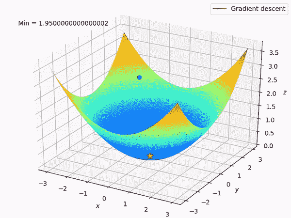
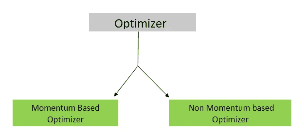
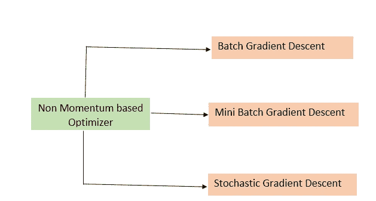
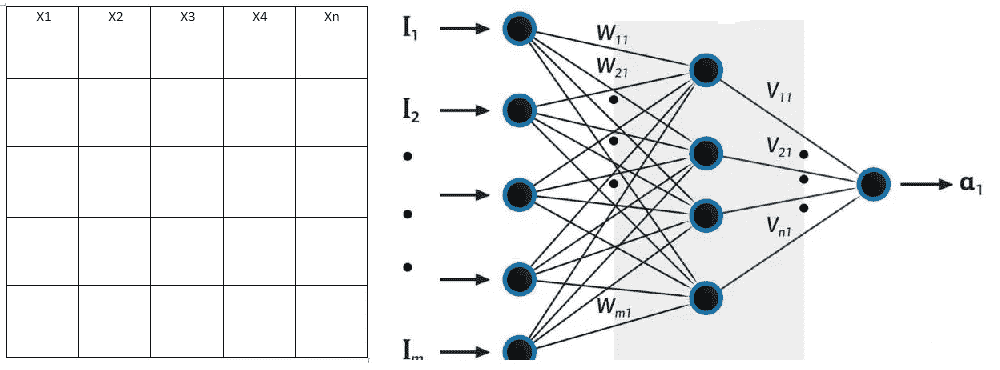
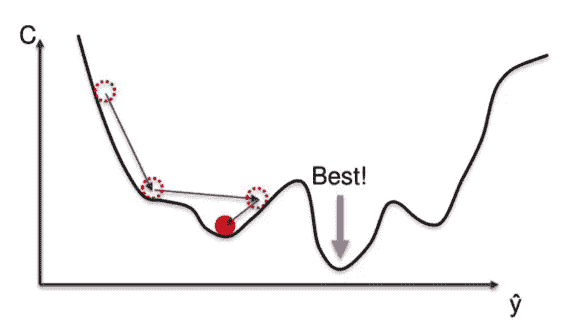
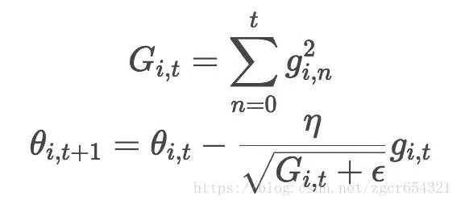
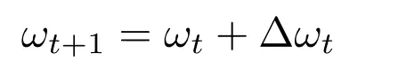
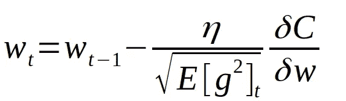
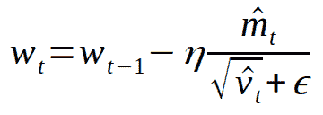

# 神经网络中的优化

> 原文：<https://medium.com/analytics-vidhya/optimization-in-neural-networks-d8d08ecf6659?source=collection_archive---------7----------------------->

[来源](https://www.google.com/search?q=optimizer+in+neural+network++gif&tbm=isch&ved=2ahUKEwjut8e43vLsAhUzSnwKHZKRAm0Q2-cCegQIABAA&oq=optimizer+in+neural+network++gif&gs_lcp=CgNpbWcQAzoECAAQHlCPgwRYrosEYL-MBGgBcAB4AIABoAGIAd0EkgEDMC40mAEAoAEBqgELZ3dzLXdpei1pbWfAAQE&sclient=img&ei=O8inX66uLrOU8QOSo4roBg&bih=657&biw=1366&hl=en#imgrc=TFiEvOMB1z792M)

> 什么是优化？

在反向传播期间，它更新神经网络的属性(权重和偏差)。

它还确保反向传播需要多少数据，并且只向网络提供该数量的数据。

图 1

让我们开始吧……

> **非基于动量的优化**

在基于非动量的优化中，新的权重**对以前的权重没有任何依赖性**每次我们输入新的一组输入时，我们都会获得与以前的权重没有任何关系的新的权重。坚持住，当你在这篇文章中更进一步时，你会明白所有这些事情。

图 2

## 1.批量梯度下降

假设数据集有 **n 个训练集输入。**当我们将所有的训练集输入数据发送到计算属性时被称为批量梯度下降。

**α=∑(y^ — y)**

图 3

**优势:**

为了计算新的权重，神经网络必须接受成本(所有被传递的输入的平均总和),这为网络提供了一种**可学习的**能力。

**缺点:**

*   由于用户必须发送所有输入数据来计算损失，因此这将是一个非常耗时的过程。
*   它会有很高的内存消耗。
*   为了处理大数据集，我们需要高计算系统，导致高成本和复杂性。

## **2。小批量梯度下降**

假设我们在一个数据集中有 **1000** 个数据点。在 **MGD** 中，与 **BGD** 不同的是，我们不会计算整个数据集的损失，但我们会在**50–256**范围内随机选择小批量数据点，然后计算属性。

**优势:**

*   由于批量较小，系统将具有较少的内存消耗，将克服内存丢失的问题(这是以前在 BGD)。
*   与 **BGD** 相比，计算复杂度更低。

**缺点:**

在小学习率的情况下，收敛率(寻找绝对最小值的过程)将会太低。

## 3.随机梯度下降

**SGD** 从 **n 个测试数据集**中随机选择一个数据集来计算新的权重和偏差。

[来源](https://www.google.com/search?q=stochastic+gradient+descent&sxsrf=ALeKk03J4LJOWqTKz1YUaWDduREGsX6Umw:1605432755864&source=lnms&tbm=isch&sa=X&ved=2ahUKEwiGtP6In4TtAhVi7XMBHS6eA-sQ_AUoAXoECBUQAw&biw=1366&bih=657#imgrc=UTjx1JwJ5WLYhM)

*   学习率的高低都不会影响属性的变化。
*   与 **BGD** 和 **MGD 相比，它的计算复杂度更低。**
*   它与基于动量的梯度下降配合得非常好。

> **基于动量的优化**

在计算新权重的技术中，我们必须考虑以前的权重。

对于新重量的计算，存在使机器可学习的当前损耗和先前损耗的贡献。

[来源](https://www.google.com/search?q=momentum+based+gradient+descent+gifi&tbm=isch&ved=2ahUKEwjehtm7oITtAhVVAysKHUHNCzMQ2-cCegQIABAA&oq=momentum+based+gradient+descent+gifi&gs_lcp=CgNpbWcQAzoECAAQHjoECAAQGFCx3wFY8-kBYIfuAWgAcAB4AIABlgGIAcIFkgEDMC41mAEAoAEBqgELZ3dzLXdpei1pbWfAAQE&sclient=img&ei=KvewX97JJtWGrAHBmq-YAw&bih=657&biw=1366#imgrc=9ZhP9qvD6rr6FM)

## 1.阿达格拉德

*   基于参数调整学习速率。即:-如果参数频繁出现，学习速率将会很慢，否则学习速率将会很快。
*   最适合稀疏数据集(非频繁数据集，有偏数据集)。
*   它适应手动调谐。

[来源](https://www.google.com/search?q=adagrad+formula&sxsrf=ALeKk03xRacFhRCK0lI_1xKZGJN154rpJA:1605433702487&source=lnms&tbm=isch&sa=X&ved=2ahUKEwj17a_MooTtAhVDgOYKHfDMBc4Q_AUoAXoECBoQAw&biw=1366&bih=600#imgrc=A8qJAoaQVrlb4M)

**Gi，t** 是每个更新的权重的平方和。 **gi，t** 渐变。Epsilon 提供平滑度。

**缺点:**

由于分母上更新权重的梯度平方和的存在，单调地降低了学习速率。

## **2。阿达德尔塔**

它是阿达格拉德的延伸。克服了 **Adagrad** 学习率单调递减的问题。

图 4

**优势:**

不再需要手动调谐。

**缺点:**

导致训练后期

## 3.RmsProp

也是作为**阿达格拉德更好的替代品。**我们采用**运行梯度**，而不是升级重量下降的平方和。

***跑步渐变？***

梯度的当前值和先前值之间的差异称为运行梯度。

图 5

**Eg** 是跑步梯度。

**优势:**

*   它自动调整学习速度，不依赖手动调谐。
*   比 **Adagrad** 和 **Adadelta 性能效率更高。**

## 4.圣经》和《古兰经》传统中）亚当（人类第一人的名字

*   Adam 被称为自适应动量估计。神经网络中最常用的算法之一。
*   实现自适应学习速率。
*   它适用于不频繁的数据。
*   是 **RmsProp** 和 **Adagrad 的组合。**
*   在**在线设置**和**离线设置**中工作良好。
*   它有非常少的内存需求。

让我们来了解亚当发明**背后的原因；**

以前，每当用户应用优化时，他们都使用梯度作为基础来制定它们。但是在神经网络领域取得一定的发展后，一群知识分子决定不使用梯度作为基础来制作优化函数，因此他们有了一个替代选项，即:-使用均值和方差来代替梯度来制作优化函数，这里 **Adam** 出现了。

Adam 使用规则的平均值和方差来表示。由于正则化，用户可以完全控制它，无论是设置学习率，取数据集的平均值和方差等。

在 **Adagrad** 、 **Adadelta** 和 **RmsProp** 的情况下，用户控制**学习速率**，但在 **Adam** 的情况下，用户控制**坡度**。

[来源](https://www.google.com/search?q=adam+optimization+neural+network&sxsrf=ALeKk00tmSF3R6lG9d-ULdAuR63CZDstKQ:1605461823488&source=lnms&tbm=isch&sa=X&ved=2ahUKEwj9v8Gti4XtAhXFX3wKHaIPDNgQ_AUoAXoECBYQAw&biw=1366&bih=657#imgrc=xRO3XwStS_Q8FM)

**结论:**

这都是我的观点，更多有趣的博客请关注……..