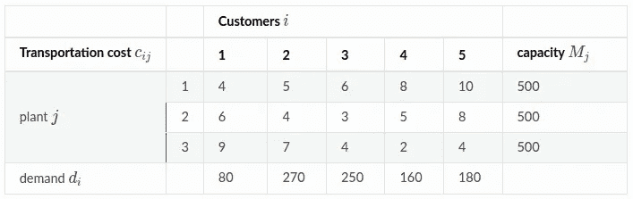
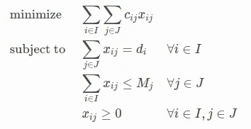
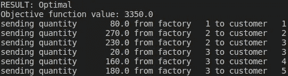
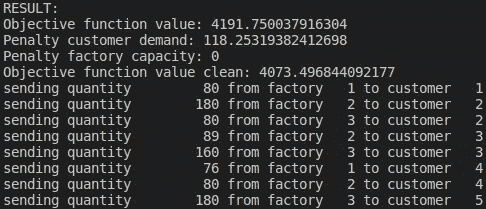
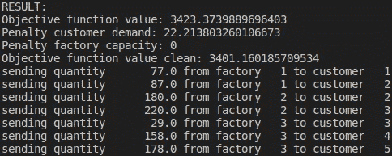

# Python 中的优化建模:带约束的元启发式算法

> 原文：<https://medium.com/analytics-vidhya/optimization-modelling-in-python-metaheuristics-with-constraints-c22b08c487e8?source=collection_archive---------3----------------------->

优化建模是寻找复杂决策问题的最优或近似最优解的最实用和最广泛使用的工具之一。

在我的[上一篇文章](/analytics-vidhya/optimization-modelling-in-python-scipy-pulp-and-pyomo-d392376109f4)中，我给出了一个非常简单的带约束的线性优化问题的例子，并使用几个 python 库提供了精确的解决方案，即 PuLP、Pyomo 和 SciPy。

在本文中，我将尝试使用一套称为**元启发式**的新技术来解决相同的问题。简单来说，元启发式是一种*通用*，高级程序，旨在找到*次优*解决方案，几乎没有关于给定问题的信息或假设。元试探法在现实世界的商业问题中越来越受欢迎，并开始被认为是精确优化方法的真正替代方法。这里我就说两个比较流行的算法:**粒子群** (PS)和**差分进化** (DE)。

首先，让我们提醒自己我们正在努力解决的问题。我们有一组客户 ***I*** = [1，2，3，4，5]和一组工厂 ***J*** = [1，2，3]。每个客户都有固定的产品需求 ***d_i*** 每个工厂都有固定的生产能力 ***M_j*** 。我们习惯于以总运输成本最小的方式将工厂发出的货物分配给客户。因此，这是整数最小化问题。



问题有***I******绑定约束**:货物总量**必须等于**客户需求。和 ***J* 非约束性约束**:发货总量**不得大于工厂生产能力**。*

**

*问题设置。*

```
*import time
import matplotlib.pyplot as plt
import numpy as npd = {1:80 , 2:270 , 3:250 , 4:160 , 5:180}  # customer demand
M = {1:500 , 2:500 , 3:500}                 # factory capacityI = [1,2,3,4,5]     # Customers
J = [1,2,3]         # Factoriescost = {(1,1):4,    (1,2):6,    (1,3):9,
(2,1):5,    (2,2):4,    (2,3):7,
(3,1):6,    (3,2):3,    (3,3):3,
(4,1):8,    (4,2):5,    (4,3):3,
(5,1):10,   (5,2):8,    (5,3):4
}              # transportation cost# Transform cost dictionary into 2D array
cost2d = np.empty([len(I), len(J)])
for i in range(len(I)):
    for j in range(len(J)):
        cost2d[i,j] = cost[i+1,j+1]# Variables bounds
n_vars = cost2d.size    # number of variables
bounds = 3*[(0,80), (0,270), (0,250), (0,160), (0,180)]*
```

# ***精确解***

*目标函数的精确解是 3350，非零变量值如下。*

**

*使用硬币或分支和切割求解器的精确解*

# *将约束转化为惩罚*

*据我所知，作为泛型，metaheuristics 不支持从目标函数约束定义中分离出来。然而，这不是一个问题，因为我们可以将约束转换成惩罚，并将它们包含在目标函数中。*

*例如，在给定的问题中，我们有两组约束条件:货物总量必须等于客户需求，货物总量必须不大于工厂产能。在这种情况下，惩罚将是违反约束的单位。对于客户需求约束，相应的惩罚可以写成 **max(0，ABS(sum _ j(goods _ ij)-demand _ I)* * 2**。因为这种约束是有约束力的，违反可以是积极的或消极的，因此 abs()在惩罚。把惩罚提高到 2 次方只是为了让惩罚更严厉。*

*对于工厂产能约束，相应的惩罚可以写成 **max(0，(sum _ I(goods _ ij)-capacity _ j)* * 3**。不需要 abs()，因为在这种情况下约束违反只能是正的。提高刑罚的权力选择是任意的。对于这个特定的问题，3 的幂似乎产生更一致的较低的目标函数值。*

*基本上，我们将最初的硬约束转换为软约束，允许违反其中的一些约束。因此，结果是次优的解决方案。*

# *粒子群优化*

*简而言之，PS 是一种基于群体的方法，其中一组粒子以随机方式探索搜索空间。每一个粒子运动都有**两个分量** : **局部探索** -纯粹随机的局部位移，和**社会运动** -向全局最优位置的整体位移。因此，PS 采用了经典的探索-利用方法。*

*下面的代码片段是来自 [Dao，S.D. 2020](https://learnwithpanda.com/2020/05/19/particle-swarm-optimization-pso-for-constrained-optimization-problems/) 的香草 PS 算法。*

```
*if problem == 'minimize':
    initial_fitness = float("inf")
if problem == 'maximize':
    initial_fitness = -float("inf")# Run Particle Swarm optimization
PSO(objective_function, bounds, n_particles, n_iterations)*
```

**

*基于粒子群算法的次优解*

*PS 算法对于给定的问题表现不佳。对于具有 500 次迭代的 200 个粒子的群体，对于大多数运行，目标函数值在 5000 左右波动。只是提醒你精确解给出值 3350。*

*即使调整粒子运动的探索性和社会性成分，或者让它们反复衰减也不会改善结果。PS 方法似乎很容易陷入局部极小值，这样粒子就出不来了。因此，目标函数值的离差相当大。*

*在上面的 PS 快照中，您可以看到两个约束的惩罚值。某些惩罚的非零值表示违反了相应的约束。在这个特定的例子中，PS 方法分配了 260 和 154 单位的货物给客户 2 和 4，而他们的需求相应地是 270 和 160。可能，不算太坏。*

# *差分进化优化*

*差分进化方法是一种基于进化的方法，结合了基于种群的策略。类似于 PS，有一组粒子随机地探索搜索空间。然而，粒子向全局最佳位置的运动是以不同的方式进行的。DE 在每次迭代中采用粒子变异和交叉，而不是简单地向某个“幸运”粒子可能首先陷入的任何局部极小值移动。在每一步中，算法选择一个最佳粒子，然后从三个随机选择的粒子中创建新的变异粒子，最后混合局部最佳粒子和变异粒子的坐标。这种所谓的基因/坐标交叉可以防止整个种群陷入局部极小值。*

```
*bounds = 3*[(0,80), (0,270), (0,250), (0,160), (0,180)]# Run Differential Evolution optimization
DE = list(de(objective_function, bounds, mut=0.8, crossp=0.7, popsize=200, its=500))x = DE[-1][0]
ofunc_value = DE[-1][-1]pen_cust_demand = \
    sum((max(0, abs(sum(x[idx: idx + len(J)]) - d[idx//len(J) +  1])))**2 for idx in range(0, cost2d.size, len(J)))pen_fact_capacity = \
    sum((max(0, (sum(x[idx: idx + len(I)]) - M[idx//len(I) + 1])))**3 for idx in range(0, cost2d.size, len(I)))print('RESULT:')
print('Objective function value:', ofunc_value)
print('Penalty customer demand:', pen_cust_demand)
print('Penalty factory capacity:', pen_fact_capacity)
print('Objective function value clean:', ofunc_value - pen_cust_demand - pen_fact_capacity)EPS = 1.e-0
for idx,_ in enumerate(x):
    if x[idx] > EPS:
        print("sending quantity %10s from factory %3s to customer %3s" % (round(x[idx]), idx%len(J) + 1, idx//len(J) + 1))*
```

**

*基于差分进化方法的次优解*

*具有 200 个粒子和 500 次迭代的 DE 算法具有非常好的收敛性，并且目标函数值(3420 - 3450)非常接近精确解(3350)。与 PS 类似，一些客户收到的货物比他们的需求少一点点。*

*值得注意的是，PS 和 DE 都可能产生相当不均匀的变量值。即，有时一些客户可能被分配 1 或 2 个单位的货物，这显然没有商业意义。*

*总之，**元试探法**是一组非常有前途的优化技术，已经可以用于现实世界的问题。与机器学习模型类似，这些方法需要针对每个特定问题进行调整。考虑到这些算法的高度随机性，每次它们都会产生略微不同的解决方案。*