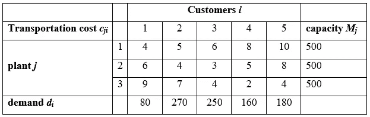
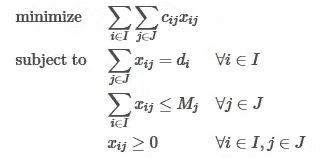
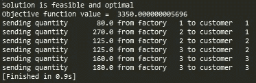
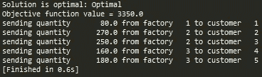
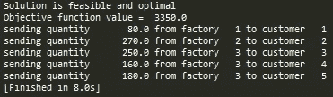

# Python 中的优化建模:SciPy、PuLP 和 Pyomo

> 原文：<https://medium.com/analytics-vidhya/optimization-modelling-in-python-scipy-pulp-and-pyomo-d392376109f4?source=collection_archive---------2----------------------->

优化建模是寻找复杂决策问题的最优或近似最优解的最实用和最广泛使用的工具之一。优化建模，大多数时候被简单地称为“优化”，是更广泛的研究领域运筹学的一部分。

在本文中，我将简要比较三个流行的开源优化库:SciPy、PuLP 和 Pyomo。我们将尝试解决单个用例，以突出提到的库的实现和语法差异。

让我们考虑简化的运输类型问题。我们有一组客户***I***=【1，2，3，4，5】和一组工厂***J***=【1，2，3】。每个客户都有一些固定的产品需求 ***d_i*** 每个工厂都有固定的生产能力 ***M_j*** 。从工厂 ***j*** 向客户 ***i*** 交付一单位货物也有固定的运输成本。



在数学上，这个优化问题可以描述如下:



我们的任务是以最低的总运输成本向每个客户交付必要数量的货物(满足客户需求和工厂生产能力)。为了将这种情况公式化为优化问题，我们必须将其分成 3 个主要部分:

*   **决策变量** —从工厂 ***j*** 发送给客户 ***i*** 的货物数量(正实数)
*   **约束**——货物总量必须满足客户需求和工厂生产能力(等式/不等式在左侧有线性表达)
*   **目标函数**——找出总运输成本最低的决策变量的值(本例中为线性表达式)

在最优化术语中，这种特殊情况是**混合整数线性规划**问题，因为决策变量不限于整数(整数规划)，并且根据业务逻辑，所有约束和目标函数都是线性的。仅存在一个业务目标使其成为单目标优化问题(多目标优化也是可能的)。

让我们开始用 python 实现解决方案。首先，我们准备好所有的数据结构:

```
import sys
import numpy as npd = {1:80, 2:270, 3:250, 4:160, 5:180}  # customer demand
M = {1:500, 2:500, 3:500}               # factory capacityI = [1,2,3,4,5]                         # Customers
J = [1,2,3]                             # Factoriescost = {(1,1):4,    (1,2):6,    (1,3):9,
     (2,1):5,    (2,2):4,    (2,3):7,
     (3,1):6,    (3,2):3,    (3,3):3,
     (4,1):8,    (4,2):5,    (4,3):3,
     (5,1):10,   (5,2):8,    (5,3):4
   }                                    # transportation costs
```

*   **SciPy**

```
# to be used in **SciPy** we must transform **cost** dictionary into 2D aray
cost2d = np.empty([len(I), len(J)])
for i in range(len(I)):
    for j in range(len(J)):
        cost2d[i,j] = cost[i+1,j+1]
```

*   **Pyomo**

```
from pyomo import environ as pe# ConcreteModel is model where data values supplied at the time of the model definition. As opposite to AbstractModel where data values are supplied in data file
model = pe.ConcreteModel()# all iterables are to be converted into Set objects
model.d_cust_demand = pe.Set(initialize = d.keys())
model.M_fact_capacity = pe.Set(initialize = M.keys())# Parameters
# Cartesian product of two sets creates list of tuples [((i1,j1),v1),((i2,j2),v2),...] !!!
model.transport_cost = pe.Param(
    model.d_cust_demand * model.M_fact_capacity,
    initialize = cost,
    within = pe.NonNegativeReals)model.cust_demand = pe.Param(model.d_cust_demand, 
    initialize = d,
    within = pe.NonNegativeReals)model.fact_capacity = pe.Param(model.M_fact_capacity, 
    initialize = M,
    within = pe.NonNegativeReals)
```

让我们初始化决策变量。

*   **SciPy**

```
x0 = np.ones(len(cost))*100
bounds = list((0,max(d.values())) for _ in range(cost2d.size))
```

*   **纸浆**

```
import pulpx = pulp.LpVariable.dicts("amount of goods", ((i, j) for i in I for j in J), lowBound = 0, cat = 'Continuous')
```

*   **Pyomo**

```
model.x = pe.Var(
    model.d_cust_demand * model.M_fact_capacity,
    domain = pe.NonNegativeReals,
    bounds = (0, max(d.values())))
```

让我们声明目标函数。

*   **SciPy**

```
def objective(x):
    obj_func = sum(x[idx]*cost2d[idx//len(J), idx%len(J)] for idx in range(cost2d.size))
    return obj_func
```

*   **纸浆**

```
objective = pulp.LpAffineExpression(e = [(x[i,j],cost[i,j]) for i,j in x], name = 'Objective function')
model = pulp.LpProblem(name = "Transportation cost minimization", 
                        sense = pulp.LpMinimize)
model += pulp.lpSum(objective)
```

*   **Pyomo**

```
model.objective = pe.Objective(
    expr = pe.summation(model.transport_cost, model.x),
    sense = pe.minimize)
```

让我们定义约束。

*   **SciPy**

```
# Constraints: sum of goods == customer demand
def const1():
    tmp = []
    for idx in range(0, cost2d.size, len(J)):
        tmp_constr = {
            'type': 'eq',
            'fun': lambda x, idx: d[idx//len(J) + 1] - np.sum(x[idx: idx + len(J)]),
            'args': (idx,)
            }
        tmp.append(tmp_constr)
    return tmp# Constraints: sum of goods <= factory capacity
def const2():
    tmp = []
    for idx in range(0, cost2d.size, len(I)):
        tmp_constr = {
            'type': 'ineq',
            'fun': lambda x, idx=idx: M[idx//len(I) + 1] - np.sum(x[idx: idx + len(I)])
            }
        tmp.append(tmp_constr)
    return tmplist_of_lists = [const1(), const2()]
constraints = [item for sublist in list_of_lists for item in sublist]
```

*   **纸浆**

```
# Constraint: sum of goods == customer demand
for i in I:
    tmpExpression = pulp.LpAffineExpression(e = [(x[i,j], 1) for j in J if (i,j) in x])
    tmpConstraint = pulp.LpConstraint(e = pulp.lpSum(tmpExpression),
        sense = pulp.LpConstraintEQ,                                
        rhs = d[i])
    model.addConstraint(tmpConstraint)# Constraint: sum of goods <= factory capacityy
for j in J:
    tmpExpression = pulp.LpAffineExpression(e = [(x[i,j], 1) for j in J if (i,j) in x])
    tmpConstraint = pulp.LpConstraint(e = pulp.lpSum(tmpExpression),
        sense = pulp.LpConstraintLE,
        rhs = M[j])
    model.addConstraint(tmpConstraint)
```

*   **Pyomo**

```
# Constraints: sum of goods == customer demand
def meet_demand(model, customer):
    sum_of_goods_from_factories = sum(model.x[customer,factory] for factory in model.M_fact_capacity)
    customer_demand = model.cust_demand[customer]
    return sum_of_goods_from_factories == customer_demand
model.Constraint1 = pe.Constraint(model.d_cust_demand, rule = meet_demand)# Constraints: sum of goods <= factory capacity
def meet_capacity(model, factory):
    sum_of_goods_for_customers = sum(model.x[customer,factory] for customer in model.d_cust_demand)
    factory_capacity = model.fact_capacity[factory]
    return sum_of_goods_for_customers <= factory_capacity
model.Constraint2 = pe.Constraint(model.M_fact_capacity, rule = meet_demand)
```

现在，让我们实际解决优化问题。为此，读者需要在他/她的机器上安装 GLPK 求解器。SciPy 模块将使用内置的解算器 SLSQP。

GLPK 可以这样安装:

```
$sudo apt-get install glpk-utils
```

*   **SciPy**

```
from scipy.optimize import minimizesolution = minimize(fun = objective,
                x0 = x0,
                bounds = bounds,
                method = 'SLSQP',
                constraints = constraints,
                tol = None,
                callback = None,
                options = {'full_output':False, 'disp':False, 'xtol': 1e-8}
                )
```

*   **纸浆**

```
solver = pulp.solvers.GLPK_CMD(msg=0)
results = model.solve(solver)
```

*   **Pyomo**

```
solver = pe.SolverFactory("glpk")
solution = solver.solve(model)
```

让我们检查结果

*   **SciPy**

```
if (solution.success) and (solution.status == 0):
    print("Solution is feasible and optimal")
    print("Objective function value = ", solution.fun)
elif solution.status != 0:
    print("Failed to find solution. Exit code", solution.status)
else:
    # something else is wrong
    print(solution.message)if solution.success:
    EPS = 1.e-6
    for i,_ in enumerate(solution.x):
        if solution.x[i] > EPS:
            print("sending quantity %10s from factory %3s to customer %3s" % (round(solution.x[i]), i%len(J) + 1, i//len(J) + 1))
```



*   **纸浆**

```
if model.status == 1:
    print('Solution is optimal: %s' %pulp.LpStatus[model.status])
else:
    print('Failed to find solution: %s' %pulp.LpStatus[model.status])print('Objective function value =', pulp.value(model.objective))EPS = 1.e-6
for (i,j) in x:
    if x[i,j].varValue > EPS:
        print("sending quantity %10s from factory %3s to customer %3s" % (x[i,j].varValue,j,i))
```



*   **Pyomo**

```
from pyomo.opt import SolverStatus, TerminationConditionif (solution.solver.status == SolverStatus.ok) and (solution.solver.termination_condition == TerminationCondition.optimal):
    print("Solution is feasible and optimal")
    print("Objective function value = ", model.objective())
elif solution.solver.termination_condition == TerminationCondition.infeasible:
    print ("Failed to find solution.")
else:
    # something else is wrong
    print(str(solution.solver))assignments = model.x.get_values().items()
EPS = 1.e-6
for (customer,factory),x in sorted(assignments):
    if x > EPS:
        print("sending quantity %10s from factory %3s to customer %3s" % (x, factory, customer))
```



正如我们可以看到的，所有三个优化模块都找到了相同的目标函数值 3350。然而，在 SciPy 中使用的 SLSQP 解算器实现了这一点，其决策变量的值与纸浆和 Pyomo 使用的 GLPK 解算器略有不同。

这里分析的三个优化模块在语法和实现原理上都非常不同。SciPy 可能是最受支持的，拥有最多的功能，并且使用简单的 python 语法。但是，据我所知它不支持二元优化问题。

纸浆和 Pyomo 有一些相似的语法结构。我有意实现了这两个模块的解决方案，将每个可能的变量或函数完全包装到**纸浆**或 **pyomo** 对象中。使用普通 python 可以实现相同的解决方案。

纸浆可以说是三个模块中比较容易学习的，但是它只能处理线性优化问题。Pyomo 似乎比 PuLP 更受支持，支持非线性优化问题，最后一点，可以进行多目标优化。