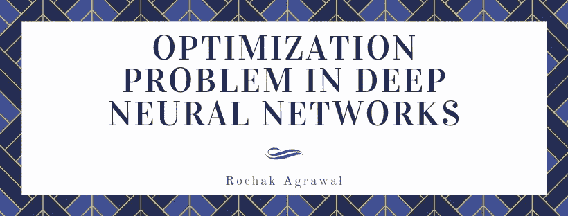

# 深度神经网络中的优化问题

> 原文：<https://medium.com/analytics-vidhya/optimization-problem-in-deep-neural-networks-400f853af406?source=collection_archive---------1----------------------->

训练深度神经网络以实现最佳性能是一项具有挑战性的任务。在这篇文章中，我将探索最常见的问题及其解决方案。这些问题包括训练时间过长、渐变消失和爆炸以及初始化。所有这些问题都被称为优化问题。训练网络时出现的另一类问题是正则化问题…