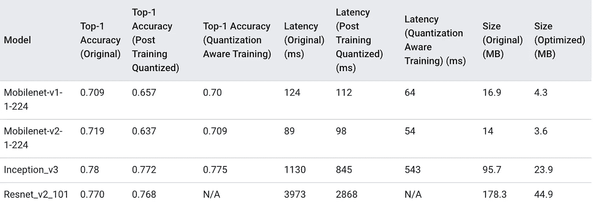
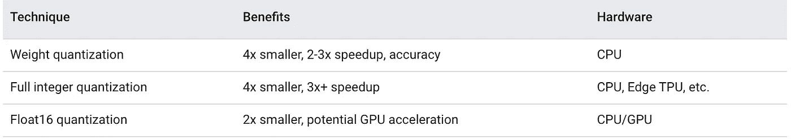
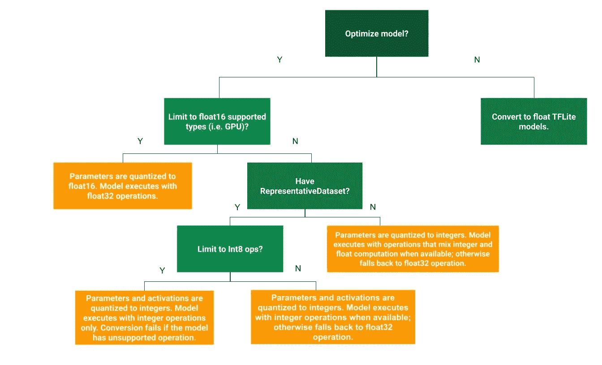
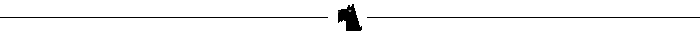

# 优化技术- TensorFlowLite！！

> 原文：<https://medium.com/analytics-vidhya/optimization-techniques-tflite-5f6d9ae676d5?source=collection_archive---------5----------------------->

最流行的优化技术之一叫做量化。


**TF Lite 入门文章**

[https://medium . com/techwasti/tensor flow-lite-machine-learning-at-the-edge-26e 8421 AE 661](/techwasti/tensorflow-lite-machine-learning-at-the-edge-26e8421ae661)

[https://medium . com/techwasti/tensor flow-lite-deployment-523 EEC 79 c 017](/techwasti/tensorflow-lite-deployment-523eec79c017)

[https://medium . com/techwasti/tensor flow-lite-converter-dl-example-febe 804 b 8673](/techwasti/tensorflow-lite-converter-dl-example-febe804b8673)

在移动设备或嵌入式设备上运行机器学习模型并进行推理会带来一定的挑战，如内存、电源和数据存储等资源量有限，因此在边缘设备上部署 ML 模型至关重要。

在移动和嵌入式设备上部署优化的机器学习模型至关重要，这样它们才能高效运行。存在优化技术，其中一种优化技术是*量化。*在上一篇文章中，我们看到了如何使用 TFLite 转换器来优化边缘设备的模型，而无需修改权重和激活类型。

## **什么是量化*？***

量化通常用于数学和数字信号处理。下面是维基的定义。

> **量化**，在数学和数字信号处理中，是将一个大集合(通常是一个连续集合)中的输入值映射到一个(可数的)较小集合中的输出值的过程，通常有有限个元素。舍入和截断是**量化**过程的典型例子。

量化是指减少代表一个数的位数的过程。在深度学习的背景下，迄今为止，用于研究和部署的主要数字格式是 32 位浮点或 FP32。将 FP32 权重和输出激活转换为最接近的 8 位整数，有时在量化中也是 4/2/1 位。

量化通过量化权重和激活类型来优化模型。TFLite 使用量化技术来加速对边缘设备的推断。TFLite converter 是*是否* ***我们可以管理一个精度更低的深度学习模型*** *。*现在你确切地知道了量子化，让我们深潜:

> 量化大大降低了使用神经网络的内存需求和计算成本。

量化深度学习模型使用的技术允许降低权重的精度表示，并可选地激活存储和计算。

TFLite 为量化提供了几个级别的支持。

1.  训练后量化
2.  量化感知训练。

下表显示了一些 CNN 模型的模型量化的好处。



选择 CNN 模型的模型量化的好处。tensorflow.org

## **培训后量化:**

顾名思义，这是在你的模型被训练之后。训练后量化是一种用于量化权重和激活类型的技术。这种技术可以减少模型大小，还可以改善 CPU 和硬件加速延迟。根据我们的要求，我们可以选择不同的优化选项，如权重、全整数等。



TensorFlow org 提供了一个决策树，可以帮助我们做决策



tensorflow.org

**权重量化:**

非常简单的训练后量化是仅量化从 FP 到 8 位精度的权重。TFLite 转换器提供此选项。在推理时，权重从 8 位精度转换为浮点精度，并使用浮点内核进行计算。这种转换只需进行一次，并进行缓存以减少延迟。如果您想进一步改善延迟，请使用混合运算符。

```
import tensorflow as tf
converter = tf.lite.TFLiteConverter.from_saved_model(saved_model_dir)
converter.optimizations = [tf.lite.Optimize.OPTIMIZE_FOR_SIZE]
tflite_quant_model = converter.convert()
```

转换时，设置`optimizations`标志以优化模型尺寸。

这种优化提供了接近完全定点推断的延迟。但是， ***输出仍然使用浮点*** 存储。

**全整数量化:**

我们可以进一步改善延迟，减少峰值内存使用，并通过确保所有模型数学量化来访问纯整数硬件加速器。在全整数量化中，您需要通过提供数据集来测量激活和输入的动态范围，使用输入数据生成器创建数据集。

```
import tensorflow as tf

def representative_dataset_gen():
  for _ in range(num_calibration_steps):
    yield [input]converter = tf.lite.TFLiteConverter.from_saved_model(saved_model_dir)
converter.optimizations = [tf.lite.Optimize.DEFAULT]
converter.representative_dataset = representative_dataset_gen
tflite_quant_model = converter.convert()
```

全整数量化的结果应该是全量化的，任何运算在 FP 中都没有量化实现。全整数执行可获得延迟更快、尺寸更小、与整数加速器兼容的模型。

通过在转换前添加以下行，可以对所有运算强制执行全整数量化，并使用整数输入和输出。

> 如果遇到当前无法量化的操作，转换器将抛出错误。

```
converter.target_spec.supported_ops = 
[tf.lite.OpsSet.TFLITE_BUILTINS_INT8]converter.inference_input_type = tf.uint8
converter.inference_output_type = tf.uint8
```

**浮点 16 量化示例:**

16 位浮点数的 IEEE 标准。我们可以通过将权重量化为 float16 来减小浮点模型的大小。与其他技术相比，这种技术将模型大小减少了一半，精度损失最小。这种技术模型在 CPU 上运行时会将权重值“反量化”为 float32。

```
import tensorflow as tf
converter = tf.lite.TFLiteConverter.from_saved_model(saved_model_dir)
converter.optimizations = [tf.lite.Optimize.DEFAULT]
converter.target_spec.supported_types = [tf.lite.constants.FLOAT16]
tflite_quant_model = converter.convert()
```

我们已经在训练后量化中看到了一种不同的技术:如果您需要最高的性能，浮点 16 量化可能不是一个好的选择。在这种情况下，定点数学的全整数量化会更好。权重量化是非常基本的量化。由于权重是训练后量化的，**可能会有精度损失，特别是对于较小的网络**。

[Tensorflow Lite 模型精度](https://github.com/tensorflow/tensorflow/blob/master/tensorflow/lite/tools/accuracy/ilsvrc/README.md)

## 量化感知培训:

训练后的模型量化可能会有精度损失，为了避免这种情况，如果您不想损害模型精度，请进行量化感知训练。如我们所知，训练后量化技术是在模型被训练之后。为了克服训练后量化技术的缺点，我们有量化感知模型训练。这种技术确保了前向传球在训练和推断两方面都符合**精度**。在这项技术中，Tensorflow 创建了 flow，在构建图形的过程中，您可以在每一层中插入假节点，以模拟向前和向后传递中的量化效果，并在训练过程中学习范围，分别针对每一层。

这项技术有两个方面

*   推理时的算子融合在训练时被精确建模。
*   推理时的量化效应在训练时建模。

```
tf.quantization.quantize(
    input,
    min_range,
    max_range,
    T,
    mode='MIN_COMBINED',
    round_mode='HALF_AWAY_FROM_ZERO',
    name=None
) out[i] = (in[i] - min_range) * range(T) / (max_range - min_range)
if T == qint8: out[i] -= (range(T) + 1) / 2.0 num_discrete_values = 1 << (# of bits in T)
range_adjust = num_discrete_values / (num_discrete_values - 1)
range = (range_max - range_min) * range_adjust
range_scale = num_discrete_values / range
quantized = round(input * range_scale) - round(range_min * range_scale) +
  numeric_limits<T>::min()
quantized = max(quantized, numeric_limits<T>::min())
quantized = min(quantized, numeric_limits<T>::max())
```

[点击此处查看完整示例:](https://www.tensorflow.org/api_docs/python/tf/quantization/quantize)

参考资料:-

[https://www.tensorflow.org/lite/convert/quantization](https://www.tensorflow.org/lite/convert/quantization)

[https://github . com/tensor flow/tensor flow/tree/r 1.13/tensor flow/contrib/quantize](https://github.com/tensorflow/tensorflow/tree/r1.13/tensorflow/contrib/quantize)

# [更多这样的故事](https://maheshwar-ligade.medium.com/)

[](https://medium.com/techwasti) [## 泰克瓦斯蒂

### Techwasti 是我们分享思想、概念、想法和代码的社区。

medium.com](https://medium.com/techwasti) 

**我们连线上**[**stack overflow**](http://stackoverflow.com/users/3187349/maheshwar-ligade)**[**LinkedIn**](https://in.linkedin.com/in/maheshwar-ligade-14447841)**[**脸书**](https://www.facebook.com/maheshwar.ligade)**&**[**Twitter**](https://twitter.com/MaheshwarLigade)**。******