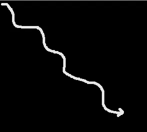
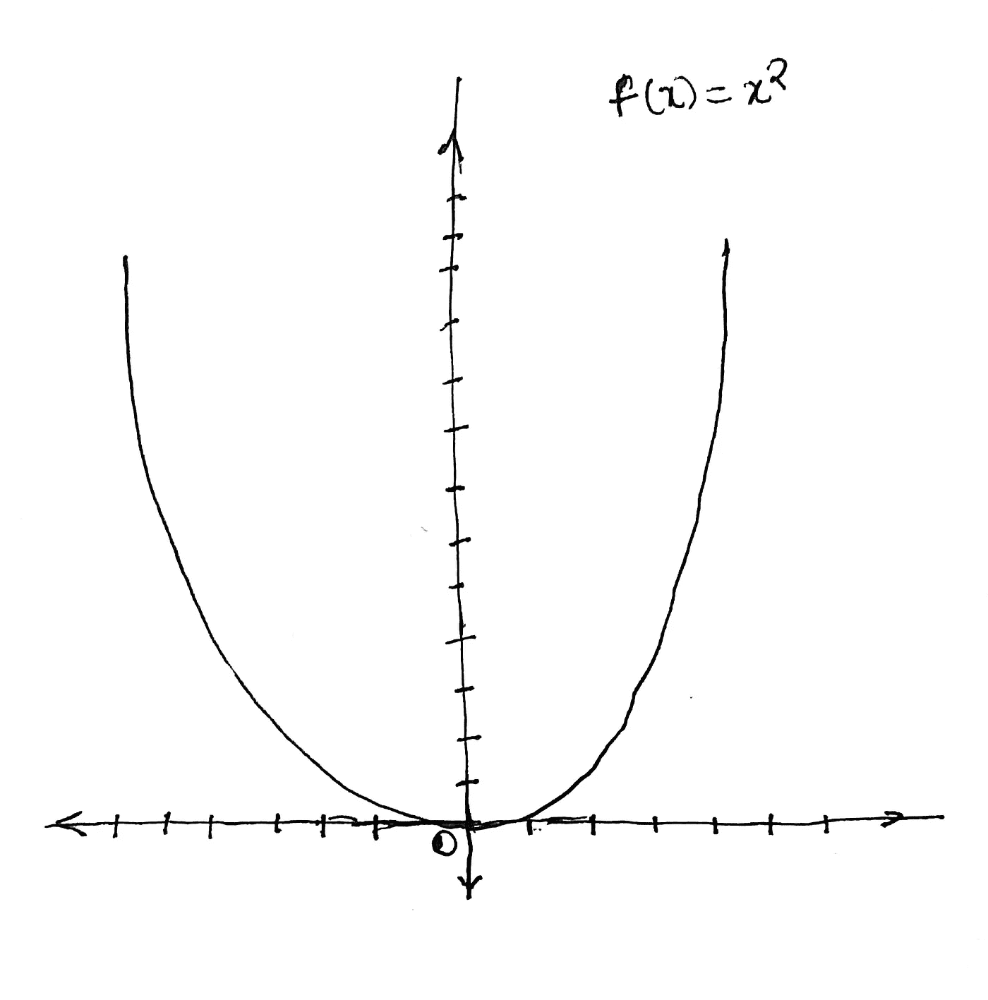
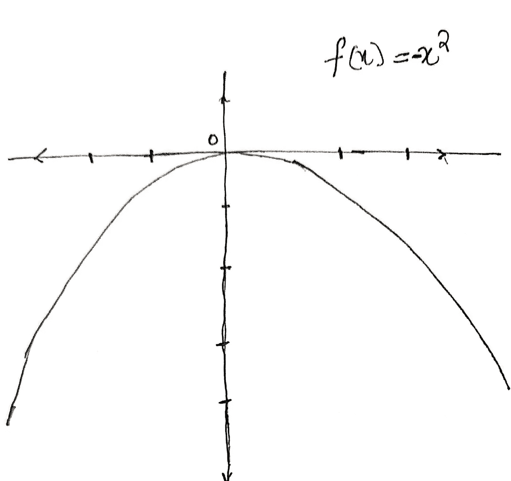
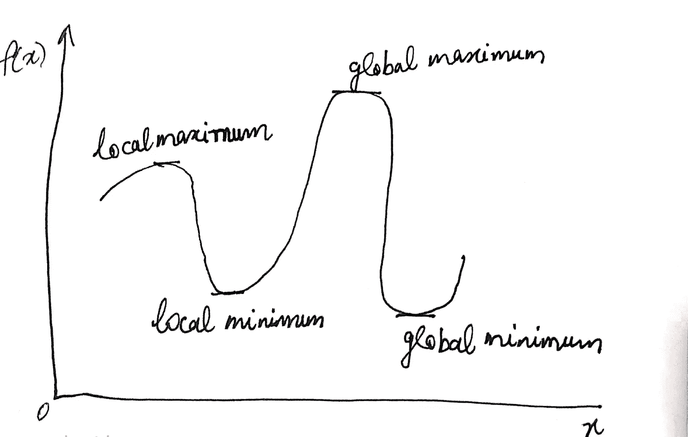
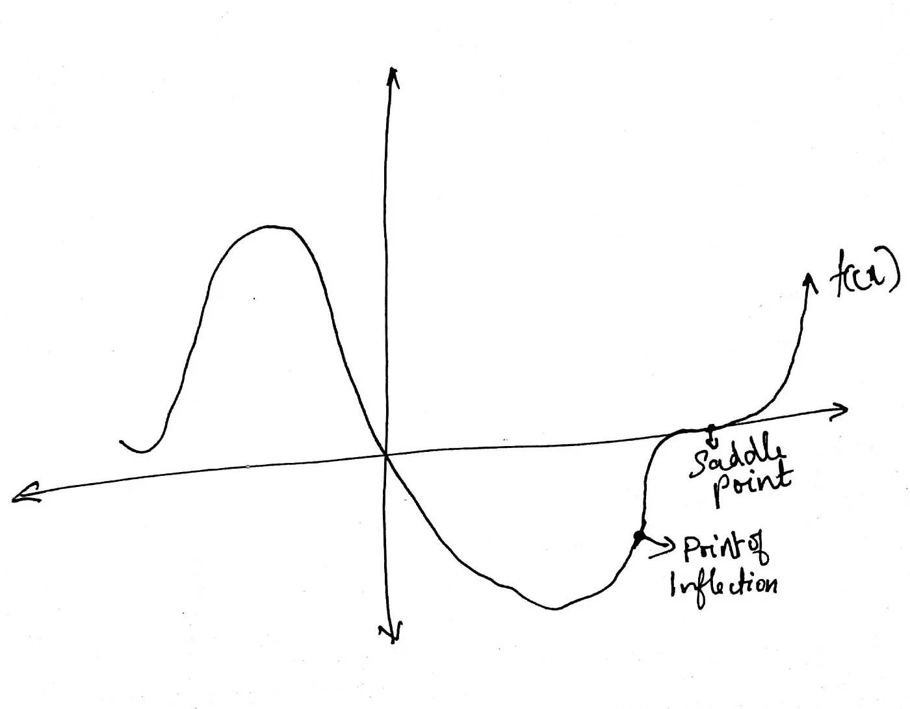
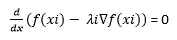
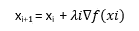
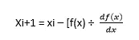

# 最优化——一个基本的数学工具包

> 原文：<https://medium.com/analytics-vidhya/optimizations-an-essential-mathematical-toolkit-b36e77b0e03a?source=collection_archive---------19----------------------->

# 介绍

有意或无意的优化是我们日常生活的一部分。我们优化的一个非常珍贵的东西是时间，我们以这样一种方式优化它，使时间可用于我们所有的家务和爱好。

从个人一生的预算开始，到一个国家的预算，都是关于优化的。所有这些优化都是在保持特定标准或约束的情况下完成的。

机器学习使用优化技术来寻找与所使用的算法相对应的损失或目标函数的最优解。根据损失函数的性质，有不同类型的优化。

解决最优化问题有解析方法和数值方法。当问题有精确解时，就使用解析解。当没有直接解时，使用数值解，这些大多是获得最优解的迭代过程。

优化算法还应具备以下特性:

**准确性**:算法应该能够精确地识别解决方案，并且不应该对系统或数据中的错误或舍入问题敏感。

**健壮性**:算法应该在各种问题上表现良好。

**效率**:算法不应该使用过多的存储或时间来收敛。

然而，获得所有上述属性是不可能的，因此，优化算法是这些属性之间的折衷。

在这篇文章中，我想简单介绍几种在机器学习算法中广泛使用的优化方法。在此之前，我们需要了解一些优化中使用的术语。

# 优化术语

# 凸函数

凸函数是一个连续函数，它在定义域中每个区间中点的值不超过它在区间两端的值的算术平均值。数学上，函数 f(x)在区间[a，b]上是凸的，如果对于[a，b]中的任意两点 x1 和 x2 以及任意λ，其中 0

f[λx1+(1-λ)x2] <= λf(x1)+(1-λ)f(x2).

An example for a convex function would be f(x) = x2

Convex function

# Concave Function

A function is a concave function if on an interval [a,b] if for any two points x1 and x2 in [a,b] and any λ, where 0

f[λx1+(1-λ)x2] > = λf(x1)+(1-λ)f(x2)。

凹函数=-凸函数。一个例子是 f(x) = -x2

凹函数

# 局部最优

对于 h 的所有值，如果 f(x*) <= f(x*+h) for all values of h.

A function f(x) is said to have a local maximum at x=x*, if f(x*) > = f(x*+h ),则称函数 f(x)在 x=x*处有局部最小值。

# 全局最优

如果 f(x*) <= f(x) for all values of x.

A function f(x) is said to have a local maximum at x=x*, if f(x*) > = f(x)对于 x 的所有值，则称函数 f(x)在 x=x*处有局部最小值。

# 拐点

如果函数在点 x*的任一侧增加或减少，那么 x*就是拐点。

# 鞍点

鞍点是图上的 x**点，这里既没有最大值也没有最小值

局部和全局极值

鞍点和拐点

# 函数的梯度

函数∇f(x 的梯度)，x=(x1，x2，..xn)是由 x 的偏导数构成的向量，它与 f(x)的切线正交。

# 约束和无约束优化

# 线性优化—受约束

线性优化采取以下形式:

最大化:w1x1 + w2x2

受约束:x1 + x2 <= Z, x1> =0，x2>=0

这里，最大化的目标函数以及约束都是线性的。约束可以是线性等式或不等式。例如，预算问题，根据制造业生产的产品数量最大化收入(最大化:收入，约束:产品数量)，根据成本降低最大化利润。

线性优化问题或线性规划问题从 1827 年就存在了，然而乔治·B·丹齐格在 1947 年提出了一种称为单纯形法的分析方法来有效地解决线性规划问题。单纯形法甚至是现在最广泛使用的线性规划问题的解决方案。

# 凸非线性优化-无约束

凸非线性优化采取以下形式

最大化:f(X)，其中 f(X)是凸非线性函数，X=(x1，x2，x3…..xn)在真实空间中。

凸函数的一个重要性质是它的局部极小值与全局极小值相同。在非线性优化中，与线性优化不同，没有解析方法来解决问题，因此我们依赖于数值方法，如梯度下降和牛顿法来解决凸非线性优化。

# 梯度下降法。

梯度下降法是一种基于梯度计算的迭代算法。它从一个初始化点开始，并根据函数的梯度到达一个最小值或最大值。这个最小值或最大值可以是局部的或全局的最小值或最大值。因为对于凸函数，局部和全局最小值或最大值是相同的，所以该算法在获得全局最小值或最大值方面对凸非线性函数工作良好。

**第一步**:初始化 xi 点

**第二步**:求函数∇f(x 的梯度)——梯度给我们达到极值的方向。

对于最大化问题，选择∇f(x)，和

对于最小化问题，选择-∇f(x)

**第三步**:找到合适的步长或学习率λi 可以通过解方程得到

**步骤 4** :找到新的近似 xi+1，如下

第五步:迭代直到我们得到最优。

**用途**:线性回归的均方误差、逻辑回归的对数损失函数等回归损失函数可以用梯度法求解。在深度学习中使用梯度下降方法的变体，例如随机梯度下降和具有动量的随机梯度下降。

# 牛顿方法

牛顿法寻找函数的根而不是梯度，这种算法比梯度下降算法更快地收敛到最优最小值/最大值，然而它是内存密集型的并且也是计算密集型的，因此限制了它的使用。这种算法只能用于连续可微的函数。在拉夫逊描述了一般三次方程的解之后，这也被称为牛顿-拉夫逊法

以下是使用牛顿-拉夫森方法为连续可微函数 f(x)找到最优解的步骤:

**第一步**:初始化点 xi

**第二步**:求 f(x)的导数，其中 f(x)的导数≠ 0

**第三步**:求出新值 xi+1 为

**步骤 4** :重复，直到 xi+1≈ xi 时达到最优解

# 非凸非线性优化-无约束

非凸优化采取这样的形式，

Min {f(x) = 1/n(∑fi(x)}，i= 1 到 n

非凸函数可能有许多局部极值和鞍点，因此寻找最优解成为一项繁琐的任务。这类问题存在于深度神经网络和一些机器学习概念中，如 K-means 聚类。

为什么梯度下降在这里不起作用？

1.梯度下降算法有收敛于鞍点或任何其他局部最小值的趋势。或者需要大量迭代来收敛，这是计算密集型的。

2.当存在大量训练数据时，梯度下降也是不可行的。

随机梯度下降(SGD)试图最小化上述限制，因此在该领域获得了普及。

# 随机梯度法

随机梯度下降法是梯度下降算法的简化。与梯度下降算法的唯一不同之处在于，在每次迭代中，SGD 随机选取“n”个替换样本进行计算，并用作 f(x)梯度的无偏估计量，而不是计算 f(x)的梯度。

使用随机采样以较少的迭代次数降低了收敛于鞍点的风险。

SGD 及其修改广泛用于深度学习和几种机器学习算法，如 SVM 和 k-Means。