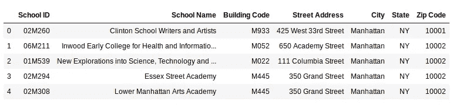

# 为数据科学优化您的 Python 代码

> 原文：<https://medium.com/analytics-vidhya/optimize-your-python-code-for-data-science-1e2456d54c87?source=collection_archive---------12----------------------->

我本质上是个程序员。早在我上大学之前，我就开始从事编程工作，我一直对使用简单 Python 代码开辟的众多途径感到惊讶。

但是我并不总是很有效率。我相信这是大多数程序员共有的特质——尤其是那些刚刚起步的程序员。编写代码的快感总是优先于它的高效和简洁。虽然这在我们的大学时代行得通，但在专业环境中，事情却大不相同，尤其是数据科学项目


作为一名数据科学家，编写优化的 Python 代码非常*非常*重要。毫无疑问，一个凌乱低效的笔记本会耗费你的时间和你的项目大量的金钱。经验丰富的数据科学家和专业人士知道，当我们与客户合作时，这是不可接受的。

因此，在本文中，我根据自己多年的编程经验，列出并展示了四种方法，您可以使用这些方法来为您的数据科学项目优化 Python 代码。

*如果你是 Python(和数据科学)的新手，我推荐你浏览下面的资源:*

*   [*Python for Data Science 免费课程*](https://courses.analyticsvidhya.com/courses/introduction-to-data-science/?utm_source=blog&utm_medium=4-methods-optimize-python-code-data-science)
*   [*数据科学导论(使用 Python)*](https://courses.analyticsvidhya.com/courses/introduction-to-data-science-2/?utm_source=blog&utm_medium=4-methods-optimize-python-code-data-science)

# 什么是优化？

我们先定义一下什么是优化。我们将用一个直观的例子来说明这一点。

这是我们的问题陈述:

假设给我们一个数组，其中每个索引代表一个城市，索引的值代表该城市与下一个城市之间的距离。假设我们有两个指数，我们需要计算这两个指数之间的总距离。简单来说，**我们需要找出任意两个给定指数之间的总和。**


首先想到的是，简单的 FOR 循环在这里也能很好地工作。但是，如果有 100，000+个城市，而我们每秒钟收到 50，000+个查询，那该怎么办？你还认为 FOR 循环会给我们的问题一个足够好的解决方案吗？

不完全是。这就是优化代码的神奇之处。

```
Code optimization, in simple terms, means reducing the number of  operations to execute any task while producing the correct results.
```

让我们计算一个 FOR 循环执行此任务所需的操作数:


我们必须计算出上面数组中索引为 1 和索引为 3 的城市之间的距离。


如果数组大小为 100，000，查询次数为 50，000 会怎样？


这是一个相当大的数字。如果数组的大小和查询的数量进一步增加，我们的 FOR 循环将花费大量时间。你能想出一个优化的方法吗？在这个方法中，我们可以使用较少的解决方案产生正确的结果。

在这里，我将讨论一个潜在的更好的解决方案，通过使用前缀数组来计算距离。让我们看看它是如何工作的:


你能理解我们在这里做了什么吗？我们只做了一次手术就达到了同样的距离！这种方法最好的一点是，它只需要一次运算就可以计算任意两个指数之间的距离，不管指数之间的差异是 1 还是 100，000。是不是很神奇？

我已经创建了一个样本数据集，其数组大小为 100，000 个查询和 50，000 个查询。你可以在我的原帖[这里](https://www.analyticsvidhya.com/blog/2019/09/4-methods-optimize-python-code-data-science/)的现场编码窗口比较两种方法所用的时间。我强烈推荐你去看看第二种算法有多好。

如果您已经了解了这一点，那么您一定已经理解了优化 Python 代码的重要性和强大功能。我们不仅通过更快地完成工作节省了时间，还节省了大量的计算能力！

因此，在这里我将分享一些我用来改进和优化我的 Python 代码的最佳技术。

# Pandas.apply() —一个特征工程宝石

[熊猫](https://www.analyticsvidhya.com/blog/2016/01/12-pandas-techniques-python-data-manipulation/?utm_source=blog&utm_medium=4-methods-optimize-python-code-data-science)已经是一个高度优化的图书馆，但我们大多数人仍然没有充分利用它。想一想在数据科学项目中经常用到它的地方。

我能想到的一个功能是[功能工程](https://www.analyticsvidhya.com/blog/2016/01/guide-data-exploration/?utm_source=blog&utm_medium=4-methods-optimize-python-code-data-science)，我们利用现有功能创建新功能。最有效的方法之一是使用 *Pandas.apply()* 。**它是熊猫图书馆的最佳附件之一，因为该功能有助于根据所需条件分离数据。然后，我们可以有效地使用它来完成数据操作任务。**

我使用 Twitter 情绪分析数据来计算每条推文的字数。我们将使用不同的方法，如 **dataframe iterrows** 方法、 **NumPy** 数组和 **apply** 方法。然后我们将在下面的实时编码窗口中进行比较。你可以从[这里](https://datahack.analyticsvidhya.com/contest/practice-problem-twitter-sentiment-analysis/?utm_source=blog&utm_medium=4-methods-optimize-python-code-data-science)下载数据集。你可以在原帖[这里](https://www.analyticsvidhya.com/blog/2019/09/4-methods-optimize-python-code-data-science/)对比结果。

# 熊猫。Data frame . loc——Python 中数据操作的绝妙技巧

这是我最喜欢的熊猫图书馆之一。我觉得这是处理数据操作任务的数据科学家必须知道的方法(几乎每个人都知道！).

大多数情况下，我们只需要根据某些条件更新数据集中特定列的一些值。*熊猫。DataFrame.loc* 为我们提供了这类问题的最佳解决方案。

让我们使用这个 *loc* 函数来解决一个问题。您可以在这里下载我们将使用的数据集[。](https://drive.google.com/file/d/1VwXDA27zgx5jIq8C7NQW0A5rtE95e3XI/view?usp=sharing)

```
# importing libraries                       
import pandas as pd             
data = pd.read_csv('school.csv')                                               data.head()
```



检查“城市”变量的值计数:


现在，假设我们只想要前 5 个城市，并希望将其余城市替换为“其他”。让我们开始吧:

```
# save the top cities in a list
top_cities = ['Brooklyn','Bronx','Manhattan','Jamaica','Long Island City']# use loc to update the target
data.loc[(data.City.isin(top_cities) == False),'City'] = 'Others'# city value counts
data.City.value_counts()
```


看到更新这些值有多容易了吗？这是解决这类数据操作任务的最佳方式。

# 在 Python 中矢量化您的函数

另一种消除慢速循环的方法是对函数进行矢量化。这意味着新创建的函数将应用于一系列输入，并将返回一组结果。**Python 中的矢量化至少可以通过两次迭代来加快计算速度。**

让我们在同一个 [Twitter 情感分析数据集](https://datahack.analyticsvidhya.com/contest/practice-problem-twitter-sentiment-analysis/?utm_source=blog&utm_medium=4-methods-optimize-python-code-data-science)上的[这里的](https://www.analyticsvidhya.com/blog/2019/09/4-methods-optimize-python-code-data-science/)中验证这一点。

# Python 中的多重处理

多重处理是系统同时支持多个处理器的能力。

这里，我们将流程分成多个任务，并且所有任务都独立运行。当我们处理大型数据集时，即使是 *apply* 函数看起来也很慢。因此，让我们来看看如何利用 Python 中的多处理库来加快速度。

我们将随机创建一百万个点，并计算每个点的除数。我们将使用*应用*功能和多处理方法来比较它的性能:

```
# importing required libraries
import pandas as pd
import math
import multiprocessing as mp
from random import randint# function to calculate the number of divisors
def countDivisors(n) : 
    count = 0
    for i in range(1, (int)(math.sqrt(n)) + 1) : 
        if (n % i == 0) : 
            if (n / i == i) : 
                count = count + 1
            else :  
                count = count + 2
    return count# create random data 
random_data = [randint(10,1000) for i in range(1,1000001)]data = pd.DataFrame({'Number' : random_data })
data.shape
```


```
%%time
data['Number_of_divisor'] = data.Number.apply(countDivisors)
```


```
%%timepool = mp.Pool(processes = (mp.cpu_count() - 1))
answer = pool.map(countDivisors,random_data)
pool.close()
pool.join()
```


这里，多重处理生成输出的速度比*应用*方法快 13 倍。性能可能会因不同的硬件系统而异，但它肯定会提高性能。

我希望你喜欢读我的文章。

快乐编码:)