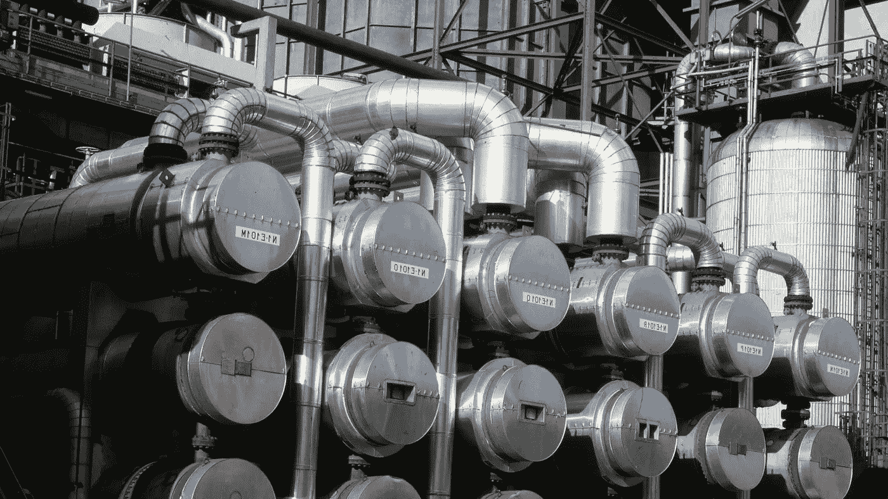
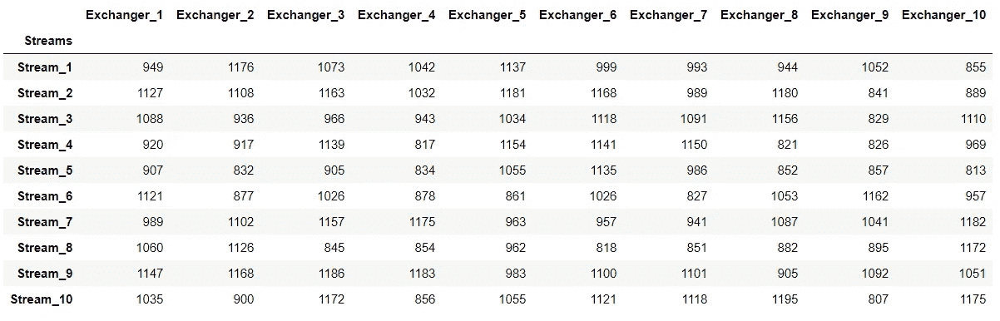
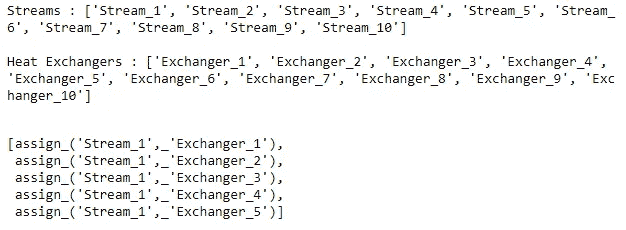
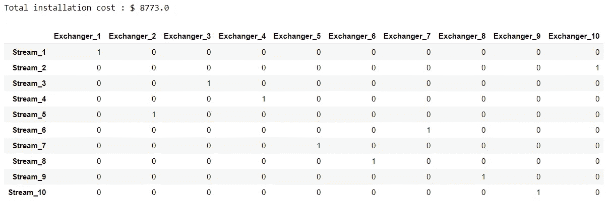
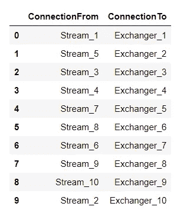

# 优化热交换器的物流分配—使用 Python 的纸浆模块构建最小化问题

> 原文：<https://medium.com/analytics-vidhya/optimized-allocation-of-streams-to-heat-exchangers-framing-a-minimization-problem-using-pythons-b7c936f9a6b5?source=collection_archive---------20----------------------->



*来源:*[*【https://www.fluor.com/projects/esso-refinery-epc】*](https://www.fluor.com/projects/esso-refinery-epc)

# 介绍

如果你在炼油厂工作了相当长的时间，你可能会遇到这些像上面这样系统排列的巨大结构。在机械术语中，该系统是一种“壳管式”热交换器，主要用于将热量从一股高温流体传递或交换到另一股低温流体，反之亦然。

热交换器的优化布置可以为工业流体在其他过程中的重新导向提供有效的通道，或者确保在邻近水体中的适当排放，而不会造成重大的环境影响。通过本文，我们将尝试使用 Python 的纸浆模块来系统地将来自多个来源的流体出口流分配给一组热交换器，以确保原材料的最小浪费并防止流体混合，从而实现最小化总体安装成本的目标，从而制定一个线性规划问题。

# 问题定义

导入所需的库

```
import pandas as pd
import numpy as np
import itertools
from pulp import *import warnings
warnings.filterwarnings("ignore")
```

> 本文使用的所有数据和代码都可以通过我的 GitHub repo 获得:[https://GitHub . com/mohiteprathamesh 1996/Heat-exchange-Assignment-](https://github.com/mohiteprathamesh1996/Heat-Exchanger-Assignment-)

现在让我们来看看现有的数据:

```
df = pd.read_excel("Heat Exchanger Assignment Optimization.xlsx", sheet_name="Installation Costs")df.set_index("Streams", inplace=True)df
```



上表显示了与将 10 个流体流的输出分配给 10 个不同的热交换器相关的各种成本(以美元计)。将流 I(其中 i **∈ (** 1、…、10)分配给热交换器 j(其中 j **∈** (1、…、10))的实际成本可能会因多种因素而异，如所用管道的长度、与交换站的距离、所需的原材料和人力等。我们现在的目标是“以尽可能低的成本将这些流中的每一个分配给它们各自的交换器，使得每一个流恰好到达一个交换器，并且相反地，每一个交换器从恰好一个流接收其输入。”

# 决策变量

在这个问题中，我们将二元决策变量 X(i，j)定义为

> 如果流‘I’被分配给交换器‘j’，则 X (i，j)= 1；否则，对于所有 i∈ (1，..10)和 j ∈ (1，…10)

```
# Create a list of stream indexes
streams = df.index.to_list()
print("Streams : {} \n".format(streams))# Create a list of indexes for exchangers
exchanger_stations = df.columns.to_list()
print("Heat Exchangers : {} \n".format(exchanger_stations))# Create a dictionary of binary type decision variables
var_dict = LpVariable.dicts(
    name="assign",
    indexs=[(i, j) for i in streams for j in exchanger_stations], 
    lowBound=0,
    cat="Binary")# Display first 5 decision variables
[var_dict[(i,j)] for i in streams for j in exchanger_stations][:5]
```



# 定义目标函数

将上述 LP 框定为最小化问题，我们可以将目标函数定义为:

**最小化，Z = 949*X(1，1) + 1176*X(1，2)+…。+1055*X(10，9) + 1175*X(10，10)**

数学上，

最小化，**Z =σC(i，j)*X(i，j)** 其中 C(I，j)是将流‘I’分配给交换器‘j’的成本，如上表所示，所有 i **∈ (** 1，…，10)和 j **∈** (1，…，10)。

```
# Define the LP Minimization problem
model = LpProblem("Minimize Installation Costs", LpMinimize) # Adding the objective function 
model += lpSum([df.loc[(i,j)]*var_dict[(i,j)] \
                for i in streams \
                        for j in exchanger_stations])
```

# 限制

如前所述，LP 受到约束，使得每个流的出口恰好到达一个交换器，相反，每个交换器从恰好一个流接收其输入。

首先是对溪流的限制。这里，我们将流索引“I”视为常数，并在每个交换站上迭代。数学上，**σX(j)= 1**

```
# Each stream must be assigned to exactly 1 heat exchanger
for i in streams:
    model += lpSum([var_dict[(i, j)] \
                          for j in exchanger_stations]) == 1
```

接下来，对交换器的约束。这里，我们将交换器指数‘j’视为常数，并在流出口上迭代。数学上，**σX(I)= 1**

```
# Every heat exchanger must receive input from exactly 1 stream    
for j in exchanger_stations:
    model += lpSum([var_dict[(i, j)] \
                          for i in streams]) == 1
```

# 最优解

在这最后一步中，我们求解上述 LP 并获得流分配的最优模式。

```
# Solve the mode
model.solve()# Saving the optimal solution results
if LpStatus[model.status]=="Optimal":
    optimal_soln = pd.DataFrame(
[(v.name, v.varValue) for v in model.variables() if v.varValue==1],
                                columns=["Assignment", "Status"])print("Total installation cost : $ {}".format(value(model.objective)))optimal_soln
```



```
pd.DataFrame(
[(optimal_soln[optimal_soln[c]==1].index.values[0], c)\
  for c in optimal_soln.columns],
             columns = ["ConnectionFrom", "ConnectionTo"])
```



最终，我们实现了我们的目标，以尽可能低的安装成本将流分配到各自的热交换器。如果上述数据集的维度发生变化，可以重用上述代码序列。

# 参考

1.  Edgar，T.F .，Himmelblau，D.M .和 Lasdon，L.S .，2001 年。*化工过程的优化*。麦格劳-希尔公司。
2.  s .米切尔、m .奥苏利文和 I .邓宁，2011 年。PuLP:python 的线性编程工具包。*新西兰奥克兰市奥克兰大学*。
3.  [https://www . explain that stuff . com/how-heat-exchangers-work . html](https://www.explainthatstuff.com/how-heat-exchangers-work.html)

PS:如果你想让我做一些编辑或任何一般性的建议，请随意评论。感谢您的宝贵时间！

我们在 LinkedIn 上连线:[https://www.linkedin.com/in/prathameshmohite96/](https://www.linkedin.com/in/prathameshmohite96/)