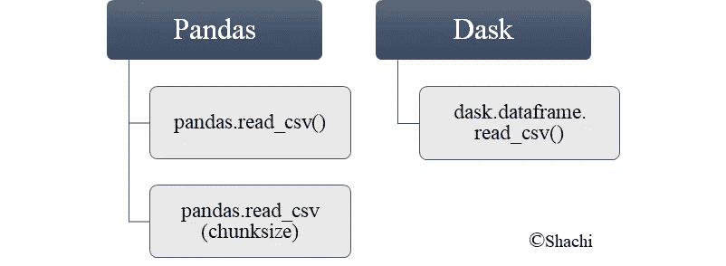

# 在 Python 中读取大型 CSV 的优化方法

> 原文：<https://medium.com/analytics-vidhya/optimized-ways-to-read-large-csvs-in-python-ab2b36a7914e?source=collection_archive---------0----------------------->

你好。🙋


[来源](https://leaderonomics.com/business/love-innovation-or-die)

在当前的时代，数据在分析和建立 ML/AI 模型中起着非常重要的作用。数据可以在 CSV、平面文件、JSON 等各种格式中找到，当数据很大时，很难读入内存。这个博客围绕着处理 CSV 格式的表格数据，这些数据是逗号分隔的文件。

**问题:**导入(读取)大型 CSV 文件导致内存不足错误。没有足够的内存来一次读取整个 CSV 文件，导致计算机崩溃。

这里有一些在 Python 中导入 CSV 的有效方法。



图 1

现在怎么办？好吧，让我们准备一个应该很大的数据集，然后比较实现图 1 所示选项的性能(时间)。让我们开始吧..🏃

用随机数和字符串创建一个 15 列 1000 万行的数据框架。将其导出为大约 1 GB 大小的 CSV 格式。

```
df = pd.DataFrame(data=np.random.randint(99999, 99999999, size=(10000000,14)),columns=['C1','C2','C3','C4','C5','C6','C7','C8','C9','C10','C11','C12','C13','C14'])df['C15'] = pd.util.testing.rands_array(5,10000000)
df.to_csv("huge_data.csv")
```

现在让我们看一下导入选项，比较一下将 CSV 读入内存所用的时间。

# 熊猫

pandas python 库提供 read_csv()函数，将 csv 作为数据帧结构导入，以便于计算或分析。这个函数提供了一个参数(将在后面的部分中描述)来更快地导入您的巨大文件。

## 1.pandas.read_csv()

***输入*** :读取 CSV 文件
***输出*** :熊猫数据帧

pandas.read_csv()将整个 csv 文件一次性加载到内存中的单个数据帧中。

```
start = time.time()
df = pd.read_csv('huge_data.csv')
end = time.time()
print("Read csv without chunks: ",(end-start),"sec")Read csv without chunks:  26.88872528076172 sec
```

如果 CSV 大小超过您的内存大小(RAM ),这有时可能会由于 OOM(内存不足)错误而使您的系统崩溃。通过下一个导入方法改进了解决方案。

## 2.pandas.read_csv(chunksize)

***输入*** :读取 CSV 文件
***输出*** :熊猫数据帧

不是一次读取整个 CSV，**CSV 的大块被读入内存**。使用 chunksize 参数指定块的大小，该参数指的是行数。这个函数返回一个迭代器来遍历这些块，然后随心所欲地处理它们。因为一次只能读取一个大文件的一部分，所以低内存足以容纳数据。稍后，这些块可以连接成一个数据帧。

```
start = time.time()
#read data in chunks of 1 million rows at a time
chunk = pd.read_csv('huge_data.csv',chunksize=1000000)
end = time.time()
print("Read csv with chunks: ",(end-start),"sec")
pd_df = pd.concat(chunk)Read csv with chunks:  0.013001203536987305 sec
```

此选项速度更快，最适合在 RAM 有限的情况下使用。或者，也可以使用一个新的 python 库 DASK，如下所述。

# 达斯克

***输入*** :读取 CSV 文件
***输出*** : Dask dataframe

在读取大的 CSV 文件时，如果它不适合你的 RAM，你可能会遇到内存不足的错误，因此 DASK 出现了。

*   Dask 是一个**开源** python 库，具有 python 中的并行性和可伸缩性特性，默认包含在 Anaconda 发行版中。
*   它通过重用**现有的 Python 库**，如 pandas、numpy 或 sklearn，扩展了其可伸缩性和并行性的特性。这对那些已经熟悉这些 Python 库的人来说很方便。
*   怎么入手呢？您可以通过 pip 或 conda 安装。我会推荐 conda，因为通过 pip 安装可能会产生一些问题。

```
pip install dask
```

嗯，当我尝试上面的方法时，它产生了一些问题，使用一些 GitHub 链接从外部添加 dask path 作为环境变量解决了这些问题。但是当有更简单的选择时，为什么要大惊小怪呢？

```
conda install dask
```

*   代码实现:

```
from dask import dataframe as ddstart = time.time()
dask_df = dd.read_csv('huge_data.csv')
end = time.time()
print("Read csv with dask: ",(end-start),"sec")Read csv with dask:  0.07900428771972656 sec
```

Dask 在读取这个大型 CSV 时似乎是最快的，不会使计算机崩溃或变慢。哇！那有多好？！！一个新的 Python 库，修改了现有的库以引入可伸缩性。

## 为什么达斯克比熊猫强？

*   Pandas 使用单个 CPU 内核，而 **Dask 通过内部分块数据帧和并行处理来使用多个 CPU 内核**。简而言之，一个大数据帧的多个小数据帧同时被处理，而在 pandas 下，操作一个大数据帧需要很长时间。
*   DASK 可以在单个 CPU 上处理大型数据集，利用它的多个核心或机器集群，称为分布式计算。它提供了一种**规模的 pandas 和 numpy 库**。
*   不仅仅是 dataframe，dask 还提供了数组和 scikit-learn 库来利用并行性。

一些 DASK 提供的库如下所示。

*   **Dask 阵列**:并行数字阵列
*   **Dask 数据帧**:平行熊猫
*   **Dask ML** :并行 Scikit-Learn

**我们将只关注数据帧，因为其他两个不在讨论范围内。但是，要想弄脏你的手，最好考虑一下** [**这个博客**](https://www.analyticsvidhya.com/blog/2018/08/dask-big-datasets-machine_learning-python/) **。**

## Dask 如何存储大于内存(RAM)的数据？

当我们导入数据时，它被读入我们的 RAM，这突出了内存限制。
比方说，你想在你的 4 GB RAM 中导入 6 GB 数据。这不能通过熊猫来实现，因为一个镜头中的全部数据都不适合内存，但 Dask 可以。怎么会？
*Dask 首先代替计算，* ***创建一个任务图*** *其中说的是关于如何执行那个任务。它相信懒惰计算，这意味着 dask 的任务调度程序首先创建一个图，然后在请求时* ***计算该图*** *。为了执行任何计算，compute()被显式调用，它调用任务调度器来利用所有核处理数据，最后将结果组合成一个。*

对于那些已经熟悉熊猫的人来说，这并不难理解。

> [](/@shachikaul35/dask-for-python-and-machine-learning-dbe1356b5d7a)

# 结论

使用各种导入选项在内存中读取约 1 GB CSV 可以通过加载到内存中所用的时间来评估。

*pandas.read_csv* 在读取比 RAM 大的 csv 时**最差**。
*pandas . read _ CSV(chunksize)*比上面的**执行得更好，并且可以通过调整 chunk size 来进一步改进。
*dask.dataframe* 被证明是**最快的**，因为它处理并行处理。**

**因此，我会建议你走出使用熊猫的舒适区，尝试 dask。但是仅供参考，我只测试了 DASK 读取大 CSV 的能力，而没有测试我们在熊猫身上做的计算。**

> ****你可以查看我的** [**github 代码**](https://github.com/shachi01/dask_in_python_ml/blob/master/efficient_read_csv.ipynb) **来访问覆盖本博客编码部分的笔记本。****

# **参考**

*   **[Dask 最新文档](https://docs.dask.org/en/latest/)**
*   **[值得一读的书](https://www.amazon.in/Data-Science-Scale-Python-Dask/dp/1617295604)**
*   **这篇博客中没有包括的其他 CSV 读写选项。**

**[](https://realpython.com/python-csv/) [## 用 Python 读写 CSV 文件-真正的 Python

### 立即观看本教程有一个由真正的 Python 团队创建的相关视频课程。和书面的一起看…

realpython.com](https://realpython.com/python-csv/) 

3.想在 DASK 里弄脏你的手，应该浏览一下下面的链接。

[](https://pythonspeed.com/articles/faster-pandas-dask/) [## 从分块到并行:更快的熊猫与 Dask

### 当数据不适合内存时，您可以使用分块:加载数据，然后分块处理，这样只有一个子集…

pythonspeed.com](https://pythonspeed.com/articles/faster-pandas-dask/) 

如果你喜欢这位作者的博客，请随意关注，因为这位作者保证会带来更多有趣的人工智能相关内容。
感谢，
学习愉快！😄

***可以通过***[***LinkedIn***](https://www.linkedin.com/in/kaul-shachi)***取得联系。*****