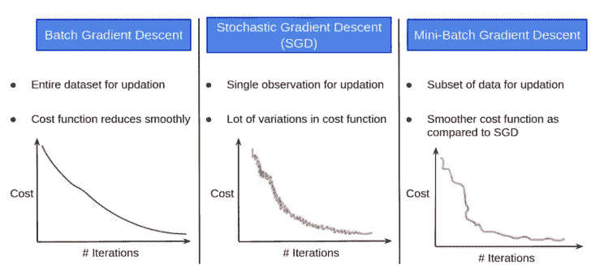
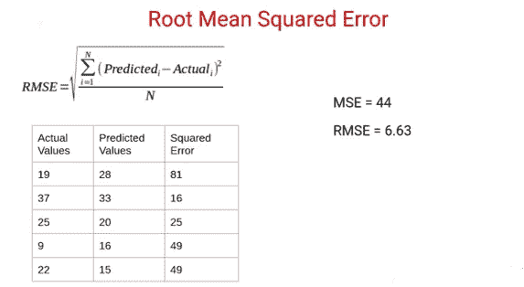

# 神经网络中的优化器和损失函数

> 原文：<https://medium.com/analytics-vidhya/optimizer-loss-functions-in-neural-network-2520c244cc22?source=collection_archive---------5----------------------->

来源:互联网

在这篇博客中，我们将了解在训练神经网络时最常用的各种优化器和损失函数。这样做的先决条件是对梯度下降算法如何工作有基本的了解。因此，我强烈建议大家参考我以前的博客 [***神经网络简介***](/@gauravrajpal1994/introduction-to-neural-networks-1d111bb4649) ，以更好地了解梯度下降算法，该算法在反向传播期间用于更新我们的权重和最小化成本函数，我们的目标是达到全局最小值。

在学习了梯度下降算法的基础知识之后，我们将关注以下内容:

1.  梯度下降的变体。

2.梯度下降的挑战/问题。

3.不同类型的优化器。

让我们回忆一下梯度下降方程，它是: **w = w - alpha * dE/dw** 其中**，dE/dw** 表示误差相对于权重的变化率，而 **alpha** 表示学习率。这里**‘E’**是成本函数。

有多种方法来计算这个成本函数。基于我们计算这个成本函数的方式，有不同的梯度下降方差。让我们更好地理解它。

V渐变下降的变体。

**批量梯度下降**:假设在我们的数据集中总共有‘m’个观察值，我们使用所有这些观察值来计算成本函数‘E’。因此，我们采用整个训练集，执行前向传播并计算成本函数。然后我们用这个成本函数的变化率来更新我们称之为权重的参数。此外，我们必须记住，因为我们在这里使用的是整个训练集，每个时期参数只会更新一次。

**随机梯度下降**:如果我们使用单一观测值来计算成本函数，我们称之为随机梯度下降，通常简称为 SGD。这里每次迭代通过神经网络计算误差，然后更新参数。然后我们将进行第二次观察，并执行类似的步骤。这个过程一直持续到我们数据集中的观察数。因此，对于 1 个时期，我们将有“m”次更新，其中“m”代表我们数据集中的观察次数。

**小批量梯度下降:**在这种类型的梯度下降中，我们从整个训练数据集中提取一个子集，并计算成本函数。这种类型的梯度下降主要用于训练深度学习模型。

*让我们看看成本函数的变化*:

来源:Vidhya 分析

当我们获取整个数据集时，成本函数平滑地降低。对于 SGD 来说，并不是那么顺利，因为我们是基于单次观察来更新参数的，所以涉及到很多迭代。模型也可能开始学习噪声。与 SGD 相比，在最小批量梯度下降的情况下，成本函数的更新更平滑，因为我们不是在每次迭代之后而是在数据的每个子集之后更新参数。

*让我们看看计算成本和时间:*

来源:Vidhya 分析

我们可以看到，小批量梯度下降比其他方法给出了更好的结果，也是在建立深度学习模型时最常用的方法。

这些是我们讨论过的梯度下降的变体，你们会经常遇到。希望现在你已经熟悉这些术语了？？

现在让我们跳到我们在使用梯度下降时所面临的挑战。

C **渐变下降的挑战**。

在这一部分，我们将重点关注梯度下降的挑战。让我们来看看吧。

1.  **它卡在局部最小值(SGD 动量)**

让我们说下面是我们的成本函数的图表。因为我们希望最小化成本，所以我们希望达到'**全局最小值** -在整个成本函数或全局中具有最小成本值的点被称为全局最小值。其邻居中的最低点称为**局部最小值。**这是梯度下降一般会卡住的点。

来源:Vidhya 分析

使用梯度下降算法，我们将计算每一个点的斜率，并且在一些点达到局部最小值之后。局部最小值处的斜率为 0，因此 dE/dw 项变为 0，这表示梯度或斜率，因为这些参数将不会得到更新并将被卡住。

来源:Vidhya 分析

我们的目标不是达到局部最小值，我们的目标是达到全局最小值。所以，我们需要一些局部最小值的推动，把我们从这个场景中带出来。

让我们用一个例子来理解这一点:

假设我们有一个初速度为 u 的球在某个高度。现在球以一定的速度滚下山坡，比如说 v，我们可以很明显地说 v > u，因为球正在滚下。当球到达局部极小值时，它会获得一些速度，最终会给它一个推力，球会从局部极小值出来。所以，我们看到要把球推出局部最小值，我们需要一些累积速度之类的东西。就神经网络而言，我们可以说累积速度相当于加权梯度。

来源:Vidhya 分析

这里，如果我们看到局部最小值，斜率或梯度将为 0，这将最终使当前时间“t”处的当前梯度等于 0。我们仍将剩下某个值，即先前在‘t-1’累积的梯度，因此加权梯度‘Vt’将具有某个值，该值将给出所需的推力，并且它将从局部最小值中出来。“β”值告诉我们它应该给当前和先前累积的梯度多少值。通常，β值取为 0.9，这意味着它将为当前梯度赋予 10%的权重，为先前累积的梯度赋予 90%的权重。现在，我们的新梯度“Vt”将用于更新神经网络的参数。 ***这也被称为随机梯度下降与动量。***

因此，使用动量随机梯度下降的概念，我们可以解决陷入局部最小值的问题。

**2。在整个培训过程中保持相同的学习速度。**

这是我们在训练神经网络时会遇到的第二个问题。一般来说，与其他变量相比，一些变量可能会导致更快的收敛，但如果我们在整个训练阶段应用相同的学习速率，我们会强制它们同步。这可能会导致收敛速度变慢。

我们的目标是，随着培训的进展，学习率也应根据成本函数进行更新。让我们看看如何解决这个问题。

回到我们的梯度下降方程，其中 dE/dw 是在我们的训练过程中更新的梯度，因此我们可以使用这一项来更新学习率。**这里有一些问题，因为一些梯度在某个点可能是正的或负的，所以它们可能会相互抵消，因此，为了消除符号，我们可以取梯度的平方和，并使用该值来更新学习率。**

来源:Vidhya 分析

这种方法可能存在另一个问题，即*任何数的平方，无论是负数还是正数，都将始终是正数，因此，将所有正数相加将始终增加θ值，反过来，这将降低学习速率，在一些迭代之后，学习速率将趋于零，变得非常小，我们的参数将几乎类似于先前的参数，这将导致收敛变慢。*

来源:Vidhya 分析

为了克服这个问题，我们可以使用带有动量方程的 SGD，它为我们当前的梯度和先前累积的梯度分配一些量级，我们将取梯度的平方来抵消负值的影响。

来源:Vidhya 分析

这是 RMSProp 的更新方程式。从上面的等式中我们可以看出，我们使用的是α，它除以加权平均值的平方根，再加上一些小误差。分母中使用了误差，因此该值不会变成 0。通常，该误差值非常小，即 0.00000001。

现在让我们理解这个等式如何帮助我们在训练过程中更新学习率- *当梯度的平方很高时，加权平均值将很高，这反过来降低了学习率。类似地，当梯度的平方较低时，加权平均值将较低，这反过来增加了学习速率。*

来源:Vidhya 分析

D **不同类型的优化者。**

1.  带动量的随机梯度下降。
2.  RMSProp。
3.  亚当。

到目前为止，我们已经介绍了上一节中讨论的两个优化器，以克服使用梯度下降时面临的挑战。在**带动量的 SGD**中，我们看到它使用先前累积梯度的加权和解决了陷入局部最小值的问题。在 **RMSProp** 中，我们看到它使用平方梯度的和解决了所有参数的相同学习速率的问题。

现在，我们将看看最常用和最广泛使用的优化器，即 **ADAM。**它结合了 SGD 和 momentum 来解决局部极小问题，以及 RMSProp，后者使用先前梯度的平方和来解决相同的学习率问题。

来源:Vidhya 分析

从 ADAM 的更新方程中，我们可以看到，我们在这里使用“Vt”作为梯度，它是当前和先前累积梯度的加权和，以解决局部最小值问题，梯度平方和的平方根也解决了相同的学习速率问题。

## 所以，这就是在构建我们的神经网络中使用的各种类型的优化器背后的详细直觉。我希望你喜欢学习它。

# 损失函数:

在本节中，我们将了解什么是损失函数，以及它们中的哪些在深度学习中最常用。

在看损失函数之前，让我们回顾一下神经网络。如果我们看到下图，我们将了解我们的预测是如何计算的，误差函数帮助我们更新神经网络中的权重和偏差，这有助于我们改进模型的预测和性能。

来源:Vidhya 分析

1.  **均方误差:**到目前为止，我们一直使用 MSE(均方误差)来计算误差/损失函数/成本函数。让我们看看如何计算 MSE。

来源:Vidhya 分析

*MSE 一般用在我们有回归类型的问题，目标变量是连续的时候。*

**2。平均绝对误差:** MAE 是用于计算损失函数的另一个度量。让我们看看如何计算 MAE。

来源:Vidhya 分析

*当我们有回归类型的问题并且目标变量是连续的时，也使用 MAE。*

**3。均方根误差:** RMSE 就是 MSE 的平方根。我们知道如何计算 MSE，所以在 RMSE，我们将只计算所得值的平方根。

来源:Vidhya 分析

因此，到目前为止，我们看到了回归任务的一些损失函数。现在让我们看看用于分类任务的损失函数。

分类任务可以进一步分为**二元分类**和**多类分类。**在二元分类中，我们的目标变量中只有 2 个目标类，而在多类分类中，我们可以预测目标变量中的 2 个以上的类。让我们理解两者中使用的损失函数:

**1。二元交叉熵/对数损失。**

*“校正预测概率对数的负平均值”*

这是分类问题中最常见的损失函数类型。它将每个预测的概率与实际的类输出进行比较，后者可以是 0 或 1。然后，它计算分数，根据与实际值的距离来惩罚概率。

让我们用一个例子来理解什么是修正概率。

来源:Vidhya 分析

这里，我们看到每个观察值的校正概率栏。我们已经预测了概率栏，它包含了类别 1 的概率。对于实际值为 0 的情况，预测概率表示类 1 的概率，因此，它属于类 0 的概率将通过从 1 中减去该值来获得。在我们的示例中，ID8、ID2 和 ID5 都会发生这种情况。

因此，我们采用属于目标类别 1 的修正概率，对于实际目标为 0 的概率，我们从 1 中减去预测概率。然后，我们对这些校正后的概率取对数，因为取对数将对小的差异给出较少的惩罚(例如，如果实际值为 1，预测概率为 0.9，我们分配较少的惩罚，如果实际值为 1，预测值为 0.6，我们分配稍高的惩罚)。

来源:Vidhya 分析

我们可以使用下面的公式，而不是计算修正后的概率。假设实际类是 1，(1-y)项将是 0。类似地，如果实际类别为 0，y*log(p)项变为 0

来源:Vidhya 分析

这就是我们计算二元交叉熵的方法，这是一个非常有用的损失函数，用于分类问题。

C **结论**

因此，我们学习了各种优化器，如解决局部最小值问题的随机梯度下降，解决相同学习速率问题的 RMSProp，然后我们学习了 ADAM，它是两者的结合。然后，我们学习各种损失函数，可用于回归和分类问题。

请务必在 LinkedIn 上联系我:[https://www.linkedin.com/in/gaurav-rajpal/](https://www.linkedin.com/in/gaurav-rajpal/)

***敬请关注我们在深度学习中使用图像数据集的演示项目的进一步更新。***

问候，

高拉夫·拉杰帕尔·(gauravrajpal1994@gmail.com)