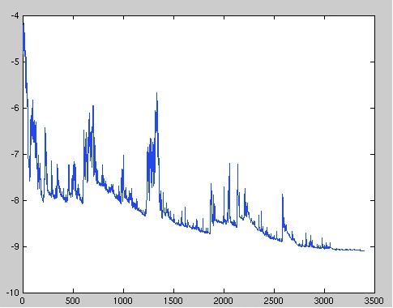

# 深度学习中的优化器

> 原文：<https://medium.com/analytics-vidhya/optimizers-in-deep-learning-36549ea9c59f?source=collection_archive---------24----------------------->

***什么是优化器？***

优化器是用来改变神经网络属性的算法或方法，如权重和学习速率，以减少损失。

**基础优化:**

## ***批量渐变下降(BGD):***

在 BGD，它将获取所有训练数据集，然后存储每个记录的所有损失值。然后将所有损失函数值的总和发送给优化器。

简单地说，在批量梯度下降中，所有的训练数据都被考虑在内以采取一个单独的步骤。

步骤:

1.  获取全部训练数据。
2.  输入神经网络。
3.  求成本函数值。
4.  计算它的梯度。
5.  使用上述梯度更新权重。

> **缺点*缺点*缺点**

1.  因为这个方法在一次更新中计算整个数据集的梯度。计算非常慢
2.  遇到大量数据集会非常棘手，你无法投入新的数据来实时更新模型。
3.  我们必须预先定义迭代次数历元。
4.  这个模型需要更多的内存空间来训练数据。

## 随机梯度下降(SGD):

在 SGD 中，我们不是取整个记录，而是一次取一个记录来输入神经网络并更新权重。

对于大型数据集，可能有相似的样本，所以 BGD 计算梯度。**会有冗余，而且 SGD 只更新一次，没有冗余，速度更快，可以添加新的样本。**

步骤:

1.  从数据中提取单个记录。
2.  把它输入神经网络。
3.  寻找损失函数值
4.  使用上面的值找到它的梯度。
5.  使用梯度更新权重。

新加坡元的波动

> **缺点:**

但是，因为 SGD 更新更频繁，所以成本函数会有剧烈的振荡。BGD 可以收敛到一个局部极小值，当然，SGD 的振荡可能会跳到一个更好的局部极小值。

## **小批量梯度下降:**

MBGD 采用小批量样本，即每次 n 个样本来计算。这样可以减少参数更新时的方差，收敛更稳定。它可以充分利用深度学习库中高度优化的矩阵运算，进行更高效的梯度计算。

步骤:

1.  从训练集中取 n 个样本数据。
2.  把它输入神经网络。
3.  求成本函数值。
4.  通过使用上面的值找到它的梯度。
5.  使用上述值更新重量。

> **缺点:**

1.  小批量梯度下降不能保证良好的收敛性。
2.  如果学习率太小，收敛速度会很慢。如果是的话。也是。大，损失函数会在最小值处振荡甚至偏离。
3.  如果批量大小等于训练数据集。那么 MBGD 等于 BGD。

— — — — — — — — — — — — — — — — — — — — — — — — — — — — — —

以上优化者都是很老的优化者了。还有非常先进的优化工具，比上面的要好得多。高级优化器有 Adagrade、Adadelta、RMSprop 和 Adam。这些优化器基于动量工作。