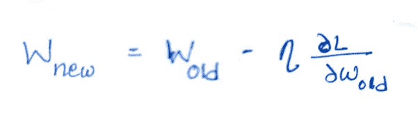
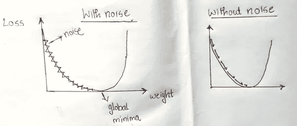
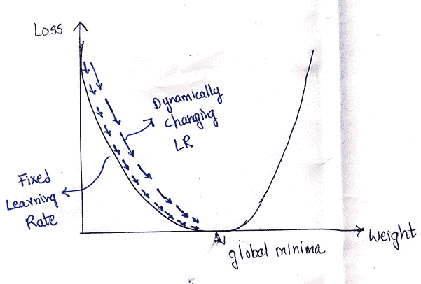
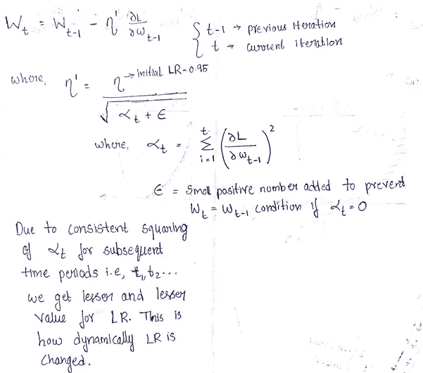
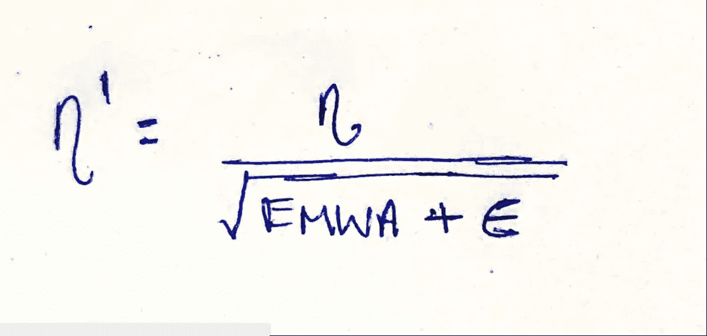

# 深度学习中的优化器——你需要知道的一切

> 原文：<https://medium.com/analytics-vidhya/optimizers-in-deep-learning-everything-you-need-to-know-730099ccbd50?source=collection_archive---------15----------------------->

在前向传播中，在训练神经网络的同时给神经元分配一些随机权重，最后，我们得到一个 ***实际输出*** ，表示为 **ŷ** 。还有，我们知道 ***预测输出*** (用 **y** 表示)应该是什么。

现在，损失函数被计算为(y-ŷ)^2.然后，在反向传播期间使用**优化器**来调整权重，并且重复进行直到 y = ŷ

让我们了解各种类型的优化算法-

# **1。梯度下降**

**直觉** —考虑一个有 100k 条记录的数据集。在前向传播中考虑整个数据集，然后计算损失函数。此后，在反向传播中使用梯度下降算法来最小化损失函数。

**缺点**:

1.  在大型数据集上，权重更新可能需要很长时间，因此达到全局最小值需要时间。
2.  需要高 RAM

**注**:全局最小值是损失函数与权重图上的点，它给出了网络中要添加的正确权重。

用于更新权重的公式-

权重更新公式

# **2。随机梯度下降**

**直觉** —考虑一个有 100k 条记录的数据集。在 1 个时期中，在特定点，在前向传播中获取 1 个记录，然后计算损失函数，之后在反向传播期间使用 SGD，添加适当的权重。

同样，对所有 99999 条记录都执行此过程。

**注**:历元是数据集所有记录的一个正反向传播周期

**优势**

相比之下，需要较少的 RAM

**缺点**

因为一次只考虑一个记录，所以仅仅完成一个时期就要花费很多时间。

# **3。小批量随机梯度下降**

**直觉:**考虑一个有 100 条记录的数据集。首先，我们必须决定批量大小。例如，让我们考虑批量大小为 20，我们运行 3 个时期。

因此，在第一时段中，运行 5 次迭代，并且在每次迭代中，处理 20 个记录，因此在 5 次迭代中，处理了所有 100 个记录。

在第二时段中，重复相同的过程，即(5 次迭代*每次迭代 20 条记录= 100 条记录)

同样，第三个时期以与上述类似的方式处理。

**优势**

1.  更少内存
2.  计算成本更低

**但是，**

在损失函数与权重图中，收敛到全局最小值在时尚上不是线性的，而是偏斜的，如下图所示，这种行为被称为**噪声**。

有噪声和无噪声的比较

为什么会这样？因为我们考虑批次形式的记录，并且特定批次中的记录可能不代表完整的数据集，或者将其视为—所考虑的批次可能有异常值。

由于噪声达到全局最小值需要一些时间，但小批量 SGD 优于 SGD 和 GD。

# **4。带动量的随机梯度下降**

这项工作类似于迷你批量 SGD，但略有修改。在 MBSGD 中，我们遇到了噪音问题，这个问题在这里得到了解决。单词“**动量**”的意思是消除噪音。

这是通过使用 [**指数加权移动平均**](/@abhinav.mahapatra10/beginners-ml-basics-exponentially-weighted-moving-average-8ce3e75768f6) 概念来实现的，同时在反向传播中更新权重。

**注意**:根据研究人员的说法，假设学习率= 0.95 是好的

**让我们回顾一下**

**需要高 RAM 小心**

**训练网络的计算成本高—已解决**

**噪音正在影响收敛——不再是了**。

因此，我们得出结论，SGD 与动量是最好的优化！？等等…

继续读下去，

# **5。Adagrad(自适应梯度下降)**

研究人员发现，固定的学习速度效率不高。因此，他们引入了动态学习率的概念

为什么我们需要一个动态的学习率？因为考虑这样一个场景，其中从网络的一组记录中没有新的东西要学习，所以在这种情况下，通过使用学习速率的动态值帮助我们更快地达到全局最小值。参考下图-

动态学习率与固定学习率

**动态学习率的说明**

现在这里有一个问题——如果它是一个非常深的神经网络，有大约 100+个隐藏层，那么我们的**新的和旧的权重有可能变成相同的**。

让我们谈谈解决这个问题的优化器，然后我们得到最好的优化器！！！

# 6。AdaDelta 和 RMS Prop

通过在学习率公式中使用指数移动加权平均的概念，解决了网络中新加入的权值与旧权值相同的问题。

**公式-**

AdaDelta 和 RMS Prop 公式—包含 EMWA 而不是 alphaT

## 我们已经到了最后，要使用的**最佳优化器**是 **RMS Prop** 和 **SGD with momentum** 的组合，称为 **Adam 优化器**。

感谢阅读！

打电话给我-

电子邮件—tejasta@gmail.com

LinkedIn—[https://www.linkedin.com/in/tejasta/](www.linkedin.com/in/tejas-ta)